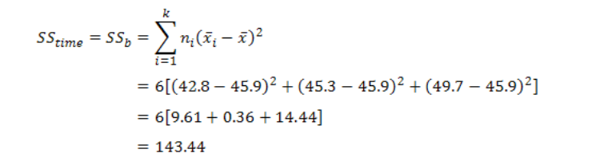

```{r setup, include=FALSE}
knitr::opts_chunk$set(
	echo = TRUE,
	message = FALSE,
	warning = FALSE
	#word_document
)
  
# setwd("F:/Rwork/04_Book/book1")
setwd("E:/Rwork/04_Book/book_git/book1")

library(rstatix)
# devtools::install_github("shoutjoy/jjstat")
library(jjstat)  # statistical summary 
library(knitr)

```

# 연구방법과 통계분석

**저자의 말**

이 책에서 다루고자 하는 것은 실제로 논문을 집필하거나 혹은 통계분석을 하고자 하는 경우에 실질적으로 필요한 부분과 집중해야할 부분을 담았다.
연구자로서 직접 분석을 하고 자신의 연구를 정밀하게 담고 싶은 마음은 정말 간절할 것이다.
R은 무료로 이 모든 것을 가능하게 해주며, 배우는 것도 그리 어려운 것은 아니다.
그러나, R을 이용하여 통계분석을 하고자 하는 경우, 너무 기초에 매달리다보니 실제로 필요한 것을 익히는데 너무 올래걸리는 것이 현실이다.
연구자들에게 통계분석만을 목적으로 사용한다면 너무 어려운 것은 아님에도 불구하고 코드(syntax)방식이라는 이유로 벽에 부딪히는 경우가 많다.
그러나, 연구를 재현하는 관점에서 접근해보면 이러한 코드형태로 사용하는 방식은 매우 편리한 방법임에는 그 누구도 부인할 수 없다.\
본 책에서는 논문 통계분석의 절차에 따라서 사용하는 R함수와 라이브러리를 소개하여 분석하는 다양한 방법을 소개하면서 R을 익힐 수 있게 하고 있다.
함수를 일일이 기억하는 것은 매우 어려운 일이지만 상황에 맞추어서 최적의 함수를 사용하는 것은 경험으로서 기억이 잘 나고 찾아볼 수 있으므로 그러한 방식으로 분석방법을 소개하려고 한다.
분석후에는 간단하게라도 가능한 APA양식에 맞추어서 보고하는 방식을 소개하고 있다.\

이 책에서는 필자가 개발한 R패키지도 사용하고 있다. jjstat라는 패키지를 이용하여 여러가지 분석의 방법과 요약기술등을 편리하게 하는 방법들을 제시하고 있다. 대체로 분석하는 것에 대한 함수는 잘 발달해있지만, 이를 정리하여 논문에 넣기위한 함수나 정리방법은 좀 미흡한 편이다. 따라서, 필자는 분석을 편리하게 하는 방법과 그리고, 결과물을 만들기 위해서 도입해야 하는 함수들을 모아서 jjstat라는 패키지로 담았다. 

\

# 1. 데이터에 대한 이해

데이터를 이해한다는 것을 자신이 분석할 실태를 잘 이해하고 있다는 의미가 된다. 데이터를 이해한다는 것은 자신의 데이터의 열에 대한 것, 즉 변수가 무엇인지 정확히 이해하는 것이다. 그 변수의 형식과 내용에 대하여 명확히 이해하는 것이 중요하다. 보통은 행렬(matrix), 리스트(list), 배열(array), 데이터프레임(data.frame), 티블(tibble)데이터를 자주 사용한다. 이러한 형식과 변수의 형식, 그리고 변수를 리코딩하여 원하는 분석에 적용하는 방식을 잘 이해해야 한다. 이러한 과정을 배우는 것은 처음에 R을 배울 때 어렵게 만드는 경향이 있다. 따라서, 
\
\


## 1. 논문을 위한 기본 개념

### 1.1. 연구주제의 선정
연구 주제 선정의 중요성  
논문 작성의 첫 걸음이자 성공적인 연구의 핵심 요소는 바로 연구 주제의 선정이다. 잘 선택된 주제는 연구의 방향성을 제시하고, 명확한 목표 설정을 가능하게 하며, 학문적 기여도를 높여주게 된다. 반대로, 부적절한 주제는 연구의 어려움, 시간 낭비, 학문적 가치 감소로 이어질 수 있다. 


**연구 주제 선정을 위한 5가지 전략**  
\

1) 관심 분야 및 전문성 고려:  
 자신의 관심 분야와 전문 지식을 기반으로 주제를 선정하면 연구에 대한 열정과 몰입도를 높일 수 있다. 이미 갖춘 지식을 바탕으로 연구를 시작하면 학습 곡선을 단축하고 연구 효율성을 높일 수 있다.  
   
2) 최신 동향 및 학문적 격차 파악:  
최신 학문적 트렌드와 연구 동향을 파악하여 미래 지향적인 주제를 발굴하고, 학문적 격차를 채울 수 있는 연구를 진행하는것이 좋다. 학술 논문, 학회 발표, 전문가 의견 등을 참고하여 최신 연구 동향을 파악하는 것도 매우 중요하다.  

3) 연구 가능성 및 실현 가능성 평가:  
연구 주제의 연구 가능성을 평가하여 성공적인 연구 수행 가능성을 높일 수 있는 방법을 찾아본다. 연구 자료, 방법론, 윤리적 문제 등을 고려하여 연구 가능성을 평가한다. 이때 중요한 것은, 실현 가능성을 위해 연구 시간, 예산, 인력, 장비 등 현실적인 제약 조건을 고려하는 것이 중요하다.  
  

4) 학문적 기여도 및 사회적 영향력 검토:   
연구 주제의 학문적 기여도와 사회적 영향력을 검토하여 연구의 가치를 높여야 한다.  연구 결과가 학문 분야에 어떤 기여를 할 수 있는지, 사회에 어떤 영향을 미칠 수 있는지 고려한다.  

5) 명확한 연구 질문 및 가설 설정:  
연구 주제를 바탕으로 명확한 연구 질문과 가설을 설정하여 연구 방향성을 명확하게 제시한다.  연구 질문은 연구의 핵심을 요약하고, 가설은 연구 결과를 예측하는 명제이므로 철저한 선행연구와 연구자의 깊은 고민을 통해서 가설에 대한 예측을 하는 것이 중요하다.  


 

# 2. 기초통계분석

## 2.1. 연구에 관한 이해
\
이제 연구에 필요한 지식을 간단하게 이야기를 하고자 한다. 연구가설, 귀무가설, 대립가설, 연구가설의 유형, 1종오류와 2종오류, 연구모형 설정, 유의수준과 신뢰수준, 유의확률 및 통계적 의사결정에 대한 이해를 하고자 한다.  
\


### 연구가설과 귀무가설  
연구 가설은 연구 결과를 예측하는 명제이다. 연구가설은 연구 질문을 바탕으로 설정하며, 연구의 방향성을 제시하고 검증 가능성을 제공하므로, 명확하고 구체적인 가설 설정은 연구의 성공에 중요한 역할을 하게된다.  
  
효과적인 연구 가설 설정 방법을 알아보자.   
  
  
먼저, 명확하고 구체적인 표현을 해야 한다. 연구 질문에 대한 직접적인 답변을 제공하고, 체계적인 선행연구를 통하여 측정 가능한 변수를 포함해야 한다. 둘째, 검증이 가능해야 한다. 경험적 또는 논리적 방법으로 검증 가능한 연구여야 한다.  셋째, 관련성이 있어야 한다. 연구가설은 선행 연구와 이론적 근거를 바탕으로 설정해야 한다. 특히 조심해야 할 것은 연구자의 개인 경험에 의존해서는 안된다는 것이다. 대체로 선행연구가 부족한 경우 자신의 경험으로 모든 가설을 설정하는 경우가 있는데 이는 피해야 한다. 넷째, 단순해야 한다. 즉 이해하기 쉽고 불필요한 복잡성을 피해야 한다는 것이다. 다섯째, 파괴력이 있어야 한다.  기존 이론이나 가설에 대한 새로운 도전을 제시하는 것이 바람직하다.   
   
연구가설의 예를 들어보자.   
연구 질문: 온라인 학습 참여도가 학습 성취도에 미치는 영향은 무엇인가?  
연구 가설: 온라인 학습 참여도가 높을수록 학습 성취도가 높아질 것이다.   


**대립가설 (Alternative Hypothesis)** :  

연구자가 검증하고자 하는 가설이다. 즉 연구 결과에 대한 예상이나 가정을 나타낸다. 보통 "H1"로 표기하며, 예를 들어 "A 치료법은 B 치료법보다 더 효과적이다"와 같은 가설이 연구가설을 말한다.  
  
  
**귀무가설 (Null Hypothesis)**:  

연구자가 연구가설을 검증하기 위해 반박하려는 가설이다. 통계적 검정에서 기본적으로 설정되는 가설이다. 보통 "H0"로 표기하며, 예를 들어 "A 치료법과 B 치료법은 효과적인 차이가 없다"와 같은 가설이 귀무가설이다. 연구가설과 귀무가설은 통계적 검정에서 중요한 역할을 하며, 연구 결과를 평가하고 결론을 도출하는데 사용된다.   


**연구 가설의 유형**:   
연구가설의 유형으로는 다음과 같은 것들이 있다.   
- 서술적 가설: 두 변수 간의 관계를 단순히 서술하는 가설  
- 관계적 가설: 두 변수 간의 방향 또는 강도를 명시하는 가설  
- 원인적 가설: 한 변수가 다른 변수에 영향을 미치는 관계를 명시하는 가설   


### 제 1종오류와 2종 오류

1종 오류와 2종 오류는 통계적 검정에서 중요한 개념이다.  
  
**1종 오류 (Type I Error)**:  
- 의미: 귀무가설이 실제로 참인데도, 이에 불구하고 귀무가설을 기각하는 오류이다. 예를 들어보면, 의사가 환자에게 병이 없다고 진단했는데, 실제로는 병이 없는 경우이거나, 신약의 효과가 없는데 있다고 잘못 판단한 경우 등이다.   
  
  
**2종 오류 (Type II Error)**:  
- 의미: 귀무가설이 실제로 거짓인데도, 이에 불구하고 귀무가설을 기각하지 못하는 오류이다. 
예를 들면, 의사가 환자에게 병이 있다고 진단했는데, 실제로는 병이 있는 경우이다. 혹은 신약의 효과가 있는데 없다고 잘못 판단한 경우이다.  
이 두 오류는 통계적 검정에서 발생할 수 있으며, 연구 결과를 평가하고 결론을 도출하는데 중요한 역할을 한다. 1종 오류는 실제 음성인 것을 양성으로 판정하는 경우이고, 2종 오류는 실제 양성인 것을 음성으로 판정하는 경우이다.   
  


### 연구모형의 설정   
연구 모형은 연구 변수 간의 관계를 시각적으로 표현한 도식으로, 연구 가설을 검증하기 위한 구조를 제시하며, 연구 변수 간의 상호 작용을 이해하는 데 도움을 준다.  

연구 모형 설정 방법은 다음과 같다.  (1) 연구 가설을 기반으로 연구 가설을 검증하기 위한 변수와 그 관계를 명확하게 설정해야 한다. (2) 변수 선정시에는 연구 질문과 가설에 부합하는 주요 변수를 선정하고, 변수 간의 논리적 관계를 설정한다. (3) 변수 간의 관계를 화살표로 표현하여 나타낸다. 화살표 방향은 영향 관계를 나타낸다. (4) 모형 유형의 설정을 한다. 연구 목적에 따라 다양한 모형 유형을 선택할 수 있다. 예를 들어, 경로 분석, 구조 방정식 모델링, 회귀 분석 등이 있다.   


### 연구 가설 및 연구 모형 설정 시 고려해야 할 사항
(1) 연구의 목적과 범위:  
 연구 목적과 범위를 명확하게 설정해야 연구 가설과 연구 모형을 효과적으로 설정할 수 있다.  
 
(2) 선행 연구:  
선행 연구 결과를 참고하여 연구 가설과 연구 모형을 설정하는 것이 바람직하다.  

(3) 통계적 검증 가능성:   
연구 가설과 연구 모형은 통계적 방법으로 검증 가능해야 한다. 

(4) 윤리적 문제:   
연구 가설과 연구 모형 설정 과정에서 윤리적 문제를 고려해야 합니다.   


### 유의수준과 신뢰수준, 유의확률

(1) 유의수준 (α):    
 귀무가설이 사실인데도 불구하고 기각할 확률을 의미한다. 일반적으로 0.05 또는 0.01로 설정한다.  
 
(2) 신뢰수준 (1-α):   
귀무가설이 사실인 경우 기각하지 않을 확률을 의미한다. 즉, 연구 결과가 신뢰할 수 있는 정도를 나타낸다.

(3) 유의확률 (p-value):  
표본 데이터에서 관찰된 결과가 우연히 발생할 확률을 의미한다. 유의확률이 유의수준보다 작으면 귀무가설을 기각하고 대립가설을 채택한다.   

  
### 통계적 의사결정
통계적 의사결정 과정은 데이터를 기반으로 합리적인 의사결정을 내리는 과정이라고 할 수 있다. 불확실성이 존재하는 상황에서 데이터 분석을 통해 가능성을 추정하고, 이를 바탕으로 최적의 선택을 하는 방법을 통계적 의사결정이라고 한다.   

**통계적 의사 결정 단계**   

통계적 의사결정 과정은 다음과 같은 단계로 구성됩니다.  
  
가. 연구 목적 설정  
 먼저, 연구 목적을 명확하게 설정해야 한다. 이를 통해 필요한 데이터를 수집하고 적절한 분석 방법을 선택할 수 있다.  

나. 가설 설정  
 연구 목적에 따라 귀무가설과 대립가설을 설정한다. 귀무가설은 일반적으로 유지하고자 하는 가설이며, 대립가설은 귀무가설을 기각할 때 채택되는 가설이다.   
  
다. 데이터 수집
 연구 목적에 맞는 데이터를 수집한다. 데이터 수집 방법에는 설문조사, 실험, 관찰 등이 있다. 물론 연구방법에 따라 양적연구와 질적연구의 수집방법에는 차이가 있다.   

라. 데이터 분석  
 수집된 데이터를 분석한다. 데이터 분석 방법에는 다양한 통계 검정 방법을 사용하며 특히 연구목적과 연구문제를 잘 설명해주고, 근거를 마련해줄 수 있는 통계적 검정 방법을 시행하여 분석한다. 특히 연구자는 자신이 분석할 연구에 대하여 명확히 이해하고 이 연구문제를 잘 설명해줄 적절한 통계기법을 사용해야 한다.     

바. 결론 도출  
 데이터 분석 결과를 바탕으로 귀무가설을 기각하거나 유지한다.  귀무가설을 기각하면 대립가설을 채택한다.  
  
사. 의사결정   
 데이터 분석 결과와 결론을 바탕으로 최종적인 의사결정을 내린다.      
\
\
\


## 2.2. 데이터의 처리와 이해
\
이제 데이터를 처리하는 방법 및 변형하여 분석에 적합하게 구성하는 방법을 알아보고자 한다.   

### 2.2.1.  데이터 사례 추출 및 변수 추출 
  데이터의 결합에는 열결합과 행결합, 공통열에 의한 결합등이 있다. 데이터 프레임을 다루다보면 행의 이름을 변수로 만들어야 하는 경우가 더러 생긴다. 이런 경우 빠르게 만드는 방법을 먼저 알아보자. 

#### 2.2.1.1. 데이터에 행번호 붙이기  

먼저 R에서 데이터를 다룰때 행이름을 열의 변수로만들어야 하는 경우가 자주 생긴다. 최근 R에서는 data.frame및 tibble데이터가 자주 사용되면서, 행이름(rownames)를 열 변수로 포함해서 분석해야 하는 경우가 자주 생기기 때문이다. mtcars데이터를 이용하여 이 과정을 살펴보자. 

```{r}
mtcars %>% head()
```
데이터에서 행이름을 추출하는 방법은 rownames()를 이용한다. 
```{r}
rownames(mtcars)
```

데이터의 열이름을 추출하는 방법은 colnames()를 이용한다.  
```{r}
colnames(mtcars)
```


행이름을 열에 포함하는 방법은 tibble::rownames_to_column()을 이용하는 것이다. 이함수에는 인수로는 data와 변수명을 정하는 var가 있다. 이 기능은 분석한 데이터를 정리해서 출력되는 표를 만들 때 상당히 유용한 기능이다. 

```{r}
mtcars  %>%  
  tibble::rownames_to_column(var = "car")  %>% 
  head()
```

이러한 변환에 사용하는 함수로는 다음과 같은 것들이 있다.   

    has_rownames(.data)  
    remove_rownames(.data)  
    rownames_to_column(.data, var = "rowname")  
    rowid_to_column(.data, var = "rowid")   
    column_to_rownames(.data, var = "rowname")   
  

#### 2.2.1.2. 데이터 선택과 추출   

이 함수는 데이터의 일부를 추출하는 기능이다. dplyr패키지의 filter()와 select() 함수의 기능을 동시에 활용이 가능한 함수이다. 다만 사용성에서 dplyr보다는 직관적성은 떨어지지만, 매우 유용한 기능이다. 

일반적으로 R에서의 데이터프레임은 인덱싱을 하는 방법이 여러가지가 있다. 먼저 $ 기호를 이용하여 변수를 추출한다. 변수를 추출할 때, 벡터로 추출하는 방법과 데이터프레임으로 추출하는 방법이 있다. 
\
##### (1) R-base방법 

```{r}
mtcars$mpg
```

두번째로는 [[]]기호를 이용하여 번호를 이용해서 추출한다.   

```{r}
mtcars[[1]]
```


데이터에 변수명을 넣어서 벡터로 추출할 수 있다. '데이터[, 변수명]'으로 벡터를 추출할 수 있다.  

```{r}
mtcars[,"mpg"] 
```

벡터로 추출된 형태에서 데이터프레임으로 만들어서 추출하려면 drop = FALSE 옵션을 사용한다.  

```{r}
mtcars[,"mpg",  drop=FALSE]  %>%  head()
```

기호를 사용할 때 []를 한번만 사용하면 데이터프레임으로 추출이 된다.    
  
   
```{r}
 mtcars[1]  %>%  head()
```
 
데이터[변수명]만 넣으면 데이터 프레임으로 추출이 된다.   

```{r}
mtcars["mpg"]  %>%  head()
```
 
 
 **조건에 맞는 데이터 추출**  
조건을 사용할 때에는 데이터[데이터$변수에 대한 조건 ,]으로 해서 열에 대한 성분을 추출한다. 예를 들어 mpg값이 30보다 큰 값을 추출해보자.    
 
```{r}
mtcars[mtcars$mpg > 30 ,1:8]

```
 
범주형 변수에 대하여 이용하여 추출하면 다음과 같이 할 수 있다. 
 
```{r}
mtcars[mtcars$cyl == 6, 1:8]
```
 
##### (2) subset을 이용한 추출 
\
 subset을 이용하면 인수는 데이터와 행을 선택하는 'subset= 행성분' 인수와 열을 선택하는 select변수가 있다. 보통은 데이터에 대하여 subset을 이용하여 조건을 사용하여 추출이 가능하다. 함수명과 인수가 같은 용어라서 헷갈릴 수 있지만, 함수와 인수를 명확히 구분하면 사용이 불편하지 않을 것이다.   
 
먼저, mtcars데이터에서 mpg값이 30이상이 되어야한다고 생각할 때, subset = mpg > 30으로 설정하여 추출한다.  
```{r}
mtcars[,1:5]  %>%  
  subset( subset = mpg > 30)
```
 
 동일한 방법으로 다음과 같이 인수를 select로 이용하여 열을 선택하는 방법도 있다.  select를 사용할 때는 여러개의 변수를 선택해야 하므로 c()를 사용한다. 
 
```{r}
mtcars  %>%  
  subset( subset=(mpg) > 30, select=c(1:5))
```
 
 열변수를 선택할 때, 번호를 이용하여 선택해도 된다. 필요한 변수의 열의 위치를 알면 그 번호를 선택하여 변수를 선택할 수 있다. 
 
```{r}
mtcars  %>%  
  subset( select = c(1, 2))  %>%  
  head()
```
 
변수명을 직접 안다면 변수를  직접 설정해서 선택해도 된다. 이 역시도 c()을 이용하여 선택하면 된다. 

```{r}
mtcars  %>%  
  # subset( select = c("mpg", "cyl"))  %>%  
  subset( select = c("mpg", "cyl"))  %>%  
        head()
```

##### (3) tidyverse의 select, filter이용한 추출 
  

이번에는 tidyverse를 이용하여 mtcars데이터에서 mpg값이 30이상의 값을 추출해보자. 조건은 mpg > 30으로 설정하여 추출한다.  
```{r}
mtcars[,1:5]  %>%  
  filter( mpg > 30)
```
 
 mpg > 30 이상이면서 열을 1~5열까지를 추출해보자. v
   
 
```{r}
mtcars  %>%  
  filter(mpg > 30)  %>%  
  select(1:5)
```
  

select함수도 역시 변수명을 안다면 변수 이름을 직접 지정해서 추출할 수 있다. 다만, "cyl"와 같이 입력하면 오류가 나고 그냥 cyl을 입력해야 변수로 인식한다.   

```{r}
mtcars  %>%  
  select(mpg, cyl)  %>% 
  head()
```


#### 2.2.1.3. 변수 생성 및 변수 변환     

transform()을 이용하여 변수를 생성하거나 변환하는 방법은 dplyr::mutate()와 같은 역할을 한다. 인수로는 데이터을 넣고, 나머지 인수는 변환이나 생성에 관한 식을 넣으면 된다. 이 파트에서는 가능한 R-base에 존재하는 함수를 최대한 사용하여 분석하는 방법을 제시했다.  


**변수리코딩**  
먼저 변수를 factor로 변경하는 변환을 해보자. 
먼저 기본적인 base R에서 하는 방법과 transform을 이용한 방법을 사용해보자. 

(1) R-base에서 변수 리코딩   

일단적으로 factor()처리를 하기 위해서 사용하는 방법을 아래에 설명했다.  

```{r}
#R- base
data(mtcars)
Mtcars <- mtcars
# Engine (0 = V-shaped, 1 = straight)
Mtcars$vs = factor(Mtcars$vs, 
                   levels = c(0,1), 
                   labels = c("V_shaped"," straight") )

Mtcars$vs
```

다음은 transform()을 이용하여 변수를 변형한 것이다.   
  
(2) transform()을 이용한 리코딩  

```{r}
#transform 
data(mtcars)
Mtcars1 <- mtcars
# Engine (0 = V-shaped, 1 = straight)
Mtcars1  %>%  
  transform(vs = factor(vs,
                        levels=c(0,1),
                        labels=c("V_shaped"," straight"))) %>% 
  head(10) 
```
(3) dplyr::mutate()에서 변수 리코딩     
  
dplyr::mutate()에서 변수를 factor로 만드는 과정을 다시 한번 해보도록 하자. dplyr::mutate는 library(tidyvers) 혹은 library(dplyr)을 수행한 후에는 그냥 mutate만 써도 된다. 독자들에게 어떤 패키지이지 정화히 알려주기 위해서 패키지명을 앞에 쓴 것이다.  


```{r}
data(mtcars)
Mtcars2 <- mtcars

Mtcars2  %>%  
  dplyr::mutate(vs = factor(vs, levels=c(0,1), labels=c("V_shaped"," straight")))  %>% 
  head(10)
```

(4)새로운 변수의 생성    

예륻 들어 새변수 두 변수의 평균 혹은 합을 이용하여 새로운 변수를 만든다고 하자. 그런 경우에는 R-base와 trandfomrm(), aplyr::mutate()를 사용하면 편리하게 만들 수 있다.  몇개이 함수의 합이나 평균을 구하거나 혹은 요인에 맞는 항목을 묶어 항목묶음(Item parceling)을 하는 경우에 새로운 변수를 만들어 내는 경우가 많다.  


```{r}
mtcars  %>%  
  transform(sum_hp_wt = hp + wt)  %>% 
  subset(select=c(mpg, hp, wt, sum_hp_wt))  %>% 
  head(10)
```

두 변수의 평균을 구해서 하나의 변수 생성하는 경우는 다음과 같이 직접 식을 입력한다.    

```{r}
mtcars  %>%  
  transform(mean_hp_wt = (hp + wt)/2 )  %>% 
  subset(select=c(mpg, hp, wt, mean_hp_wt))  %>% 
  head(10)
```

**airquality 데이터를 이용하여 변수 생성 연습**
airquality(New York Air Quality Measurements) 데이터는 1973년 5월부터 9월까지 뉴욕의 일일 대기질 측정한 데이터이다. 이 데이터를 이용하여 새로운 변수를 리코딩해보도록 하자. 먼저 오존(Ozone)데이터에는 부호를 바꾸고, 온도에 대한 단위를 변경해서 새롭게 데이터를 만들어보려고 한다.


```{r}
airquality  %>%  head()
```
airquality에 나타나는 Temp는 화씨($℉$) 로나타나있다.   
이것을 섭씨$℃$ 로 바꾸는 것을 해보자.  바꾸는 공식은  다음과 같다. 
$$ ℃  =  \frac{ ℉ -   32}{1.8}$$
이것을 새로운 변수를 변수를 만들 때 사용할 수 있다.   
원래 변수명을 입력하면 데이터의 내용이 교체되어 원본데이터가 없어지기 때문에 가능한 새로운 데이터를 만들어서 사용하는 것을 권장한다.  C_Temp라는 변수명을 만들어서 섭씨로 전환시킨 변수를 새롭게 하는 것은 아래 코드에서 확인할 수 있다.  


```{r}
# transform(airquality, Ozone = -Ozone)
#Ozone은 new변수로 마이너스를 붙여서 생성 
# F(Fahrenheit )   -> C(Celsius)  = (F-32)/1.8
transform(airquality, new = -Ozone, C_Temp = (Temp-32)/1.8)  %>% 
  head()
```
  
\
\
\


#### 2.2.1.4. 역코딩   
  
**변수변환 처리 recode** 
\
다음은 일반적으로 변수를 리코딩, 즉 역코딩을 하는 방법이다.if문을 사용하면 너무 복자하게 된다. 따라서, 이련 경우는 dplyr::case_when()을 이용하여 바꾸면 된다.  `조건 ~ 내용`형식으로 적용한다.  

```{r}
library(dplyr)
# generate data
y <- seq(1, 5, by = 1)
## recoding variable 
data.frame(y) %>% 
  mutate(rev = case_when(
            y == 5 ~ 1,
            y == 4 ~ 2,
            y == 3 ~ 3,
            y == 2 ~ 4,
            y == 1 ~ 5
        ))

```
  
\
그러나, 매번 역코딩에서는 이러한 방법으로 코딩하여 바꾸는 것은 불편한 일이다.  
따라서, 역코딩 기법을 이용하여 변수를 변환하는 것이 더 좋은 방법이 된다.  
역코딩 방법 데이터를 역코딩 하는 방법은 단순하다. 5점 척도라면, 다음과 같은 규칙으로 바꾸면 된다.   

$$5->1,\;\;4->2,\; \quad 3->3,\;\quad 2->4,\quad 1->5 $$
\

이렇게 만드는 방법은 5점 척도이면 $역코딩 = 6 - 변수$로 하면 된다. 7점척도이면 8-변수로 하여 게산하면 자연습럽게 계산이 된다. 그렇다면 4,6,8로 구성된 변수라면 어떻게 하면될까? 생각해보면 간단한 문제이다. 12-변수를 하면 된다. 8->4로, 6->6으로, 4->8로 만들려면 가장 작은수(minimun value)와 가장 큰 수(Maximum value)를 더한 값에서 각각의 변수를 빼는 것이 역코딩의 원리이다.   
\

그렇다면, mtcars에서 cyl변수를 역코딩해서 확인해보도록 하자. 이때 12(= 4+8)에서 빼게 되는 이유는 최솟값 4와 최대값 8의 합을 이용하여 빼야 반대로 나타나기 때문이다.   
\

역코딩을 하기 위해서 사용하는 함수는 R-base에서는 transform()함수이다. transform(변형시키다 (=convert))라는 단어에서 볼 수 있듯이 
이 함수는 새로운 변수를 만들거나 혹은 리코딩해서 변수를 수정해야 하는 경우 매우 편리한 함수이다. transform(Transform an Object, for Example a Data Frame)은 변환을 하는 함수이며, 데이터프레임을 받아서첫 번째 인수를 데이터프레임으로 변환하는 함수이다.  변환을 한 후에 subset(select = c(cyl, cyl_reverse)을 사용한 것은 변환된 것만을 보이게 하기 위해서 변수를 선택한 것이다.     
\
\


```{r}
mtcars  %>%  
   transform(cyl_reverse = 12- cyl)  %>% 
   subset(select = c(cyl, cyl_reverse))  %>%  # 변수를 선택: 원래변수와 역코딩된 변수만 선택
   head(n= 10)  
```
\

결과를 보면, 각각의 값이 역코딩 되어 들어가 있는 것을 확인할 수 있다. 그리고, 역코딩한 변수를 만들때에는 원래의 변수를 바꾸기 보다는 새로운 변수를 만드는 것을 추천한다. 분석을 하다가 원래것으로 다시 돌리는 일도 생기기 때문에 가능한 역코딩을 한 변수는 새로운 변수를 만드는 것이 낫다. 


tidyverse 패키지를 이용하여 mutate를 이용하는 방법도 있다. 일반적으로 타이디버스(tidyverse)를 이용하는 방법이 더 만힝 알려져있고, mutate(;(새로운 형태로) 변형되다)라는 단어의 의미가 직관적이이기 때문에 함수를 기억하기 좋다는 장점이 있다. 또한 필자의 입장에서는 변수를 선택함에 있어서 select()도 subset()보다는 활용하기가 더 편리하다는 생각이 든다. 여하튼 tidyverse는 여러 가지 면에서 활용하기 좋은 패키지이다.   


```{r}
library(tidyverse)

mtcars  %>%  
   mutate(cyl_reverse = 12- cyl)  %>% 
   select(cyl, cyl_reverse)  %>%  
   head(n= 10)
```


**jjstat를 이용한 역코딩 방법: rc, rev_coding, revcode**  
\
역코딩을 하는 것은 어려운 것은 아니지만, 역코딩을 직접적인 코딩을 하다보면 실수가 자주 생기곤 한다. 그래서 이러한 부분에서 함수를 이용하여 실수를 줄이는 것도 좋은 방법이 된다.  보통 교육학 연구나 심리학 및 경영학 연구에서는 여러 가지 면에서  주의(attention)을 주기 위해서 측정도구내에 역코딩을 하는 경우가 많다보니 변수의 역코딩을 자주 활용하게 된다.  

이때 사용하면 좋은 것이 jjstat패키지의 rc() 혹은 rev_coding()함수이다. 이를 이용하여 역코딩을 해보면 된다.  옵션으로 n은 리커트 척도에서 설정된 값을 최솟값+최댓값의 합을 입력해야 한다. 즉, 1~5점 척도는 n = 6이고, 1~7점 척도이면 n=8이다. 그리고, 인수중에서 check = TRUE로 하면 원래의 소스와 역코딩된 값을 함께 보여주어 제대로 잘 변환이 되었는지 점검을 할 수 있다.   
rc과 rev_coding의 함수는 같은 함수인데, 하나는 이름을 명확하게 하기 위해 이름을 길게 둔 것이고 익숙해지면 쉽게 사용할 수 있도록 이름을 줄여놓은 함수이다.   


```{r}
jjstat::rc(mtcars$cyl, n=12)

```

이번에는인수에서 check = TRUE로 설정한 경우를 보자. 결과값을 확인해보면, 원래의 입력된 소스와 역코딩된 결과를 확인할 수 있다. check는 제대로 코딩이 되었는지 점검용으로 확인하기 위한 인수이다. 
  

```{r}
jjstat::rc(mtcars$cyl, n = 12, check=TRUE)  %>%  head(10)
```

이것을 데이터내에서 활용하려고 하면, tidyvers함수들과 함께 이용하려면 새로운 변수를 만들때 유용하다. 먼저 두가지 rc()함수나 rev_coding()함수를 이용하면 된다. 
\

(1) rc함수이용 
\

```{r}
mtcars  %>%  
   mutate(cyl_reverse = rc(cyl, 12))  %>%    # reverse code(간편한 이름 )
   select(cyl, cyl_reverse)  %>%  
   head()
```
\
(2) rev_coding함수 이용  
\

```{r}
mtcars  %>%  
   mutate(cyl_reverse = rev_coding(cyl, 12))  %>%    # reverse code(명확한 이름 )
   select(cyl, cyl_reverse)  %>%  
   head()
```
\
그런데, 한 두개의 변수를 처리할 때에는 나름대로 괜찮지만, 데이터내에서 여러개의 변수를 역코딩히야 하는 경우는 이또한 상당히 불편해진다.  
따라서 데이터 내에서 이를 처리하는 것을 알아보자. 

#### 2.2.1.5. 데이터내에서 한번에 처리하기 

데이터 내에서 처리하려면 jjstat::revcode을 이용하면 된다. 인수로는 데이터를 받아서 n(= max + min)을 지정하고, 변수명을 선택하면 된다.  cyl의 변수를 역코딩을 해보자. cyl은 4, 6,8로 구성이 되어있어서 4->8로 6->6으로 8->4로 바꾼다.  
데이터에 변환된 것을 쉽게 보이게 하기 위해서 select함수를 이용하여 필요한 변수를 선택하여보이게 하였다.   
먼저 데이터에서 tidyverse를 통해서 생성하는 것이 아니라 그냥 데이터 내에서 처리하는 방법이다. 아래의 코드는 데이터가 길어서 보기 힘들수 있어서 알아보기 쉽게 데이터를 구성하여 역코딩한 결과를 보여주었다. 
 
```{r}

MTCARS <- mtcars %>%  select(mpg, am, vs, gear, carb, cyl) #변수의 선택 
MTCARS  %>%  jjstat::revcode(n=12, "cyl")  %>% 

  head()
```
 revcode함수는 변수하나만을 할 수 있는 것이 아니라, 여러개의 변수를 바꿀 수도 있다. 
 이번에는 mtcars데이터의 vs, am은 0,1로 코딩된 데이터인데 이것을 역코딩해보자.   
```{r}
# MTCARS <- mtcars %>%  select(mpg, am, vs, gear, carb, cyl) 
jjstat::revcode(MTCARS,   #변수의 선택 
                n = 1,    #역코딩 계수  
                "am","vs")  %>%   #역코딩할 변수 
  head()
```
 
만약에 변수의 코딩을 해야 하는데, 척도가 다른 변수가 있다면 어떻게 해야할까? 이는 각각의 빼야할 n값을 달리해야할 것이다. mtcars데이터에서 cyl은 4,6,8이므로 역코딩을 하려면 12에서 빼야 하고, gear(3 ,4, 5)은 1~5로 되어있으니 n을 6로 해야한다. 그리고 crab는 1~8까지 척도로 되어있어서 역코딩을 하려면 n=9에서 빼야 한다. 이렇게 각각의 역코딩해야할 값이 다르다면 n값을 c()함수로 결합한 값으로 설정하면된다.  

```{r}
# MTCARS <- mtcars %>%  select(mpg, am, vs, gear, carb, cyl) 
jjstat::revcode(MTCARS,
                n = c(12, 6, 9), # 역코딩 계수
                "cyl","gear","carb")  %>%  #역코딩할 변수
  head(10)
```
 
 간단한 데이터를 다룰 때에는 불편함이 없을 수 있으나, 다루는 데이터가 많은 경우에는 revcode를 이용하여 처리하는 것이 시간을 절약해준다. 
\
\
이번에는 박중희(2020)의 스마트러닝 기술수용 모델 연구자료(sats)를 이용해보자. jjstat패키지에서 data(sats)로 불러올 수 있다. sats데이터에서 sux1~ sux5를 모두 역코딩해보자.이것은 1~7점 척도이다. 데이터가 변수가 많아 실제로 변경할 변수만 선택하여 결과를 비교해보자. 여기에서는 모든 변수가 1-7점 척도이므로 이때의 n값은 8만 하나만 입력해도 모든 변수에 적용이 된다. 입력되는 것은 변수명이므로 변수의 이름이 동일해야 한다.   c()함수로 묶어도 되며, 입력된 순서대로 역코딩을 한다.아래의 코드에서는 sux3, sux2를 순서를 바꾸어서 입력했는데 나타난 결과도 순서가 바뀌어서 나타났다.   


```{r}
#변수선별
SATS1 = sats %>%  select(sux1:sux5)

#역코딩 진행:  n=8을 모든 변수에 한번에 적용하는 방법  
revcode(SATS1, n=8, "sux1", "sux3", "sux2", "sux4", "sux5")  %>% 
  head(10)
```
만약 변수명이 아니라 열번호를 선택한다면 열번호 명에 "_r"을 붙여서 나타내게 된다. 입력하는 방식은 
c(1:5)로 하거나 1:5도 가능하고,  c(1, 3, 5) 나 1, 3, 5 등으로 어떤 방식으로 입력해도 가능하다.  

```{r}
#변수선별
SATS1 = sats %>%  select(sux1:sux5)
#역코딩 진행 
revcode(SATS1, n=8, 1,3,5 )  %>% 
  head(10)
```


### 2.2.2. 데이터 형태 변형   

통계분석을 위해서는 데이터를 크게 2가지로 구분되는데, 롱포맷(long foramat)데이터와 와이드포맷(wide format)데이터로 구분할 수 있다.   
데이터 분석을 하다 보면 종종 데이터의 형식을 변환해야 할 때가 있다. 연구자가 사용하는 통계 도구에서 원하는 데이터의 모습이 아닌 경우가 많기 때문이다. 이때 롱포맷과 와이드포맷은 많이 사용되는 방법들이다. 롱포맷은 데이터를 행 기반으로 정리하는 형식이라고 할 수 있다. 여러 변수를 하나의 열로 정리하여 데이터를 구조화하는데, 주로 다양한 통계 분석 기법(다변량분석, 회귀분석, ANOVA 등)에 적합하다. 롱포맷은 매우 유연해서 변수를 추가하거나 삭제하거나 하는 재구성에 매우 유리하며, 시각화를 할때 적합한 형식이다.    
반면 와이드포맷은 데이터를 열 기반으로 정리하는 형식이다. 여러 관측치를 하나의 행으로 집계하여 데이터를 요약한다. 주로 데이터 저장과 기본적인 통계 분석에 유용하다. 데이터를 간결하게 표현하기에 적합한 만큼 변수가 적을 때 유리하다고 할 수 있다. 대체로 기본 통계분석에 유리한 형식이다.   
데이터 분석을 할 때는 연구 주제와 분석 목적에 맞게 데이터 형식을 변환해야 하는 경우가 많다. 이렇게 자유롭게 형식을 변경할 수 있으면 데이터를 효율적으로 다룰 수 있고 정확한 분석 결과를 얻을 수 있기 때문에 이러한 형식의 전환은 중요하다고 할 수 있다.   
이 절에서는 가능한 다양한 방법의 롱포맷과 와이드 포맷을 바꾸는 방법을 배우도록 하자.  r-base에 있는 stats::reshape()함수를 이용하는 방법과 tidyverse패키지중 tidyr::gather, spread와 pivot_longer, pivot_wider 이용한 방법, 그리고, reshape2::melt, dcast를 이용한 방법을 익혀보도록 하자. 참고로 reshape::reshape()함수에서는 함수명이 동일하고, 긴데이터는 direction ="long"로 설정해야 하며, 넓은데이터는  direction ="wide"로 설정해서 변경한다. reshape패키지의 긴데이터로 변경할 때 melt는 특이점이 없으나, dcast는 formula를 이용하게 되므로 주의깊게 살펴볼 필요가 있다.  

실제 분석을 하는 경우에는 각 상황에 잘 맞는 방법을 사용하면 될 것이기 때문에 상황에 맞게 익혀서 사용하면 된다.   

\
\
**일반데이터를 긴데이터(long format)으로 변경**  

일반데이터를 긴데이터로 변경하는 개념은 다음과 같다.    
일단 데이터내에서 유지해야하는 데이터를 선정하는 것과 길에 늘어서는 데이터의 변수들의 이름을 정하는 부분, 그리고 값들이 위치하는 곳의 이름을 정해주어야 하는 것이 변형시키는 기본적인 방법이라고 할 수 있다.   
\
이제 제시된 그림 1. 긴데이터로 변경에 대한 내용을 이해해보도록 하자. 
일반적인 데이터(주로 넓은데이터)인 경우 봐야할 부분이 바로 열부분의 변수와 해당하는 값들에 대한 것들이다. 긴 데이터로 만들기 위해서는 다음과 같이 생각해보자.   


   
   
 **긴 데이터로 변경하는 절차**   
 
    (1) 고정되어야 하는 열이 무엇인지 결정한다. 이 열은 위치가 고정된다. 
        그림 1.에서는 id, time변수가 고정되어야 하는 값이다. 
    (2) 길게 변형되어야 하는 변수(열)이 무엇인지 결정한다. 
        그림1에서는 y1 ~ y3까지를 모두 이동시킬 예정이다. 
    (3) 옮겨지는 부분의 열이름이 값들로 변화되므로 새롭게 만들어질 열이름을 설정한다. 
    (4) 해당하는 값들이 들어가서 새롭 게 만들어지는 열의 이름을 결정한다.   

긴데이터로 변경하는 경우 어떠한 함수를 사용하더라도 이러한 부분의 원칙은 유지된다. 고정되어야 하는 열과 이동되어야 하는 열을 결정하고, 이동되어야 하는 열은 열이름(colnames)가 값으로 들어가는 변수명을 정하고, 해당하는 값들이 들어가는 변수명을 정하면 된다.   


\
\
**넓은데이터(wide format)으로 변경 **   

이제 넓은 데이터로 만드는 방법을 알아보자.  긴데이터를 만드는 방법이 이해되었다면 이제는 과정에 대한 것을 거꾸로 하는 것이므로 개념적인 것들은 이해하고 바라보면 이 방법도 간단하게 설명이 된다.  또한 이해해야 할 부분은 넓은 데이터로 변경할 때에는 넓은 데이터로 만드는 방법도 있고, 이러한 과정에서 집계함수의 기능을 수행하기도 한다. 와이드 데이터로 변경하는 함수들은 대부분 집계함수의 기능을 수행하는 경우가 많다. 그래서, 처음에 와이드 데이터로 만드는 함수가 복잡하게 느껴진다. 지금은 와이드한 데이터로 만드는 것이므로 복잡하게 생각하지 말고, 와이드 데이터로 만드는 과정을 이해하는 것이 중요하다.   


  

데이터를 와이드하게 바꾸는 목적은 크게 2가지인데, 첫번째로 통계패키지에 맞게 사용하기 위함이다. SPSS나 JAMOVI, JASP, EXCEL 등은 모두 기본적으로 와이드한 데이터를 사용한다. 이렇게 변경하면 변수를 명확하여 사용하기가 편리해진다. 두번째로 집계 데이터를 생성하기 위함이다. 그룹별 기술통계나 기타 여러가지 집계하여 정리하기 위한 목적으로 사용된다.  
\

독자들이 긴데이터와 넓은 데이터를 변경하는 방법이 헷갈리다고 말하는 경우가 많다. 대부분 연구자들이 학위논문이나 학술논문을 사용할 때, 설문지를 받는다면 대체로 와이드한 데이터이다. 따라서, 긴데이터로 변경하는 부분에 집중하여 알아보면 데이터를 사용하는 것이 편리해질 수 있다.   


#### 2.2.2.1. stats::reshape 함수 


데이터는 다음과 같이 생성했다. 독자도 같은 값을 얻으려면, set.seed(20240226)을 적용하여 부트스트랩의 시드(seed)값을 동일하게 해주면 된다.   

```{r}
set.seed(20240226)
df <- data.frame(id = 1:12,
                 type = rep(c("mid","fin"), 6, each=TRUE),
                 y1 = sample(1:7, 12, replace=TRUE),
                 y2 = sample(1:7, 12, replace=TRUE),
                 y3 = sample(1:7, 12, replace=TRUE)
                 )

# df

# 다른 방법  
jjstat::df
```
롱데이터로 변경하는 방법은 r-base의 stats패키지의 reshaple()를 이용하는 방법이다. 함수의 기본 설정은 다음과 같다.   


      reshape(data, varying = NULL, v.names = NULL, timevar = "time",
        idvar = "id", ids = 1:NROW(data),
        times = seq_along(varying[[1]]),
        drop = NULL, direction, new.row.names = NULL,
        sep = ".",
        split = if (sep == "") {
            list(regexp = "[A-Za-z][0-9]", include = TRUE)
        } else {
            list(regexp = sep, include = FALSE, fixed = TRUE)}  )


**롱포맷(long format)데이터로 변경**  
reshape에서는 앞으로 소개된 롱포맷 변경함수들과 달리 변수의 앞부부을 없애고, 숫자형태로 변환한다.  예를들면 y1, y2, y3 이라는 변수가 롱포맷으로 변경될 결과를 보면 variable에는 1, 2, 3으로 변경이 되어있다. 이렇게 변경되는 것은 나중에 통계분석 활용시 다층분석(혼합모형분석)등에서 데이터 변환시 편리함을 주는 경우가 많다는 점을 참고하면 좋을듯 하다. 따라서 원래대로 돌릴 경우에는 변수명을 정확히 입력하여 변형해야 한다. 여기에서 중요한 것은 direction = 'long'라고 설정하는 부분인데, 이 옵션이 반드시 설정되어야 긴데이터로 변경이 된다.   


```{r}
df_long1 = reshape(df, 
        idvar=c("id", "type"), #유지할 데이터
        varying = list(3:5), # value가 될 변수 
        timevar = "variable",  #value가 된 column
        v.name = "score", # value의 명칭
        direction ='long')     
df_long1
```
이 롱데이터를 와이드 데이터로 바꾸려면 다음과 같이 같은 함수를 사용한다. 다만 아래와 같은 방법으로 바꾸게 되면, 열(column)의 변수명이 자동으로 롱데이터에 있던 이름을 사용하게 된다. 


\
**와이드포맷(wide format)데이터로 변경 **  
앞에서 강조한 것처럼 롱포맷으로 변경된 데이터는 다시 와이드 데이터로 만들때, 컬럼명에 문자가 빠진 숫자만 있었기 때문에 열에 있던 score라는 이름을 이용하여 숫자를 붙이면서 돌아왔다. 따라서, 원래의 데이터명을 유지하려면 이러한 부분을 잘 고민해서 이름을 정하는 것이 좋다.
\

```{r}
reshape(df_long1, 
        idvar=c("id","type"), #유지될 데이터 
        timevar="variable", #column이 되는 변수 
        direction ="wide" )
```
위 결과를 보면 처음에 이름을 정확히 하지 않았기 때문에 발생한 문제를 해결하는 방법은 변수명을 정확히 다시 입력해주면 되는데, 이에 대한 방법은 당므과 같다. 먼저 column의 이름을 명확히 하려면, varying이란 인수를 list로 변수명을 정확하게 입력해주면된다. 이렇게 하면 정확한 변수명이 나타나는 것을 확인할 수 있다.  
\


```{r}
reshape(df_long1, idvar=c("id","type"), #유지될 데이터 
        timevar="variable",#column이 되는 변수 
        varying=list(c("y1","y2","y3")), #column의 정확한 변수명
        direction ="wide" )

```
\

만약에 reshape()함수를 이용하여 일반데이터를 롱데이터로 만든 경우에는 rownames영역에 기록된 정보가 있어서 간단하게 원래대로 돌리는 것도 가능하지만, 정확한 함수의 사용법을 익히는 것이 중요하는 점을 강조하고 싶다. 
아래와 같이 간단하게 변경이 되기도 하지만, 일반적으로 롱데이터를 와이드한 데이터로 바꾸는 방법을 정확히 익히도록 하자.  

```{r}

reshape(df_long1, 
        direction ="wide" )
```


#### 2.2.2.2. tidyverse(tidyr::gather, tidyr::spread)
\
**gather함수를 이용한 롱데이터**  

 다음은 tidyverse에 포함되어 있는 tidyr패키지의 gather()와 spread()를 이용한 방법이다. 지금은 다음절에 소개된 pivot_longer()와 pivot_wider()를 더 추천한다고 하지만, 예전에 만들어진 대부분의 코드가 gather와 spread로 만들어거나 분석한 경우가 많아서 익혀야 하는 방법이기도 하다. 
\
gather 함수의 사용은 다음과 같다.   

      gather( data,
      key = "key",
      value = "value",
        ...,
      na.rm = FALSE,
      convert = FALSE,
      factor_key = FALSE)


먼저 데이터는 앞에서 만들어진 df데이터를 사용하도록 하자. 롱포맷으로 바꾸는 것은 gather()라는 함수를 사용하는데, 이 단어의 의미대로 이해하면 될 것같다. key인수는 롱데이터로 만들면서 모이는 열변수들이 전체 이름을 정하는 것이고, value옵션은 데이터(값)들이 모인 열의 이름을 정하는 것이다. gather함수에서는 dplyr::select()함수가 자동으로 적용이 되어 ,(comma)를 이용하여 모여질 열들을 선택하면 된다. 함수를 사용할 때 'tidyr::gather'와 같은 '패키지명::함수'로 사용하는 것은  library(tidyverse)나 library(tidyr)을 임포트 하면 붙일 필요없으나, 본서에서는 각 함수가 어떤 패키지에서 왔는지 명확하게 알려주기 위해서 패키지명을 붙여서 사용하였다. 
\


```{r}
df_long2 <-tidyr::gather(df,
         key = "variable", 
         value= "score", y1, y2, y3) 
df_long2
```

지금은 y1, y2, y3이라는 열을 선택했는데, 거꾸로 id, type열을 빼내는 방법도 가능한데, 이때 사용하는 방법은 select()함수에 사용하는 것처럼 -(minus)를 붙이면 된다.  
\
```{r}
tidyr::gather(df,
         key = "variable", 
         value= "score", -id, -type) 
```

**spread함수를 이용한 와이드데이터**  

spread함수의 구조는 다음과 같다.   

    spread(data, key, value, 
          fill = NA, convert = FALSE, 
          drop = TRUE, sep = NULL)


롱포맷 데이터를 와이드한 데이터로 바꾸는 경우에 사용하는 spread함수는 key 인수에는 열의 변수로 돌아갈 이름이 들어있는 변수명을 택하고, value인수는 값으로 돌아갈 값들이 들어있는 변수를 택하면 된다.   

```{r}
tidyr::spread(df_long2, 
        key = "variable", #열(column)으로 돌아갈 값들 
        value = "score")  #각 열의 값이 되어야 하는 부분
```


#### 2.2.2.3. tidyr::pivot_longer, pivot_wider  

tidyvers에서는 gather, spread를 솔리드버전(완전히 고정되어 없애지 않는 버전)으로 택하고, 좀 더 명확하게 이해되는 이름은 pivot_longer와 pivot_wider를 사용하는 것을 추천하고 있다. 특히 인수는 데이터를 어떻게 변형하는지 더 이해가 쉬운 인수명을 사용하고 있다. 또한 wide데이터로 변형하는 경우 더 다양한 집계함수와 기능을 추가하여 데이터를 분석하는데 유리한 것들을 제공하고 있다. 다만, 이를 자주 사용하는 경우 좀 더 완벽하게 익혀서 데이터 과학,데이터 분석에 효과적으로 사용하는 기능을 공부하는 부담이 좀 있지만 데이터를 분석하기 좋게 변경하는 기능에서는 복잡하지 않고 쉽게 사용이 가능하여 목적에 잘 맞게 사용하면 편리한 함수라고 보여진다.   


**롱포맷으로 변경 **  

pivot_longer의 기본적인 설정은 다음과 같다. 중요하게 설졍해야 하는 부분이 cols, names_to,values_to에 대한 부분이다. 

함수의 구조는 다음과 같다.   


    pivot_longer(
      data,
      cols,
      ...,
      cols_vary = "fastest",
      names_to = "name",
      names_prefix = NULL,
      names_sep = NULL,
      names_pattern = NULL,
      names_ptypes = NULL,
      names_transform = NULL,
      names_repair = "check_unique",
      values_to = "value",
      values_drop_na = FALSE,
      values_ptypes = NULL,
      values_transform = NULL
    )
  
이제 df데이터를 사용하여 롱포맷으로 변경해보자.  

```{r}
df_long3 = pivot_longer(df, 
            cols = y1:y3,
            names_to="variable", 
            values_to="score")
df_long3
```


**와이드포맷으로 변경 **  
\

pivot_wider는 data인수외에 주요한 인수가 names_from과 values_from인수이다. 즉 롱데이터를 와이드하게 변형할 때 변수가 될 것이 무엇인지와 값이 될 변수가 무엇인지 정하는것이다. 대체로 모든 함수들의 인수는 동일한 특성을 가지고 있으므로 이해하기 어렵기 않다고 생각된다.   

  함수의 구조는 다음과 같다.   
  

    pivot_wider(
      data,
      ...,
      id_cols = NULL,
      id_expand = FALSE,
      names_from = name,
      names_prefix = "",
      names_sep = "_",
      names_glue = NULL,
      names_sort = FALSE,
      names_vary = "fastest",
      names_expand = FALSE,
      names_repair = "check_unique",
      values_from = value,
      values_fill = NULL,
      values_fn = NULL,
      unused_fn = NULL
    )

이제 데이터를 와이드 데이터로 변경해보자.   


```{r}
pivot_wider(df_long3, 
            names_from="variable", #열이 될 이름 
            values_from="score")  #열변수의 값들 
```
\
\


#### 2.2.2.4. reshape2::melt, dcast 
\
reshape2패키지는 롱포맷과 와이드포맷을 변경하는 것을 문론 dcast함수는 집계함수로서도 동작한다. 집계함수의 기능은 추후에 소개하기로 하고 지금은 포맷을 변경하는 것에만 사용해보도록 하자.   
   

  
아래의 데이터는 연습을 위해서 jjstat패키지에서 df데이터를 가져왔다.  


```{r}
# data 생성 
# set.seed(20240226)
# df <- data.frame(id = 1:12,
#                  type = rep(c("mid","fin"), 6, each=TRUE),
#                  y1 = sample(1:7, 12, replace=TRUE),
#                  y2 = sample(1:7, 12, replace=TRUE),
#                  y3 = sample(1:7, 12, replace=TRUE)
#                  )

df <- jjstat::df

```
\
  
데이터를 롱포맷으로 바꾸는 방법을 위해서는 melt함수를 이해해야 한다. 
함수의 구조는 다음과 같다.   


    
    melt( data, id.vars, measure.vars, variable.name = "variable",
     ...,
     na.rm = FALSE,   value.name = "value", factorsAsStrings = TRUE)  
       
  
       
기본 값이 variable.name = "variable", value.name = "value"으로 설정이 되어있으므로  이 이름을 그대로 사용하려고 하면 굳이 바꿀 필요는 없다.  

```{r}
#롱데이터로 변경 
df_long <- reshape2::melt(df, id.vars = c("id","type")) 
df_long 
```
  
이제, 변수명을 바꾸어보자. variable.name="New_name",  value.name="New_score"으로 하여 name을 변경할 수 있다. 변수명이 어떻게 바뀌는지 확인해보도록 하자.  

```{r}
#새로운 변수명 설정 
reshape2::melt(df, id.vars = c("id","type"), 
               variable.name="New_name", 
               value.name="New_score")  %>%  
  head()
```


**와이드포맷으로 변경**  

이제 dcast를 통하여 원래의 모습대로 만들어보자. dcast()에는 인수로 롱포맷데이터와 formula를 통해서 변경한다. id, type를 유지한채 variable변수와 value를 다시 넓게 펼치는 데이터로 변경하는 방법으로 하기 위해서는 `id + type ~ variable`라고 입력하는데, 왼쪽은 유지해야 할 변수이고, 오른쪽은 펼쳐야 할 변수이다.   


\


```{r}
reshape2::dcast(df_long, id + type ~ variable)
```

**집계함수로의 dcast**  
          
    집계함수로서의 기능: dcast(데이터, formula, function)
    
dcast는 집계함수의 기능도 있다. 예를 들어 롱포맷으로 변경된 데이터에서 평균을 구해보자. type에 value에 대한 평균을 구해보자.  값을 구해보면 fin = 2.75, mid = 2.66으로 나타났다. type에 대한 평균을 구하기 위해서 tpye ~ 1 이라는 formula를 사용했다. ~1은 평균(혹은 절편)을 나타낸다. 

```{r}
type_mean = reshape2::dcast(df_long, type ~ 1, mean)
type_mean
```

 type에 value에 대한 평균을 구해보자.  
 이 값에 대하여 집계함수를 사용해서 값을 찾아서 비교해보자. 
```{r}
# jjstat package
jjstat::mysummaryBy(value ~ type, data = df_long )[,1:2]
```
 

만약에 varibale ~ type에 대한 것으로 각 그룹에 따른 평균을 구해보자. 결과는 행렬형태로 나타난다.  

```{r}
reshape2::dcast(df_long, variable ~ type, mean) 
```

다음은 집계하여 합을 구한 것이다.  
```{r}
reshape2::dcast(df_long, variable ~ type, sum) 
```


데이터의 포맷을 바꾸면서 집계함수를 직접적으로 사용하는 경우는 많지 않다. 다만, 연구자가 많이 사용하는 함수를 사용하여 집계를 하면 된다. 데이터의 형태에 따라 aggregate, apply, lapply, sapply, group_by, summarise 등을 사용하기 때문에 각자에 맞는 집계함수를 사용하여 데이터를 구하면 된다.   


#### 2.2.2.5. 변수선별하여 round처리  
\

이 부분을 설명하는 것은 실제로 데이터를 처리하면서 자주 만나고, 반드시 해결해야 하는 중요한 처리 방법이다. round처리를 하는 경우 변수의 종류가 factor변수와 numeric변수가 섞여 있어서 이를 데이터에 처리하려면 dplyr::mutate_if()를 사용하여 처리하면 된다. 이는 데이터를 처리할 때 중요한 기술이므로 잘 활용하는게 중요하다.  
  
  
평균으로 집계하한 후에 muatate_if를 이용하여 numeric변수만을 round처리   

```{r}
reshape2::dcast(df_long, variable ~ type, mean)  %>% 
  dplyr::mutate_if(is.numeric, round, 2)
```
\
  
평균으로 집계하한 후에 sapply를 이용하여 numeric변수만을 round처리   

R-base에서 적용하는 방법은 sapply를 이용하는 방법이다. 단, 이 방법을 적용할 때에는 함수를 적용해야 한다.  sapply(data, FUN)로 사용하기 때문에 FUN부분에 반복 적용되는 데이터의 변수에 대하여 numeric변수인지 확인하고 맞으면 ronud처리를 하고, 아니면 넘어가도록 설정하였다.   

```{r}
reshape2::dcast(df_long, variable ~ type, mean)  %>%  
 sapply(function(x){if(is.numeric(x)){round(x, 2)}else{x}})  %>% 
  data.frame()

```

\
  

### 2.2.3. 데이터분리와 합치기   
  
#### 2.2.3.1. separate를 이용한 데이터분리   

데이터를 분리하는방법은 tidyr의 separate()사용할 수 있다. 데이터를 인수로 받아서 sep="/"와 같이 구분자를 넣는다. 디폴트는 "/"으로 되어 있다. into=()를 이용하여 분리되는 변수명을 설정해주면 데이터가 분리된다. 

    separate( data,  col, into,
     sep = "[^[:alnum:]]+",
     remove = TRUE,
     convert = FALSE,
     extra = "warn",
     fill = "warn",
     ...
     )

데이터를 분리하는 연습을 위해서 jjstat패키지의 worldcup 데이터를 사용해보자. 이는 월드컵 개최국과 개회연도, 그리고 임의로 만들어진 골개수 데이터이다.   


```{r}  
# worldcup data   
worldcup_sep <- jjstat::worldcup  %>%  
  tidyr::separate(goal, into = c("vip_goal", "total_goal"), sep ="/")

worldcup_sep
```
vip_goal, total_goal 변수를 보면 데이터가 numeric데이터임인데 분리해보니 character데이터로 나타닜다. 이때, convert = TRUE를 설정하면 데이터를 더 적합한 모습으로 변경해준다. 아래의 결과를 보면 변경된 데이터 int로 변경된 것을 알 수 있다.  
 
 
```{r}
jjstat::worldcup  %>%  
  tidyr::separate(goal, into = c("vip_goal", "total_goal"),  
                  convert = TRUE)
```
sep = 2 로하면 선택한 변수에 대하여 앞에서 부터(왼쪽부터) 두자리를 중심으로 분리한다. 변수중에서 year을 century와 year로 분리하였다.  sep가 음수이면 오른쪽부터 분리된다.  
\

```{r}
jjstat::worldcup  %>%  
  tidyr::separate(year, into = c("century", "year"), sep = 2, convert = TRUE)
```

#### 2.2.3.2. unite를 이용한 데이터 결합   

이번에는 앞에서 만든 worldcup_sep 데이터에서 vip_goal과 totla_goal을 결합해서 한개의 변수로 만들어 보자. sep ="_"에는 '_' 을 이용하여 변수를 결합하게 만들어 준다.  

```{r}
worldcup_sep  %>% 
  unite(goal,vip_goal, total_goal, sep = "_" )
```
\
\


### 2.2.4. 결측값 

데이터 
```{r}
 sleep  %>%  str()

```


\
\


#### 2.2.4.1. 결측 확인하기   


```{r}

library(VIM)
VIM::aggr(sleep, prop=FALSE, numbers = TRUE)
```

왼쪽 그래프는 각 변수별로 NA의 개수가 얼마나 되는지 보여주며, 오른쪽 그림은 NA의 조합이 어느 변수들의 조합으로 이루어진 것인지 보여주는 그림이다.  
누락된 자료가 없는 행은 42개라고 나타나있다. 붉은 색이 업는 것들이 NA가 없는 것이다.   

```{r}
VIM::marginplot(sleep[c("NonD","Span")], pch = 20, 
                col = c("gray60","red","blue"))
```


누락된 자료들 간의 상관관계보기   

```{r}
x = as.data.frame(abs(is.na(sleep))) 
# x
y = apply(x, 2, function(x) sum(x) > 0)
# y
round( cor(x[y]), 2)

```

**MCAR (Missing Completely At Random), MAR (Missing At Random)**, 그리고 **MNAR (Missing Not At Random)**에 대한 개념을 이해해보자. 

\
\

#### 2.2.4.2. 결측의 종류  

**MCAR (Missing Completely At Random):**  


MCAR는 데이터의 누락이 완전히 무작위로 발생하는 경우를 의미한다.
즉, 누락된 값이 해당 관측치의 다른 값이나 다른 변수와 관련이 없는 경우이다.
예를 들어, 설문조사에서 누락된 값이 응답자의 나이와 상관없이 무작위로 발생하는 경우가 MCAR이다. MCAR의 가정은 데이터를 삭제하거나 간단한 대체 방법으로 처리할 수 있다.


**MAR (Missing At Random):**
MAR는 누락된 값이 다른 변수와 관련이 있지만 해당 관측치의 값과는 관련이 없는 경우를 의미한다. 즉, 누락된 값이 다른 변수의 값에 의해 결정되는 경우이다.
예를 들어, 연령대별로 누락된 값이 다르게 발생하는 경우가 MAR이다. 따라서, MAR의 경우 고급 대체 방법(예: MICE)을 사용하여 누락된 값을 처리해야 한다.


**MNAR (Missing Not At Random):**
MNAR는 누락된 값이 관측치의 값과 관련이 있는 경우를 의미한다. 즉, 누락된 값이 다른 변수의 값에 의해 결정되는 경우이다.
예를 들어, 소득이 높은 사람들이 소득을 더 낮게 보고하는 경우가 MNAR이다.
MNAR의 경우 추가적인 데이터 수집이 필요하거나 더 복잡한 대체 방법이 필요하다.

\
\

  
요약하면:

MCAR: 무작위로 누락됨. 간단한 대체 방법 사용 가능.  
MAR: 다른 변수와 관련 있으나 해당 관측치의 값과는 관련 없음. 고급 대체 방법 필요.   
MNAR: 누락된 값이 관측치의 값과 관련 있음. 추가 데이터 수집이 필요.    


#### 2.2.4.3. listwise deletion 과  pariwise deletion  

데이터에 NA가 있으면 결측으로 인하여 상관분석을 할 수 가 없다. 따라서 결측이 발생한 행을 지우게 된다. 이때 결측이 발생한 데이터를 제거하는 방법은 2가지가 있다. Listwise Deletion과 Pairwise Deletion은 누락된 데이터를 처리하는 방법이다.  각각의 개념과 차이점을 알아보자. 

**(1) Listwise Deletion (전체 삭제):**
Listwise Deletion은 누락된 값을 가진 전체 관측치를 분석에서 제외하는 방법이다.
즉, 하나 이상의 변수에서 누락된 값이 있는 경우 해당 관측치를 분석에서 제거하게 된다. 이때 분석은 데이터가 완전한 상태인 관측치에 대해서만 수행된다. 
이 방법은 MCAR (Missing Completely At Random) 가정하에 사용된다.


**(2) Pairwise Deletion (부분 삭제):**
Pairwise Deletion은 누락된 값을 가진 관측치를 일부만 분석에서 제외하는 방법이다.
통계적 절차는 누락된 데이터가 없는 변수를 사용하여 분석을 수행하게 된다. 예를 들어, 한 관측치에서 변수 A의 값이 누락되었더라도 변수 B와 C의 값은 분석에 활용되게 된다. 이 방법은 MAR (Missing At Random) 가정하에 사용되는 방법이다. 

Listwise Deletion은 데이터를 완전히 삭제하므로 정보 손실이 크지만, Pairwise Deletion은 누락된 값을 최대한 활용하여 분석을 수행한다. 그러나 Pairwise Deletion은 각 계산된 통계량이 서로 다른 관측치의 부분 집합에 기반하여 계산되므로 주의해야 한다. 예를 들어, 상관 행렬은 Pairwise Deletion으로 계산할 경우 양의 준정부호성을 보장하지 않을 수 있다는 점을 유념해야 한다.   

```{r}
# Listwise Deletion 
sleep_all = na.omit(sleep)
cor_all= cor(sleep_all$BodyWgt, sleep_all$NonD)
nrow(sleep)
nrow(sleep_all) 


```

결측이 있으면 계산이 되지 않는다. 
```{r}
cor(sleep$BodyWgt, sleep$NonD)
```


결측을 완전 제거한 경우
```{r}
cor_all= cor(sleep_all$BodyWgt, sleep_all$NonD)
cor_all
```

결측을 부분 제거한 경우  


```{r}
sleep_partial =  na.omit(sleep[c("BodyWgt","NonD")])
nrow(sleep_partial)


```


```{r}
cor_partial = cor(sleep_partial$BodyWgt, sleep_partial$NonD)
cor_partial
```

cor_all(-0.3936373), cor_partial(-0.3759462)의 값을 비교해보면 금색 확인을 할 수 있다. 

```{r}
#  Pairwise Deletion
cbind.data.frame(
      method =c("raw_data","Listwise Deletion","Pairwise Deletion"),  
      N = c(nrow(sleep),nrow(sleep_all) ,nrow(sleep_partial)),
      Cor = c("Failure to calculate.",
              round(cor_all, 3), 
              round(cor_partial, 3) )
)

```

\
\
\


#### 2.2.4.4. 다중 대입법(multi imputatin ,MI) 

다중대입법은 반복된 시뮬레이션을 통해서 누락된 데이터를 통계적으로 채워넣는 방법이다(문건웅, 2015). 다중대입법은 누락된 되이터를 채운 가상의 데이터를 3~10개의 세트를 만든 후에 몬테카를로 방법에 근거하여 채우게 되는데 이후에는 표준 통계 방법을 적용하여 통계결과 및 신뢰구간을 제공한다.   
가장 많이 활용되는 패키지는 mice패키지이며, 함수도 mice이다.  

```{r}
library(mice)
sleep2 = mice(sleep, nedd=1234)
sleep2
```


실제 데이터의 자료를 누락시킨후에 mice을 이용하여 채운 값을 비교하여 어느정도의 차이가 발생하는지 확인하자.  
이것은 다중 대입법으로 채우는 값들이 어느 정도의 정확도를 가지는지 확인하기 위함이다. 


```{r}
# Missing data 생성 
irna = iris[1:5,1:4]
irna

```

결측생성   
```{r}
irna1 <- irna
irna1[5, 1]<-NA  # 5
irna1[2, 2]<-NA  # 3
irna1[4, 3]<-NA  # 1.5
irna1
```


채우기 
```{r}
irna1 %>% missfillinFor( mean)
```

```{r}

irna2 = mice::mice(irna1, seed = 1234)
irna2
```


```{r}
myirna  = miceadds::mids2datlist(irna2)
myirna
```

```{r}
myirna[[1]]
```

```{r}
# 반복계산 함수 
mi_des_rep = function(myimp){
result  = myimp %>%
          summarise_all(
            .funs = c("mean","sd")
          ) %>%
          tidyr::pivot_longer(cols =  names(.))%>%
          tidyr::separate(name, c("vars", "type"), sep = "_") %>%
          tidyr::pivot_wider(names_from = type, 
                        values_from = value, ) %>%
  data.frame()

  rownames(result) = result$vars
  result = result %>% dplyr::select(-vars)
  return(result)
} 


with(myirna, fun = function(data){mi_des_rep(data)}) %>%
miceadds::withPool_MI() %>% 
tibble::rownames_to_column("vars") %>%
Round(3)

```


원래의 데이터와 비교를 위한 자료 
```{r}
bind_cols(
var =  colnames(irna),
mean = irna %>%apply(2, mean),
sd = irna %>%apply(2, sd)) %>% Round(3)


```


#### 2.2.4.5. jjstat package missCheck, missfill  

jjstat에서 missCheck와 missfill함수는 아주 간편하게 결측을 확인하고 평균이나 중앙값을 채우는 기능을 제공한다. 
\
\
sleep데이터에는 결측이 포함되어 있는 데이터이다. 이 데이터에서 결측이 어느 수준으로 존재하는지 확인하려면 missCheck함수를 이용하여 간편하게 확인할 수 있다. 
  
```{r}
sleep  %>%  jjstat::missCheck()
```
옵션으로 plot= TRUE를 해보자. 결측이 발생한 부분은 붉은색으로 표시가 나타난다. 왼쪽에는 결측이 발생한 변수를 나타내며 빈도를 표시해준다. 오른쪽그림은 결측의 개수와 결측이 없는 것은 42개가 있다고 알려주고 있다. 그림은 VIM::aggr()에서 출력되는 것과 같은 것이다.    

```{r}
sleep  %>%  jjstat::missCheck(plot=TRUE)
```

**결측값을 채원허기**  
NA가 잇는 변수의 값을 채워넣기  
다음은 median을 채운 것이다.  채원진 값에는 `*` 표시가 붙는다. 예를 들면, data1에는  8.35*라는 중앙값(median)이 채워진 것이다.  

```{r}
sleep$NonD   %>%  jjstat::missfillin(fn = median)
```


전체의 결측 채우기  
default는 mean으로 되어있다.

```{r}

sleep  %>%  jjstat::missfillinFor(fn=median )  %>% 
  head(10)
```


# 3. 기본 통계분석  
\

  
기술통계 분석은 데이터를 수집하고 요약하여 데이터의 특징을 파악하는 분석 방법이다.  데이터의 중심 경향, 분포, 변동성 등을 파악하여 데이터를 이해하고 해석하는 데 반드시 필요하다. 

기술통계 분석의 목적으로는 (1) 데이터를 요약하고 이해하기 위해서이다. 이는 방대한 데이터를 쉽게 이해하고 분석하기 위해 주요 특징을 요약하는 과정이다. (2)데이터의 분포 파악하기 위해서이다.  데이터가 어떻게 분포되어 있는지 파악하여 데이터의 특징을 이해할 수 있다. (3) 변수 간의 관계 파악을 위해서이다. 변수 간의 상관관계를 파악하여 데이터에 대한 통찰력을 얻을 수 있다. (4) 추론 및 가설 검정을 위해서이다. 데이터를 기반으로 추론하고 가설을 검정하는데 사용한다. 


## 3.1. ㅣ기술통계(Descriptive statistics)  

기본적인 분석은 가장 먼저 해야할 분석을 말한다.\   
대푯값과 산포도를 중심으로 분석하게 된다.  
대표값에는 평균, 중앙값, 최빈값을 분석하게 되는데 평균은 mean(), 중앙값은 median(), 최빈값은 table()을 사용하여 분석한다.\  

**기술통계 분석의 종류**  
기술통계 분석을 살펴보면 다음과 같이 크게 4가지로 기술통계를 분석한다고 할 수 있다.   

가. 중심 경향 측은 다음의 3가지를 주로 측정한다.  
  (1)평균: 데이터 값들의 합을 데이터 개수로 나눈 값  
  (2) 중앙값: 데이터 값들을 크기 순으로 정렬했을 때 중앙에 위치하는 값  
  (3) 최빈값: 데이터 값들 중 가장 자주 나타나는 값  
  
나. 분포 측정   
  (1) 표준편차: 데이터 값들이 평균에서 얼마나 떨어져 있는지를 나타내는 값  
  (2) 분포형: 데이터 값들이 어떤 형태로 분포되어 있는지를 나타내는 것  
  (3) 사분위 범위: 데이터 값들을 4등분했을 때 각 그룹의 범위  

다. 변동성 측정  
  (1) 분산: 데이터 값들이 평균에서 얼마나 흩어져 있는지를 나타내는 값  
  (2) 표준편차: 분산의 제곱근  
  (3) 변동계수: 표준편차를 평균으로 나눈 값  

라. 상관관계 측정  
  (1) 상관계수: 두 변수 간의 선형적인 관계를 나타내는 값  
  (2) 결정계수: 한 변수가 다른 변수를 얼마나 설명하는지를 나타내는 값  
    
      

### 3.1.1. 빈도분석  

빈도분석을 가장 먼저 소개하고 이야기를 하는 이유는 대체로 논문을 쓰는 과정에서 가장 먼저 대상자에 대한 것을 소개하거나 측정도구를 사용하여 분석한 내용을 소개하기 때문이다.   

먼저 R에 기본으로 탑재된 mtcars 데이터를 이용하여 빈도분석을 해보자.\
데이터의 구조는 다음과 같다.\
이 데이터는 1974년 미국 Motor Trend US 잡지에서 추출된 자료로 32개의 자동차회사의 1973년\~1974년 모델에 대한 자동차의 10가지의 디자인 및 성능에 대한 연료 소비량(mpg)를 나타낸 자료이다.\


    A data frame with 32 observations on 11 (numeric) variables.\
      [, 1] mpg Miles/(US) gallon\
      [, 2] cyl Number of cylinders\
      [, 3] disp Displacement (cu.in.)\
      [, 4] hp Gross horsepower\
      [, 5] drat Rear axle ratio\
      [, 6] wt Weight (1000 lbs)\
      [, 7] qsec 1/4 mile time\
      [, 8] vs Engine (0 = V-shaped, 1 = straight)\
      [, 9] am Transmission (0 = automatic, 1 = manual)\
      [,10] gear Number of forward gears\
      [,11] carb Number of carburetors\
\
\


**데이터구조**   
데이터의 구조를 보는 좋은 방법중 하나가 str()함수를 사용하는 것이다.  

```{r}
library(tidyverse)  # dplyr: %>% (pipe)
data(mtcars)
mtcars %>% str()  # same as str(mtcars)
```

#### 3.1.1.1. table()

논문의 분석을 시작할 때, 항상 설문이나 실험참가자의 빈도분석을 통해서 제시하게 되어있는데, 이때 사용하는 것이 table함수이다.\


table함수의 구조는 다음과 같다.   

     table(..., 
         exclude = if (useNA == "no") c(NA, NaN),
         useNA = c("no", "ifany", "always"),
         dnn = list.names(...),
          deparse.level = 1)


useNA: 누락된 값 처리. 사용 가능한 옵션은 "no"(기본값), "ifany" 및 "always"이다. 


빈도분석은 보통 table()함수를 활용하는 경우가 많다.
빈도분석은 입력된 데이터들이 도수분포표(frequency table)상에서 어떠한 분포적 특성을 가지고 있는지 파악하는 데 사용된다.\

mtcars의 am변수는 Transmission을 나타낸다 (0 = automatic, 1 = manual).\
따라서, 먼저 변수를 factor처리를 먼저해서 빈도를 분석해보자.

```{r}
# mtcars$am
data(mtcars)
mtcars$am <- factor(mtcars$am,
                    level = c(0, 1),
                    labels = c("automatic", "manual" ))
# frequency analysis
table(mtcars$am)
```

분석된 결과는 다음과 같이 설명한다.\
빈도분석결과, 자동차의 트랜스미션(transmission)에 대하여 오토매틱은 19개, 수동은 13개로 나타났다.\
이번에는 엔진(engine)에 대한 빈도분석을 해보자.

```{r}
mtcars$vs <- factor(mtcars$vs, level=c(0, 1),
                    labels = c("V-shaped", "straight" ) )
table(mtcars$vs)
```

빈도분석을 이용하여 barplot을 그려볼 수 있다.   

```{r}
table(mtcars$cyl) %>%
  barplot(ylab="Count", col=2:4)
```

만약 빈도를 분석할 대, 빼고 싶은 값들이 있다면 exclude옵션을 이용하여 제거한다.   
실린더개수6에 해당하는 것을 제외시켜보자.   

```{r}
table(mtcars$cyl, exclude="6")
```

useNA옵션은 NA데이터가 포함된 경우 사용한다.   
```{r}
# Sample data
data <- c("B", "A", NA, NA, "A", "C", "B")

# Count NA values if any
table(data, useNA = "ifany") 

```

useNA = "always"를 하면 NA가 없는 경우 0을 표시해준다.   
```{r}
# Sample data
data <- c("B", "A", "A", "C", "B")

# Count NA values even if there are none
table(data, useNA = "always") 

```


**두가지 이상의 변수를 이용한 빈도분석(Two-way contingency tables) **  

트랜스미션(transmission)별 엔진(Enigne)의 빈도분석을 해보자.
이는 table(변수1, 변수2)를 넣으면 분석이 된다.
행렬(matrix)의 형태로 빈도를 볼 수 있다.

```{r}
#변수의 factor처리 
mtcars$am <- factor(mtcars$am, level=c(0, 1),
                    labels = c("automatic", "manual" ) )

table(mtcars$am, mtcars$vs)
```

R에서는 이와 같은 것을 데이터프레임에서 쉽게 하도록 xtabs()라는 함수를 두고 있고, 입력방식도 간단하게 제공하고 있다. 포뮬러(formula)형식을 사용하고 데이터를 지정하는 방식이어서 많이 편리한 방식이다. 
```{r}
xtabs(~ am + vs, data = mtcars)
```

xtabs의 장접은 가중치를 적용한 교차표(Weighted contingency table)를 만들 수 있다. mpg변수의 값의 합을 구해보자. 

```{r}

xtabs(mpg ~ am + vs, data = mtcars)
```


이 데이터에서 각각의 비율을 보려면 prop.table()함수를 이용하면 된다. 

```{r}
table(mtcars$am, mtcars$vs) %>% 
  prop.table()
```


table을 이용한 빈도분석표에 합을 구해서 넣으려면 addmargins()를 사용해서 나타낼 수 있다.   

```{r}
table(mtcars$am, mtcars$vs) %>% 
  addmargins()
```

addmargins의 옵션중에서 margin =1, 2가 있는데 이는 1은 열(column)의 합을 나타내고, 2는 열의 합을 나타낸다. 
먼저 열의 합을 나타내보자.   
```{r}
table(mtcars$am, mtcars$vs) %>% 
  addmargins(margin = 1)
```

행의 합을 나타내기    
```{r}
table(mtcars$am, mtcars$vs) %>% 
  addmargins(margin = 2)
```


그런데 이러한 방법이 아닌 목록으로 정리하여 보고 싶다면 데이터프레임(data.frame)으로 변경하면 목록형태로 나타나서 논문표에서 넣기 더 편할 수 있다.

```{r}
data.frame(table(mtcars$am, mtcars$vs))
```
\
이러한 자료를 barplot으로 시각화할 수 있는데, 이때 barplot에서는 beside옵션을 이용하여 두가지 데이터를 비교할 수 있도록 설정해주어야 한다. beside =TRUE로 설정한다. 
```{r}
barplot(table(mtcars$am, mtcars$vs), beside = TRUE, col = 2:3)
#legend
legend("topright", legend = c("automatic", "manual"), fill = 2:3)
```

만약에 두 데이터를 누적하여 표현하고자 하면 beside=FALSE로 두면 된다. 이것은 디폴트로 설정되어있다.   
```{r}
barplot(table(mtcars$am, mtcars$vs), beside = FALSE, col = 2:3, ylim=c(0, 20))
legend("topright", legend = c("automatic", "manual"), fill = 2:3)

```


 


\

#### 3.1.1.2. count(), n()

R을 사용하는 경우 다양한 라이브러리(library)를 사용할 수 있기 때문에 분석하는 방법이 한가지로 고정되어 있는 것은 아니다.
사용하는 라이브러리를 이용하여 다양한 분석을 할 수 있다.
먼저. dplyr패키지를 이용하여 나타내는 방법도 매우 유용하다.
dplyr::count()는 매우 편리한 함수이다.
사용방법은 count(데이터, 변수)로 입력하여 사용한다.

```{r}
count(mtcars, am)
# mtcars %>% count(am)
```

```{r}
count(mtcars, am, vs)
```

좀 불편할 수 있으나, 실제 활용도가 높은 것중 하나가 n()이다.
빈도분석하는 과정에서 수시로 사용회는 함수인데, summarise()와 함께 사용하는 유용한 함수이다.
\

summarise()와 n()을 이용하여 다음과 같이 나타낼 수 있다.

```{r}
mtcars %>% 
  group_by(am)%>% 
  summarise(N=n())
```
\


#### 3.1.1.3. forcats::fct_count()

이번에는 forcats라는 라이브러리의 fct_count()이다.
필자의 경우도 매우 자주 사용하고 애용하는 라이브러리함수이다.
그 이유는 여러가지로 변형이 가능하기 때문이다.
그러나, fct_count()는 vector형식으로 한가지 변수만 분석이 가능하다.
출력은 tibble데이터로 출력되어 table()와는 다른 형식으로 출력된다.
fct_count(데이터)를 입력하면 되고, 옵션으로는 sort를 이용한 정렬기능과 prop라는 비율을 나타내는 옵션이 있다.\
먼저 일반적인 빈도분석이다.\

```{r}
#frequency analysis : default option 
library(forcats)
forcats::fct_count(mtcars$am)
```

이번에는 각 빈도에 비율을 포함시켜보자.\

```{r}
# add proportion 
forcats::fct_count(mtcars$am, prop=TRUE)
```
\
\

**그래프의 시각화**    

ggplot을 이용하여 그래프를 그린 후에 그래프위에 실제적인 값들을 표시하고자 할 때에는 geom_text를 이용하여 나타낸다.
geom_text, geom_label(텍스트를 박스에 표시)은 같은 기능을 수행한다.   

```{r fig.width= 5, fig.height=2}
library(forcats)

fct_count(mtcars$am) %>% 
  ggplot(aes(x=f, y=n))+
  geom_bar(stat="Identity")+
  geom_text(aes(label=n), vjust=-.5)+  
  labs(x="transmission", y="frequency")+
  ylim(0, 23)+theme_bw()
```

#### 3.1.1.4. 빈도의 수가 0인 경우 출력하는 방법

빈도수가 0인 것을 출력해야 하는 경우는 다양한 변수별로 빈도를 분석해서 데이터를 병합할 때 컬럼의 개수가 맞지 않으면 병합하기 어렵기 때문이다.
리커트 척도로 5개의 척도에 대하여 빈도를 분석한 경우, 0이라고 출력하지 않으면 어떤 것은 3개, 4개, 5개로 달라지기 때문에 병합할 수 없게 된다.
따라서, 빈도가 0으로 나와도 출력을 해주어야 하는 경우가 발생한다.

```{r}
y <- c(0, 0, 0, 3, 4, 4, 4, 4)
z <- c(0, 0, 1, 3, 4, 5, 5, 5)
table(y)
```

0에서 5까지의 변수중에서 개수를 센 상태인데, 2의 경우는 0개이다.
그런데 이 경우 2와 5가 0이라고 나타내고 싶은 경우는 factor로 처리하면서 2를 세도록 해야 한다.

```{r}
table(factor(y, levels = 0:5))
```

이것은 fct_count()에서도 동일하다.
다만, fct_count함수는 벡터에서만 사용한다.

```{r}
y <- c(0, 0, 0, 3, 4, 4, 4, 4)
#2가 0개에서 표시가 안된 경우 
fct_count(factor(y))

```

2를 0개라고 표시한 경우이다.\
이를 시각화해보면 막대그래프가 4개가 그려지면서 실제 빈도수가 나타난다.

```{r ,fig.width = 5, fig.height=3}
y <- c(0, 0, 0, 3, 4, 4, 4, 4)

fct_count(factor(y))%>% 
  ggplot(aes(x = f, y = n))+
  geom_bar(stat = "Identity")+
  geom_text(aes(label = n), vjust = -.5)+
  ylim(0, 5)
```

실제 개수가 없는 데이터를 표시하게 만들려면 factor에서 level을 모두 나타나게 해야 한다. 따라서 level = 0:5까지 모두 설정하면 빈도의 개수가 없는 값이 없는 것들이 개수도 나타난다.   


```{r}

# 개수가 없는 것은 0개로 표시한 경우 
fct_count(factor(y, level=0:5)) 
```

이것을 다시 시각화해보자. 시각화를 하면 존재하지 않는 level에는 0개로 개수가 나타난다.   
즉, 0은 3개, 3은 1개, 4는 4개가 있으나 1, 2, 5는 0개로 존재하지 않는다. 이것을 그래프로 시각화 한 것이다.  
실제로 논문에 들어가는 분석에는 0개인 것들을 표시해야 하는 경우가 많다.   


```{r,fig.width=5, fig.height=3}
fct_count(factor(y, level = 0:5)) %>% 
  ggplot(aes(x = f, y = n))+
  geom_bar(stat = "Identity")+
  geom_text(aes(label = n), vjust = -.5)+
  ylim(0, 5)
```

jjstat패키지의 Freq_table을 이용하여 나타내보자.   


```{r}
jjstat::Freq_table(factor(y))
```
이번에도 y 데이터에 대하여 `factor()`을 이용할 때 `levels = 1:5`을 이용하여 결측된 값도 표시되도록 하는 것은 앞에서도 설명을 하였다.  

```{r}
factor(y, levels = 1:5)
```

이제 levels를 표시한 데이터를 이용하여 다시한번 Freq_table을 이용하여 나타내보자.  

```{r}
jjstat::Freq_table(factor(y, levels = 1:5))
  
```


### 3.1.2 기술통계분석

#### 3.1.2.1 대푯값

대푯값에는 평균, 중앙값, 최빈값등이 있다.  
평균을 구할 때에는 mean(), 중앙값은 median(), 최빈값을 구할 때에는 table()을 사용하는 것이 일반적이다.\

**평균** :  
주어진 데이터의 합을 데이터 개수로 나눈 값으로, 데이터의 중심을 나타내는 대표값으로 통계적 의미는 데이터의 중심 위치를 파악하는데 사용된다. 
$$ \text{평균}  = \frac{Σx} {N}$$

```{r}
mean(mtcars$mpg)
```

  
  

**분산**:  
산포도를 나타내는 지표로서 편차의 제곱의 평균값이다. 분산은 데이터가 얼마나 넓게 퍼져있는지를 나타내며, 편차를 제곱하여 평균을 구한 값이다. 분산은 단위를 사용하지 않는다. 

$$ \text{분산} = \frac{1}{N} \sum_{i=1}^{n} (x_i - \bar{x})^2 $$
```{r}
var(mtcars$mpg)
```
\
\


**표준편차** :  
데이터가 평균에서 얼마나 퍼져있는지를 나타내는 값이며,  분산의 양의 제곱근으로 정의된다. 데이터의 산포도를 측정하며, 값이 작을수록 데이터가 평균 주변에 모여있음을 의미한다. 

$$ \text{표준편차} = \sqrt{\text{분산}}$$
\
```{r}
sd(mtcars$mpg) ; sd(mtcars$mpg)^2  #variance 
```


**왜도**    
왜도는 데이터 그룹의 대칭성을 나타내는 척도이다. 왜도가 0이면 데이터는 대칭적이며, 왜도가 양수이면 오른쪽으로 치우쳐 있고,왜도가 음수이면 왼쪽으로 치우쳐 있다는 것을 의미한다. 왜도의 활용을 알아보면,  왜도는 데이터 분포 파악에 사용된다. 왜도를 통해 데이터 분포가 대칭적인지, 아니면 왼쪽 또는 오른쪽으로 치우쳐 있는지를 알 수 있다. 두번째로는 정규 분포 가정 검정한다. 많은 통계 분석 방법들은 데이터가 정규 분포를 따른다고 가정하는데, 왜도를 통해 데이터가 정규 분포를 따르는지 검정할 수 있다. 또한 **이상치 감지**에도 사용된다. 왜도가 크면 데이터 그룹에 이상치가 존재할 가능성이 높다고 추정할 수 있다. 또한 모델 선택 및 평가에도 사용되는데, 왜도를 통해 모델이 데이터를 잘 설명하는지 평가할 수 있다.  왜도는 데이터 그룹의 크기에 영향을 받는다. 즉 데이터 그룹의 크기가 작으면 왜도가 크게 나타날 수 있다는 점이다. 왜도는 이상치에 영향을 받기 때문에, 데이터 그룹에 이상치가 존재하면 왜도가 크게 나타날 수 있다
공식은 다음과 같다. 
         $$왜도 = Σ\frac{(x - 평균)^3 }{N × 표준편차^3}$$


  - $Σ(x - 평균)^3$: 각 값과 평균의 차이의 세제곱의 합
  - $N$: 데이터 그룹의 개수
  - 표준편차: 데이터 그룹의 표준편차  
  
  


R-base에서는 왜도(skewness)를 직접 구하는 함수가 없어서, jjstat 패키지의 SKEW()함수를 이용하였다.   

```{r}
jjstat::SKEW(mtcars$mpg)
```
  
밀도 그래프를 그려보면 다음과 같다.   

```{r }
plot(density(mtcars$mpg))
```
\
\


**첨도**   
첨도는 분포의 정점 또는 편평도 정도를 측정하는 통계적 척도이다. 데이터 분포의 꼬리나 특이치의 존재 여부를 측정하느데, 높은 첨도는 뾰족한 분포를, 낮은 첨도는 평평한 분포를 나타낸다. 정규분포의 첨도는 보통 3으로 알려져 있다. 

$$ \text{첨도} = \frac{1}{n} \sum_{i=1}^{n} \left(\frac{x_i - \bar{x}}{\sigma}\right)^4 - 3$$

 - $x_i$는 각 데이터 값, 
 - $\bar{x}$은 평균,
 - $\sigma$는 표준편차,
 - $n$은 데이터 개수

첨도(kurtosis)를 구하는 함수도 jjstat 패키지의 KURT()함수를 활용하여 구하였다.   

```{r}
jjstat::KURT(mtcars$mpg)
```
  
  


이상으로 기술통계에 적용하는 함수들을 알아보았다.  이 외에도 max, min, range 등이 있다.   

```{r}
max(mtcars$mpg); min(mtcars$mpg);range(mtcars$mpg)
```
   
   
 `sprintf()`를 이용하여 각각의 계산값을 나타내었다. 
 `sprintf()`함수는 포맷팅을 하는 함수이므로 이 함수를 이용하여 문자와 함께 결과를 나타낼 때 편리하다.    
 
```{r}
sprintf("mtcars의 mpg데이터의 최댓값은 %.2f이다.",max(mtcars$mpg) )

sprintf("mtcars의 mpg데이터의 최솟은 %.2f이다.",min(mtcars$mpg) )

sprintf("mtcars의 mpg데이터의 존재하는 범위는 [%.2f, %.2f]이다.", range(mtcars$mpg)[1],  range(mtcars$mpg)[2])
```
  
\

**왜도와 첨도에 대한 패키지의 차이**  
\

 각 통계 패키지마다 첨도를 계산하는 공식의 차이가 있다. 예를 들어, 분모에 사용되는 표준편차의 정의, 편향 보정 여부 등이 다를 수 있다. 어떤 패키지는 기준값으로 0을 사용하고, 어떤 패키지는 3을 사용하는 등 기준값이 다를 수 있다. 왜도와 첨도를 계산할 때는 패키지와 함수를 선택할 때 주의해야 한다. 분야마다 기준이 다를 수 있으며, 통계 패키지마다 설정이 다르기 때문에 결과를 비교할 때 주의가 필요하다.  
\

**왜도**  

1. momnets 패키지의 경우 공식   

 moments 패키지의 왜도계산 공식   
  
    $$m_r = \frac{{\sum_i (x_i - \mu)^r}}{{n}}$$
    여기서, $x_i$는 비결측값인 데이터 요소, $n$은 데이터의 개수, $\mu$는 평균이다.  
\


2. e1071 패키지의 경우  

skewness()는 3가지의 계산 유형을 제공하고 있다.  

유형 1: 
$$g_1 = \frac{{m_3}}{{m_2^{3/2}}}$$
이는 많은 오래된 교재에서 사용되는 정의이다.  
\

유형 2: 
$$G_1 = \frac{{g_1 \sqrt{{n (n-1)}}}}{{(n-2)}}$$

SAS와 SPSS에서 사용되는 공식이다.   
\

유형 3: 
$$b_1 = \frac{{m_3}}{{s^3}} = g_1 \left(\frac{{(n-1)}}{{n}}\right)^{3/2}$$
MINITAB과 BMDP에서 사용되는 공식이다. 


```{r}
# library(e1071)
#library(moments)
#유형1 
# skewness(mtcars$mpg, 1)
sprintf("교과서에서 사용하는 왜도 : %.7f", e1071::skewness(mtcars$mpg, 1))
#유형2 
# skewness(mtcars$mpg, 2)
sprintf("SAS와 SPSS에서 사용되는 공식: %.7f", e1071::skewness(mtcars$mpg, 2))
#유형3 
# skewness(mtcars$mpg, 3)
sprintf("MINITAB과 BMDP에서 사용되는 공식: %.7f", e1071::skewness(mtcars$mpg, 3))

#
# moments::skewness(mtcars$mpg)
sprintf("moments 패키지를 사용한 공식: %.7f", moments::skewness(mtcars$mpg))

# moments::skew(mtcars$mpg)
sprintf("psych 패키지를 사용한 공식: %.7f", psych::skew(mtcars$mpg))


```


**첨도**  

1. momnets 패키지의 경우 공식 
   moments 패키지의 첨도계산 공식  

$$m_r = \frac{{\sum_i (x_i - \mu)^r}}{{n}}$$
  
  여기서, $x_i$는 비결측값인 데이터 요소, $n$은 데이터의 개수, $\mu$은 평균이다. 
  
  
2. e1071, psych 패키지의 경우   

유형 1: 오래된 정의
$$g_2 = \frac{{m_4}}{{m_2^2}} - 3$$
이는 많은 오래된 교재에서 사용되는 정의이다. 


유형 2:  정규분포와 유사한 경우에 가장 적합
$$G_2 = \frac{{((n+1) g_2 + 6) \cdot (n-1)}}{{((n-2) (n-3))}}$$
 SAS와 SPSS에서 사용되는 공식이다. 
 

유형 3:  정규분포가 아닌 경우에 더 좋은 성능
$$b_2 = \frac{{m_4}}{{s^4}} - 3 = (g_2 + 3) \left(1 - \frac{{1}}{{n}}\right)^2 - 3$$
MINITAB과 BMDP에서 사용되는 공식이다.   
\

```{r}
# library(e1071)
#library(moments)
#유형1 
# kurtosis(mtcars$mpg, 1)
sprintf("교과서에서 사용하는 왜도 : %.7f", e1071::kurtosis(mtcars$mpg, 1))
#유형2 
# kurtosis(mtcars$mpg, 2)
sprintf("SAS와 SPSS에서 사용되는 공식: %.7f", e1071::kurtosis(mtcars$mpg, 2))
#유형3 
# kurtosis(mtcars$mpg, 3)
sprintf("MINITAB과 BMDP에서 사용되는 공식: %.7f", e1071::kurtosis(mtcars$mpg, 3))

#
# moments::kurtosis(mtcars$mpg)
sprintf("moments 패키지를 사용한 공식: %.7f", moments::kurtosis(mtcars$mpg))

# psych::kurtosi(mtcars$mpg)
sprintf("psych 패키지를 사용한 공식: %.7f", psych::kurtosi(mtcars$mpg))

```


참고로 수치를 나타낼 때, comma등을 넣으려면 formmat함수를 활용하면 되는데, 이를 jjstat패키지에서 `comma()`함수를 활용해보자. 
```{r}
comma(1234567)
```
천단위의 숫자에 ','(comma)를 사용하여 나타낼 수 있다. 
format함수를 이용하여 나타낼 수도 있다.  

```{r}
format(1234567, digits = 2, big.mark = ",")
```

\

  
  
#### 3.1.2.2. 집계함수에 대하여   

다음은 집계함수들을 모아둔 것이다. 일반적으로 apply군이라고 불리며 사용법이 비슷하지만, 나름대로의 특징을 가지고 있다.   
`apply`, `sapply`, `lapply`, `tapply`, `vapply` 등 여러 가지 함수들은 복잡하게 만들어졌다기보다는 데이터와 상황에 맞게 사용할 수 있도록 만들어진 함수라는 점이다. 따라서 입력되는 데이터와 출력되는 데이터, 그리고 활용에 대한 이해가 필요하다.  

표. apply함수군 

| **함수**   | **기능**                               | **사용법**                  | **입력 데이터**          | **출력 데이터**       |
|-----------|---------------------------------------|-----------------------------|--------------------------|-----------------------|
| **apply** | 배열, 행렬, 데이터프레임 등에서 함수 적용 | `apply(X, MARGIN, FUN, ...)` | 다차원 데이터 구조       | 배열, 행렬, 리스트    |
| **sapply** | 리스트나 벡터의 각 원소에 함수 적용    | `sapply(X, FUN, ...)`       | 리스트, 벡터             | 벡터, 리스트          |
| **lapply** | 리스트의 각 원소에 함수 적용           | `lapply(X, FUN, ...)`       | 리스트                   | 리스트               |
| **tapply** | 요인(factor) 수준별로 함수 적용        | `tapply(X, INDEX, FUN, ...)` | 벡터, 리스트             | 리스트, 배열          |
| **vapply** | 함수를 적용할 데이터 유형 명시         | `vapply(X, FUN, FUN.VALUE, ...)` | 리스트, 벡터         | 벡터, 리스트          |

\
\
\
  
#### 3.1.2.3. apply의 기본이해와 활용 

**apply**  
\
apply() 함수는 R에서 배열, 행렬, 데이터프레임과 같은 다차원 데이터 구조에서 함수를 적용하는 데 사용되는 벡터화된 함수이다. 이 함수를 사용하면 반복문을 사용하지 않고도 복잡한 작업을 수행할 수 있다는 장점이 있다. 

$$apply(X,\quad MARGIN, \quad FUN, \quad ... , \quad simplify = TRUE)$$

apply() 주로 MARGIN 인수를 설정하여 행 또는 열에 함수를 적요한다. 기본 구문은 apply(X, MARGIN, FUN, ...)로 활용하게 된다.
 X는  배열, 행렬, 데이터프레임으로 압력한다.  
 MARGIN: 1 (행), 2 (열), 또는 c(1, 2) (행과 열 모두)이고, 3이면 table단위로 입력된다. 
FUN: 적용할 함수이다.  
 기존에 존재하는 함수와 직접 함수를 정하며 사용할 수 있다.   
 
 (1) 기본적인 사용   
 
 데이터는 연습을 위해서 stat_onl데이터를 이용하여 해보자.  
 
 
```{r}
x_df = stat_onl %>%  select(5:7)  %>%  slice(1:5)
x_df
  # apply(1, mean)
```
\

 행단위로 집계를 하려면 MARGIN = 1로하면 된다. FUN = sum을 입력하면 행단위로 합을 구하게 된다. 이를 적용해서 합을 구해보자. 
 \
 MARJIN = 1

```{r}
apply(x_df, 1, sum)
```
\
평균을 구할 때에는 FUN = mean으로 하면된다.   
```{r}
apply(x_df, 1, mean)
```


MARGIN = 2로 하면 열단위로 집계한다.  

```{r}
apply(x_df, 2, sum)
```

이러한 부분을 실제 데이터내에서 활용하려면 tidyvers와 함께 사용하여 데이터를 변환하거나 조작할 때 사용하면 편리하다. 
각종 기술통계 함수를 활용하여 데이터에 추가할 수 있다.   

```{r}
x_df  %>%  
  mutate(Mean = apply(x_df, 1, mean),
         Sum = apply(x_df, 1, sum),
         Max = apply(x_df, 1, max),
         Min = apply(x_df, 1, min),
         Median = apply(x_df, 1, median)
         )
```
행에 합을 추가하는 방법은 rbind를 이용하여 하단에 합을 추가할 수 있다.  데이터에 적용하는 방법은 다른 함수와 함께 적욯하면 적절하게 데이터를 조절하고 정리할 수 있다.   

```{r}
x_df  %>%  
  rbind(
  apply(x_df, 2, sum) )
```


**array에서의 활용 **  


```{r}
y <- array(1:24, dim = c(4,3,2))
#2nd menthod 
# y <- 1:24
# dim(y)<-c(4,3,2)
y

```


paste() 함수를 활용하여 데이터를 합쳐보았다. 
\
```{r}
apply(y, MARGIN = 1, FUN = paste)

```

합구하기  
```{r}
 apply(y, MARGIN = 1, FUN = sum)

```
이번에는 MARGIM =2로 하여 column을 중심으로 붙여보자.  

```{r}
apply(y, MARGIN = 2, FUN = paste)

```

\

```{r}
apply(y, MARGIN = 2, FUN = sum)

```
  
MARGIN = 3으로 하면 table단위로 합친다.   

```{r}
apply(y,  MARGIN = 3, paste)

```
합치는 구조는 이해하기 어렵지 않다.   
이번에는 row끼지 collapse해서 합쳐보자.  마진을 1로 한 결과이다. 

```{r}
apply(y, 1, paste, collapse ="-")

```
 마진을 2로 하면 열끼지 합치게 된다. 

```{r}
 #col 합치기 
apply(y, 2, paste, collapse ="-")
```

마진을 3으로 하여 table에 적용해보자. 
```{r}
# 3은 table에 적용 
apply(y, MARGIN = 3, paste, collapse ="-")

```


\
\


#### 3.1.2.4. array 데이터 1:1 결합 

행끼리 매칭하는 방법 

```{r}
#행끼리 1:1매칭 
apply(y, MARGIN = c(1,2), paste, collapse ="-")

```

열끼리 매칭하는 방법   

```{r}
#열끼지 1:1 매칭 
apply(y, MARGIN = c(2,1), paste, collapse ="-")

```

#### 3.1.2.5. Titanic데이터를 이용한 범주형 자료분석

```{r}
Titanic %>% str()
```

Titanic 데이터보기 
```{r}
Titanic
```

모자이크 플롯을 이용한 범주형 데이터 구조 파악  
```{r}
## Formula interface for tabulated data:
mosaicplot(~ Sex + Age + Survived + Class, data = Titanic, 
           color =c("orange","steelblue") )
```

apply함수를 이용하여 탑장자를 분석해보자.   
\

(1) 탑승자분석   
```{r}
apply(Titanic, 1, sum)
```
전체적으로 승무원과 3등석에 많이 탄 것을 알 수 있다.   

```{r fig.width= 5, fig.height= 4}
apply(Titanic, 1, sum) %>%   
  barplot(col =2:5, ylim =c(0, 980))%>% 
  text(labels = apply(Titanic, 1, sum),
       y =  apply(Titanic, 1, sum) + 50)

```
   
  \
   
 (2) 성별 탑승자 분석  
 
```{r}
apply(Titanic, 2, sum)
```

시각화 
```{r fig.width=5, fig.height=4}
apply(Titanic, 2, sum)%>%   
  barplot(col =3:2, ylim =c(0, 2000))%>% 
  text(labels = apply(Titanic, 2, sum),
       y=  apply(Titanic, 2, sum)+100, cex = 1)
```

(3) 연령별 탐승자 분석  
```{r}
apply(Titanic, 3, sum)
```

```{r fig.width=5, fig.height=4}
apply(Titanic, 3, sum)%>%   
  barplot(col =3:2, ylim =c(0, 2400))%>% 
  text(labels = apply(Titanic, 3, sum),
       y=  apply(Titanic, 3, sum)+100, cex = 1)
```

(4) 생존자의 사망자 빈도    
```{r}
apply(Titanic, 4, sum)
```
  
```{r fig.width=5, fig.height=4}
apply(Titanic, 4, sum)%>%   
  barplot(col =2:3, ylim =c(0, 1700),
          main="Taitanic survived")%>% 
  text(labels = apply(Titanic, 4, sum),
       y =  apply(Titanic, 4, sum)+100, cex = 1)
```
  
(5) 좌석별 생존자 분석   
```{r}
# Class survived
apply(Titanic, MARGIN = c(1,4), sum)

```

```{r fig.width=5, fig.height=4}
apply(Titanic, MARGIN = c(1,4), sum)%>%   
  barplot(col =2:5, ylim =c(0, 800), beside=TRUE,
          main="Survivor analysis by Tatinic class",
          legend.text = rownames(apply(Titanic, 
                                       MARGIN = c(1,4), sum)) )%>% 
  text(labels = apply(Titanic, c(1,4), sum),
       y =  apply(Titanic, c(1,4), sum)+ 40, cex = 0.8)
```

(6)  성별 생존자 분석   
```{r}
apply(Titanic, c(2,4), sum)

```

```{r fig.width=5, fig.height=4}
apply(Titanic, c(2,4), sum)%>%   
  barplot(col = 3:2, ylim =c(0, 1500), beside=TRUE,
          main="Survivor analysis by Tatinic Sex",
          legend.text = rownames(apply(Titanic, 
                                       MARGIN = c(2,4), sum)) )%>% 
  text(labels = apply(Titanic, c(2,4), sum),
       y =  apply(Titanic, c(2,4), sum)+ 90, cex = 0.8)

```

(7) 연령별 생존자 분석   

```{r}
#Age survived
apply(Titanic, c(3,4), sum)

```

```{r fig.width=5, fig.height=4}
apply(Titanic, c(3,4), sum)%>%   
  barplot(col = 3:2, ylim =c(0, 1600), beside=TRUE,
          main="Survivor analysis by Tatinic Age",
          legend.text = rownames(apply(Titanic, 
                                       MARGIN = c(3,4), sum)) )%>% 
  text(labels = apply(Titanic, c(3,4), sum),
       y =  apply(Titanic, c(3,4), sum)+ 90, cex = 0.8)
```
  
    
    

### 3.1.3. 정규성 검정

정규성 검정이란 데이터가 정규분포를 따르는지 확인하는 과정을 말한다. 정규분포는 평균을 중심으로 좌우 대칭인 분포를 말하는데, 정규성 검정은 모수적 방법과 비모수적 방법으로 수행되게 된다. 가설 검정을 수행하기 전에 데이터의 정규성을 확인하는 것이 일반적이다. 정규성 검정을 하는 이유는 데이터 정규성을 가정한 통계 검정들의 결과가 믿을 수 있는지 없는지를 체크하는 것인데, 즉 믿을만한 데이터인지 검정하는 과정이라고 볼 수 있다.    
정규성 검정 절차로 알려진 몇가지 유명한 것들이 있는데, 첫째, Shapiro-Wilk 검정이다. 작은 샘플 크기에서 사용되며, 정규성을 확인하는데 사용한다. 둘째, Kolmogorov-Smirnov 검정은 주로 큰 샘플 크기에서 사용되며, 분포의 차이를 확인하는데 사용한다. 셋째로 Anderson-Darling 검정: 다양한 분포에 대해 정규성을 검정한다고 알려져 있다. 
\
\


#### 3.1.3.1. Shapiro-Wilk 검정  

 가설 검정을 수행하기 전에 데이터의 정규성을 확인하며, 샘플 크기가 작을 때 특히 유용하다. 정규성이 확보되면 t-검정이나 분산 분석(ANOVA)과 같은 모수적 방법을 사용하게 된다.   

    귀무가설 (H₀): 표본의 모집단이 정규분포를 따른다. 
    대립가설 (H₁): 표본의 모집단이 정규분포를 따르지 않는다.
    
검정 통계량 (W)은 다음과 같이 계산한다. 
$$W = \frac{\left(\sum_{i=1}^{n} a_i X_{(i)}\right)2}{\sum_{i=1}{n} (X_i - \bar{X})^2} $$
여기서 
 $X_{(i)}$는 순서통계량(order statistic)
 $a_i$는 정규분포를 갖는 계수
\
가설검정에서 중요한 것은 p> 0.05 일때 정규성이 확보된다는 점을 잊어서는 안되겠다. 

```{r}
# 데이터 생성
set.seed(123)
data <- rnorm(100)
data  %>%  head(30)
```


데이터의 정규성을 확인하기 위해서 히스토그램과 밀도그래프를 그렸다.  

```{r fig.width=5, fig.height=3}
# density plot 
ggplot(data.frame(data), aes(x = data)) +
  geom_histogram(aes(y = ..density..), alpha = 0.4,
                 binwidth = 0.2, color = "black", fill = "gray80") +
  geom_density(color = "red", size = 1) +
  labs(title = "Histogram with Overlay Density",
       x = "Values", y = "Density") +
  theme_minimal()

```
\

R-base에서 그리는 방법도 있다. 
독자의 편리성에 따라서 잘 익숙해지는 방법을 찾아서 그리면 될 것이다.  


```{r fig.width=7, fig.height=4}
# 히스토그램 그리기
hist(data, probability = TRUE, 
     col = "lightblue", 
     main = "Histogram with Overlay Density")
# 밀도 그래프 그리기
lines(density(data), col = "red", lwd = 2)
# 범례 추가
legend("topright", 
       legend = c("Histogram", "Density"), 
       fill = c("lightblue", "red"))
```


```{r}
# 샤피로 윌크 검정 수행
shapiro.test(data)
```


분석결과를 보면 다음과 같다.   


    	Shapiro-Wilk normality test
 
     data:  data
     W = 0.99388, p-value = 0.9349
\

p-value = 0.9349로서 p > 0.05이므로 정규성이 나타나는 자료라고 할 수 있다. shapiro.test는 한번에 한개의 변수만을 검정할 수 있다.   

다음은 jjstat::report_stat함수를 이용하여 정규성 검정에 대한 해석결과를 보고자 한다.  report_stat()함수는 인수로 데이터를 받아서, type을 결정하면된다. type="normality"로 되어있으면 정규성에 대한 검정결과를 보여준다. 특히 정규성을 검정하는 nomality는 기본설정(default)으로 되어있다.  
```{r}
shapiro.test(data)  %>%  
  jjstat::report_stat("normality")

#같은 방법 
# shapiro.test(data)  %>%  
#   jjstat::report_stat()
```

기본은 영어로 나타내게 되어있는데, 이를 한국어로 번역하여 나타내고 싶다면, trans옵션에서 TRUE로 두면 한국어로 번역해서 나타내준다. jjstat패키지의 번역프로그램을 이용하는 것이므로 우리말로는 자연습지 않을 수도 있으니 적절하게 이해해야 한다.   


```{r}
shapiro.test(data)  %>%  
  jjstat::report_stat("normality", trans = TRUE)
```


여러개의 변수에 대하여 정규성 검정을 해야 한다면 jjstat패키지의 shapiro_test_all()를 이용한다. 선택한 변수에 대한 정규성 검정을 해준다. 검정해야 할 변수가 많은 경우 이것을 활용하면 편리할 것이다. 


```{r}
data <- mtcars[,c("mpg","disp","hp","drat","wt","qsec")]
data %>% 
   jjstat::shapiro_test_all()

```
\


#### 3.1.3.2. Kolmogorov-Smirnov 검정   

Kolmogorov-Smirnov 검정은 데이터의 누적 분포 함수와 비교하고자 하는 분포의 누적 분포 함수 간의 최대 거리를 통계량으로 사용하는 가설 검정 방법이다. 주로 정규성 검정에서 사용되며, 다른 분포와도 비교할 수 있다는 장점이 있다. Kolmogorov-Smirnov 검정에서는 최대 거리를 검정통계량으로 사용한다. 최대 거리는 데이터의 누적 분포 함수와 비교하고자 하는 분포의 누적 분포 함수 간의 차이를 측정한다.  

    귀무가설 (H₀): 표본의 모집단이 정규분포를 따른다.
    대립가설 (H₁): 표본의 모집단이 정규분포를 따르지 않는다.

검정통계량 D는 다음과 같다.   

 $$D = \max(|F_{\text{data}}(x) - F_{\text{normal}}(x)|) $$
 여기서 $F_{\text{data}}(x)$는 데이터의 누적 분포 함수(CDF)이고, $F_{\text{normal}}(x)$은 정규분포의 CDF를 나타낸다.  
 
데이터를 하나 생성해서 검정을 시행해보자.  

```{r}
ksdata<- c(6, 1, -4, 8, -2, 5, 0)
mean(ksdata); sd(ksdata)
```
\

**평균과 표준편차를 가정하여 정규분포와 비교하는 방법**  

먼저, 평균과 표준편차를 가정하여 데이터가 정규분포를 따르는지 확인하는 방법이 있다. 이는 데이터의 분포를 미리 가정해서 확인하고 시행하는 방법이므로 강력한 방법이라고 할수 있다. 
 
```{r}
# Kolmogorov-Smirnov 검정 수행
ks.test(ksdata, "pnorm", 
        mean = mean(ksdata), 
        sd = sd(ksdata))
```
**데이터의 분포를 정규분포와 비교하는 방법**   
 반면에 평균과 표준편차를 가정하지 않는 경우는 데이터의 분포만을 기준하여 정규분포와 비교하는 방법으로 매우 유연한 방법으로 비교하는 것이라고 할 수 있다.   
 
```{r}
ksdata<- c(6, 1, -4, 8, -2, 5, 0)
ks.test(ksdata, "pnorm")
```
 
 \
jjstat패키지의 report_stat()를 이용하여 결과를 확인해보자. 앞에서 보여주었던 것처럼 report_stat()함수의 경우는 정규성 검정결과는 정규성에 맞게 디폴트 설정대로 사용하면 된다.   


```{r}
ks.test(ksdata, "pnorm")  %>% 
  jjstat::report_stat()
```
 \
 \
 
 
 
#### 3.1.3.3. Anderson-Darling 검정

Anderson-Darling 검정은 데이터의 적합도를 평가하는 데 사용된다. 특히 적합선(선택된 분포에 근거)과 비모수적 계단 함수(표시 점에 근거) 사이의 영역을 측정하는 방법을 사용하는데, Anderson-Darling 값이 작을수록 분포가 데이터를 보다 잘 적합시킨다고 할 수있다. 

$$A^2 = -n - \frac{1}{n} \sum_{i=1}^{n} \left[ \frac{2i - 1}{2n} \left( \ln(F(X_{(i)})) + \ln(1 - F(X_{(n+1-i)})) \right) \right]$$
 
$X_{(i)}$는 순서통계량(order statistic)이며, $F(X_{(i)})$는 해당 순서통계량의 누적 분포 함수(CDF) 값을 나타낸다.   
Anderson-Darling검정은 nortest 패키지의 ad.test를 사용한다. 인수는 벡터를 받는다. mtcars의 mpg데이터에 대한 정규성을 검정해보자. 

```{r}
# library(nortest)
nortest::ad.test(mtcars$mpg)
```

비교를 위해서 ks.test에서 활용한 데이터도 한번 검정해보자. 
```
  ksdata<- c(6, 1, -4, 8, -2, 5, 0)
  nortest::ad.test(ksdata)
  "nortest::ad.test(ksdata)에서 다음과 같은 에러가 발생했습니다:sample size must be greater than 7"
```


적어도 7개이상은 되어야 한다는 메시지가 나타난다.  
데이터를 임의로 추가하여 검정해보자. 

```{r}
nortest::ad.test(c(6, 1, -4, 8, -2, 5, 1, 3))
```
결과는 정규성이 있는 결과로 나타났다. 그래서 이를 히스토 그램에서 그려보자. 대략적인 모습을 보니 결과가 나온 이유가 추측이 된다. 히스토그램의 모양은 정규분포의 모습을 가지고 있다고 보여진다. 

jjstat::report_stat()를 이용하여 결과를 정리해보자.   

```{r}

nortest::ad.test(c(6, 1, -4, 8, -2, 5, 1, 3))  %>% 
  jjstat::report_stat(trans = FALSE)
```


```{r}
#정밀하게 확인하기 
# jjstat::histogram(c(6, 1, -4, 8, -2, 5, 1, 3))
hist(c(6, 1, -4, 8, -2, 5, 1, 3))
```

추가적으로 정규성을 검정하는 방법은 Q-Q (Quantile-Quantile) Plot을 이용하는 방법도 있다. Q-Q Plot을 그려보고, 데이터가 정규분포를 따르는지 확인하는 방법은 만약 점들의 분포가  45도 직선상에 모여 있게 되면, 정규분포를 따른다고 할 수 있다.  
이를 시각화 하면 다음과 같이 할 수 있다.   


```{r}
ksdata<- c(6, 1, -4, 8, -2, 5, 0)
# Q-Q Plot 그리기
qqnorm(ksdata)  # 점 형태로 그리기
qqline(ksdata, col = 2)  # 근사선 그리기
```
\


## 3.2. 척도분석

이 부분은 처음 통계를 공부하거나 R을 사용하여 분석을 하는 경우 쉽지 않은 부분이다.  따라서, 이 부분을 과감히 넘어가는 것도 가능하다. 이 과정을 먼저 소개하는 이유는 실제로 논문을 쓸 때 측정도구(설문지)를 이용하여 측정된 내용에 대하여 문항에 대한 신뢰도와 타당도를 분석한 후에 통계분석에 들어가기 때문이다. 따라서, 실제 연구절차에 맞추어서 척도분석 파트를 먼저 소개하려고 한다. 사회과학 분야에서는 매우 중요하게 다루는 영역이기 때문이다(백영민, 2018).

척도 분석은 설문조사나 척도의 타당성과 신뢰성을 평가하는 과정이다. 척도 분석을 통해 척도가 연구 목적에 맞게 잘 구성되었는지,측정하고자 하는 개념을 정확하게 측정하는지 판단하거나 확인할 수 있다.   
척도 분석은 크게 타당성 분석과 신뢰도 분석으로 나눌 수 있다.   


**가. 신뢰도 분석**   
  
신뢰도 분석은 척도가 일관되고 정확하게 측정하는지 확인하는 과정이다. 신뢰도 분석에는 여러 가지 방법이 있으며, 대표적인 방법으로는 다음과 같은 것들이 있다.  
  
 (1) 테스트-재테스트 신뢰도: 척도를 두 번 이상 측정하여 결과가 일관되는지 확인하는 방법이다.
 (2) 분할 신뢰도: 척도를 여러 개의 하위 척도로 나누어 각 하위 척도의 신뢰도를 확인하는 방법이다. 
 (3) 내적 일관성 계수: 척도의 문항들이 서로 얼마나 일관성이 있는지 확인하는 방법이다. 대표적인 내적 일관성 계수로는 크론바흐 알파 (Cronbach's alpha)가 있으며, 대부분의 논문에서는 크론바흐 알파를 사용한다.    
  
  
**나. 타당성 분석**  
    
타당성 분석은 척도가 측정하고자 하는 개념을 실제로 측정하는지 확인하는 과정이다. 타당성 분석에는 여러 가지 방법이 있으며, 대표적인 방법으로는 다음과 같은 것들이 있다.     
 (1) 내적 타당성: 문항들이 측정하고자 하는 개념을 잘 나타내는지 확인하는 분석이다.   
 (2) 구성 타당성: 척도의 요인 구조가 연구자가 가정한 모델과 일치하는지 확인하는 분석이다.   
 (3) 차별 타당성: 척도가 다른 개념과 구별되는지 확인하는 분석이다.   
 (4) 외부 타당성: 척도 결과가 다른 척도나 기준과 일치하는지 확인하는 분석이다.     
   
   
척도 분석이 중요한 이유는 연구 결과의 신뢰성과 타당성을 확보할수 있기 때문이다.  척도 분석을 통해 척도의 문제점을 파악하고 개선하여 연구 결과의 질을 높일 수 있다는 점에서 매우 중요하다고 할 수 있다.   
  
  
### 3.2.1. 신뢰도 분석  
    
신뢰도 분석은 설문조사 또는 척도의 신뢰성을 평가하는 방법이다. 즉 신뢰성은 측정 도구가 얼마나 일관되고 정확하게 측정한 것인지를 나타내는 척도로 활용된다. 특히 가장 많이 사용되는 것이 **크론바흐 알파 (Cronbach's alpha)**인데, 신뢰도 분석에 가장 많이 사용되는 지표이다. 크론바흐 알파는 복수의 변수들이 단일차원에 속해있는지 살펴볼 때 가장 많이 활용하는 통계치이기도 하다(백영민, 2018).
이 지표는 설문 문항 간의 내적 일관성을 측정하여 척도의 신뢰성을 평가하는데 자주 사용된다. 크론바흐 알파 값은 0에서 1 사이이며, 값이 높을수록 척도의 신뢰성이 높다는 것을 의미합하는데, 일반적으로 0.7 이상이면 신뢰성이 높다고 판단한다(Cronbach, 1951). 하지만, 연구 분야, 척도의 특성, 표본 크기 등에 따라 기준값은 달라질 수 있으니 0.7보다 작다고해서 무조건 삭제하거나 문제있다고 판단해서는 안된다.  크론바흐 알파는 척도의 신뢰성을 평가하는 데 유용한 지표이다. 하지만, 단독으로 사용하기보다는 다른 지표들과 함께 고려하여 척도의 신뢰성을 판단하는 것이 바람직하다고 할 수 있다.   
\

$$α = \frac{K}{K-1} \left( 1 - \frac{\sum_{i=1}^{K} \sigma_i^2}{\sigma_x^2} \right)$$
 $K$: 문항 수  
 $σ_i^2$: i번째 문항의 분산  
 $σ_x^2$: 전체 문항들의 분산  
 \
 \
 
#### 3.2.1.1. 신뢰도 분석 
 
**신뢰도를 높이는 방법**  

 - 문항을 명확하게 작성하는 것이 중요하다. 참여자가 문항을 읽고 정확한 의미를 알수 있게 만들어야 신뢰도가 높아지는 것이다. 특히 한 문항안에 2가지 이상의 질문을 넣지 않도록 하는 것이 중요한데, 대체로 문항을 만들면서 자신도 모르게 여러가지를 물어보는 경우가 있다. 예를 들면, '선생님은 친절하면서 잘 가르친다'라고 1~7점을 표시하라고 했다면, 이는 친절함을 측정하라는 것인지 잘 가르치는 것을 측정하라는 것인지 헷갈릴 수 있다는 것이다.   
 - 문항의 내용을 일관되게 유지한다. 
 - 불필요한 문항을 제거한다. 선행연구를 통해서 측정하고자 하는 문항만을 사용하는 것이 좋다. 
 - 예비 조사를 통해 문항을 수정한다.    
 \
 
 wemen 데이터에 대해여 alpha함수를 적용해보자. 이는 설문데이터는 아니지만 간단히 설명하기 위해서 임의로 적용한 것이므로 독자들은 여기에서 나타난 숫자에는 큰 의미부여를 하지 않길 바란다.   
 
```{r}
women  %>%   
  psych::alpha()  %>%  
  summary()
```
 \
   
 
  Raw Alpha값은 크론바흐 알파 계수는 0.693으로 나타났다. 이 값은 설문지의 항목들이 얼마나 일관되게 응답되었는지를 나타내는데, 이 값이 높다는  것은 설문지의 항목의 신뢰도가 높다는 것을 의미한다. Standardized Alpha (표준화된 알파) 계수는 0.998로 나타났다. 이 값은 설문지의 항목들이 얼마나 일관되게 응답되었는지를 표준화하여 나타낸 값이다. G6 (Guttman’s Lambda 6)계수는 0.995이었다. 이 값은 설문지의 항목들이 얼마나 일관되게 응답되었는지를 다른 방식으로 평가한 값이다. 선형회귀를 기준으로 계산된 $R^2$과 비슷한 통계치이며, 활용하는 빈도는 높지 않은 편이다. Average Inter-Item Correlation (평균 항목간 상관계수)는 0.995인데, 이값은 설문지의 항목들이 얼마나 상호 연관되어 있는지를 나타내는 피어슨 상관계수의 평균값이다.  
S/N는 신호대비 잡음비(Signal-to-Noise Ratio)이며, S/N은 441.92로 나타났다. 설문지의 신호(일관성)와 노이즈(불일치성)의 비율을 나타내며 측정문항과 측정문항들 사이의 피어슨 상관계수를 이용하여 계산한 값인데, 자주 사용하지 않는다.  Alpha Standard Error는 알파 계수의 표준 오차이며, Item Statistics는 항목 통계로  평균과 표준편차를 모두 나타낸다.  Non-Missing Response Frequency는 응답 빈도, 각 항목에 대한 응답 빈도를 나타낸다. check.keys = TRUE라는 옵션은 간혹 나타나는 역코딩되어야할 변수에 대한 것을 점검해주고, 그것을 감안해서 측정해주는 옵션이다. 
 
 
**데이터로 이해하는 신뢰도 분석 **   

이번에는 jjstat패키지의 stat_onl(박중희, 2023)데이터의 일부를 이용하여 신뢰도를 분석해보자. 여기에서 학습앱만족도에 관한 요소로 upgrade(사용향상감), satisfy(사용만족도), fatigue(사용피로감)에 대한 측정 결과이다. 이중에서 fatigue요소는 역코딩을 해야하는 변수인데, 분석의 절차를 이해하고 확인하기 위해서 원래의 변수를 먼저 그대로 넣어서 분석을 해보도록 하자.   


```{r}
stat_onl  %>% 
  dplyr::select(upgrade, satisfy, fatigue)  %>%       
        psych::alpha() %>% 
        summary()
```
이 결과를 보면 다음과 같은 메지시가 출력된다. 

     Warning message:
     In psych::alpha(dplyr::select(stat_onl, upgrade, satisfy, fatigue)) :
     Some items were negatively correlated with the first principal component and probably should be reversed.To do this, run the function again with the 'check.keys=TRUE' option

신뢰도 분석 결과 매우 낮은 값인 0.2345379이라는 값이 나타났다.   
일부 항목에서 주요 구성요소와 부적 상관이 나타나고 있으니 'check.keys=TRUE' 라는 옵션을 추가하라는 것이 함수를 다시 해보라는 것이다. 아마도 처음에 말한 것처럼 역코딩 되어야 할 변수 사용피로감(fatigue)의 문제로 보인다. 이번에는 check.keys=TRUE라는 옵션을 넣어서 분석해보자.   


```{r}
stat_onl  %>% 
  dplyr::select(upgrade, satisfy, fatigue)  %>%       
        psych::alpha(check.keys=TRUE) %>% 
        summary()
```

이번에는 신뢰도 값이 0.7(=0.6994)로 높은 값으로 변하였다. 출력되는 메시지도 변경되었다.

         Some items were negatively correlated with the first principal component and were automatically reversed. This is indicated by a negative sign for the variable name.

 함수에서 알아서 fatigue변수를 역코딩을 해서 출력했다는 의미이다. 그러나, 크론바흐 알파를 분석하면서 임의로 역코딩해서 분석한 것이지 실제로 역코딩이 된 것은 아니다. 그렇다면 summary된 결과가 아니라 실제 세부적인 것들을 점검할 필요가 있으므로 한번 확인해보자.   
 

```{r}
stat_onl  %>% 
  dplyr::select(upgrade, satisfy, fatigue)  %>%       
        psych::alpha(check.keys=TRUE)
```

fatigue- 로 표시가바뀌면서 갑은 0.609로 나타났는데, 이는 alpha함수에서 알아서 역코딩 처리를 한후에 분석했다는 의미이다.  upgrade도 0.86, satisfy도 0.87로 비교적 높은 값을 나타내고 있다.  여기에서 확인해보아야 하는 것은 Reliability if an item is dropped항목이다. 

    Reliability if an item is dropped:
              raw_alpha std.alpha G6(smc) average_r   S/N alpha se var.r med.r
    upgrade       0.43     -0.81   -0.29     -0.29 -0.45    0.130    NA -0.29
    satisfy       0.46     -0.89   -0.31     -0.31 -0.47    0.127    NA -0.31
    fatigue-      0.80      0.81    0.68      0.68  4.20    0.047    NA  0.68

이것은 upgrade를 제거(drop)을 시키면, 전체 신뢰도는 0.43으로 변한다는 의미지고,  fatigue- 를 제외(drop)시키면 크론바흐 알파값은 0.80으로 변한다는 의미이다.  
예를 들어, fatigue(사용피로감)변수를 제외한 상태에서 분석해보자.   

```{r}
#fatiguefmf 제거(drop)한 후 분석
jjstat::stat_onl  %>% 
  dplyr::select(upgrade, satisfy)  %>%       
        psych::alpha(check.keys = TRUE)  %>% 
          summary() 
```
여기에 나타난 값은 크론바흐 알파값이 0.8049024라는 높은 값으로 변경되었다.  

**신뢰도가 좋지 않은 경우 연구자가 고민할 것은...**  
\
이쯤 되면 연구자 혹은 독자들은 유혹에 빠지기 쉽다. 신뢰도를 높이기 위해서 신뢰도를 낮추는 문항들을 사정없이 숙청(drop)시키면서 제외시키는 행동을 하기 쉽다는 것이다. 그러나, 잊지 말아야 할 것은 수치적으로 신뢰도를 높이는 것은 위험한 행동이다. 즉, 연구목적을 위해 임의로 설정한 변수, 혹시 몰라 추가로 확인하는 변수들이 있을 수 있는데, 이는 처음부터 제외할 수 도 있는 변수들이 있다는 것이다. 이러한 것들이 신뢰도에 영향을 주면 빼내도 된다. 그러나, 그것이 아니라 반드시 사용해야 하는 변수라면, 마구 지워서는 안된다. 신뢰도가 잘못된 중요한 이유를 먼저 설명한 것들이 있는데, 이를 참고하여 신뢰도를 높이는 연구를 해야한다. 측정도구(설문지)부터 재점검하고 제대로 다시 측정하는 것이 좋다. 따라서, 점검이 안된 설문지를 본 조사에 사용하는 것은 지극히 좋지 않은 행동이다. 따라서, 측정도구를 완성할 때 좀 더 정밀하게 만들어야 하고, 선행연구를 통해서 미리 연구하는 것이 중요하다. 


이제 fatigue변수를 역코딩하여 넣어보자. 역코딩은 2.2.1.4.절에서 이미 이야기를 하였다. 리커트 척도의 제일 큰값에서 1을 더한후에 변수의 값을 빼면 된다.  
\
\


먼저 fatigue값을 보자.이 값은 1~7점으로 된 리커트 척도이다.  

```{r}
stat_onl$fatigue
```

\
\

이를 역코딩하는 값은 다음과 같다. 
```{r}
fatigue_reverse = 8 - stat_onl$fatigue
fatigue_reverse 
```
\
\

stat_onl데이터에는 이를 미리 계산하여 둔 fatigue_inverse 변수가 미리 계산되어 있어서 이것을 사용하여 분석해보면 된다. 


데이터는 upgrade, satisfy, fatigue_inverse(역코딩)데이터를 이용하여 신뢰도를 분석해보았다. 

```{r}

stat_onl  %>% 
  dplyr::select(upgrade, satisfy, fatigue_inverse)  %>%       
        psych::alpha() %>%  summary()
```
 

\

이제 데이터를 정리하는 방법을 알아보자. 
 
```{r}
stat_onl  %>% 
  dplyr::select(upgrade, satisfy, fatigue_inverse)  %>%  
  jjstat::alpha_table()
```
 다음과 같이 표로 만들어서 활용할 수 있다. 약간의 편집을 통해서 논문에 넣을 수 있는 표로 만들어질 수 있다.  
 \
 \
 표. 온라인앱 사용만족도 신뢰도 분석   

|Var |alpha_95%CI                     |subfactor       | cronbach alpha|
|:---|:-------------------------------|:---------------|--------------:|
|.1  |                                |upgrade         |      0.4263113|
|.2  |alpha = 0.699, 95%CI[0.55, 0.8] |satisfy         |      0.4593506|
|.3  |                                |fatigue_inverse |      0.8049024|
\
\

논문에 넣을 때 필요한 부분은 표로 정리한 모습이다. 이러한 부분에서 편리함을 제공한다.  
그런데 이렇게 한개의 요인만 하는 것이 아니라 여러 개의 요인을 분석하여 정리하는 경우는 매번 분석한 내용을rbid혹은 bind_rows()함수를 이용하여 결합해야 한다. 

결과를 보면, 아래와 같이 결합할 수 있다.그런데 생각보다 코드는 복잡한 모습을 가지고 있다.  

```{r}
dplyr::bind_rows(
stat_onl %>% select(S_Review, S_Add_learn, S_Feedback) %>%
  jjstat::alpha_table(show="data", variable = "A" ),
stat_onl %>% select(SE_Place, SE_Time) %>%
  jjstat::alpha_table(show="data", variable = "B"),
stat_onl %>% select(On_Satisfy, On_Joy, On_Easy, On_Engage) %>%
  jjstat::alpha_table(show="data", variable = "C"),
stat_onl %>% select(upgrade,satisfy,fatigue_inverse) %>%
 jjstat::alpha_table(show="data", variable = "D")
 )
```
  
사실 복잡하기 보다는 같은 것이 반복된 것뿐인데, 복잡해보인다. 그러나, 이러한 부분에서 신뢰도 테이블을 빠르게 만들고 논문에 넣는 것은 jjstat패키지를 이용하면 된다.  
jjstat::bind_alpha_table() 함수를 이용하면이러한 부분에서 편리하게 결합된 내용을 만들 수 있다. 예를 들어보면 다음과 같다.   

```{r}
## select variable 
bind_alpha_table(data = stat_onl, 
                 c("S_Review", "S_Add_learn", "S_Feedback")) # 변수 선택 
```
여기에서 주의할 것은 bind_alpha_table(data = stat_onl, c(S_Review, S_Add_learn, S_Feedback))와 같은 방법은 열을 찾아낼 수 없고, "S_Review"와 같이 따옴표를 넣어서 해주어야 한다.  
만약에 변수의 열 번호를 알고 있다면 변수의 열번호를 입력하여 구할 수도 있다. 변수명이 아니라 열번호에 어떤 변수가 있는지 안다면 입력을 쉽게하여 분석할 수도 있다.   

```{r}
#select col number 
bind_alpha_table(data = stat_onl, c(9:11))
# 같은 방법 
# bind_alpha_table(data = stat_onl, c(9, 10, 11))

```

다변량 데이터를 한번에 하려면 모든 변수를 순서대로 입력하면된다. 
예를 들면 다음과 같다. 데이터를 입력하고 c()함수를 이용하여 한번에 묶어서 요인으로 크론바흐 알파값을구할 것들을 묶어서 입력하면 된다. 결과는 아래와 같다. 
```{r}
# multivariate data
jjstat::bind_alpha_table( stat_onl, 
        c("S_Review", "S_Add_learn", "S_Feedback"),
        c("SE_Place", "SE_Time"),
        c("On_Satisfy", "On_Joy", "On_Easy", "On_Engage"),
        c("upgrade","satisfy","fatigue_inverse")
)

```
  
  
물론 이함수에는 변수의 위치, 즉 열번호를 알면 열번호를 혼합해서 입력해도 같은 결과를 나타낸다.  
\


```{r}
# Multivariate data, and the column number and variable name are mixed
bind_alpha_table( stat_onl, 
        c("S_Review", "S_Add_learn", "S_Feedback"),
        c("SE_Place", "SE_Time"),
        c("On_Satisfy", "On_Joy", "On_Easy", "On_Engage"),
        c(5:6, 21)
)
## %>%  knitr::kable(align="cccc", digits = 3, booktabs = TRUE,
             #    caption ="Table.  신뢰도 분석 결과")
```
\
\

신뢰도를 분석하는 과정은 R에서는 생각보다 간단하다.  psych:alpha함수를 이용하여 세밀하게 확인하는 과정과 jjstat패키지의 alpha_table과 bind_alpha_table을 이용하여 원하는 표를 빠르게 완성하는 것도 좋은 활용이 될  것이다.   
\


다음의 표는 신뢰도 분석 결과의 일부를 편집한 것이다.    
\

|Var |alpha_95%CI                      |subfactor       | cronbach alpha|
|:---|:--------------------------------|:--------------:|--------------:|
|a1  |                                 |S_Review        |      0.7923222|
|a2  |alpha = 0.84, 95%CI[0.76, 0.9]   |S_Add_learn     |      0.7705651|
|a3  |                                 |S_Feedback      |      0.7708075|
|b1  |alpha = 0.879, 95%CI[0.8, 0.93]  |SE_Place        |      0.8558135|
|b2  |                                 |SE_Time         |      0.7227740|
|c1  |                                 |On_Satisfy      |      0.8238116|
|c2  |alpha = 0.877, 95%CI[0.82, 0.92] |On_Joy          |      0.8292648|
|c3  |                                 |On_Easy         |      0.8653063|
|c4  |                                 |On_Engage       |      0.8491109|
|d1  |                                 |upgrade         |      0.4263113|
|d2  |alpha = 0.699, 95%CI[0.55, 0.8]  |satisfy         |      0.4593506|
|d3  |                                |fatigue_inverse |      0.8049024|


#### 3.2.1.2. 이분형 변수의 신뢰도 측정  

측정한 항목들이 연속형 변수가 아니라 이분형변수 (0, 1)로 코딩된 변수일 경우에는 KR20(Kuder-Richardson formula 20)이라고 한다. 측정문항들이 이론적으로 위계적 관계를 가지는 경우 뢰빙거의 H(Loveinger's coefficient H)를 사용한다(Mokken, 1971; Sijtsma & Molenaar, 2002; Sijtsma & Van der Ark, 2017).  
  
mtcars의 am, vs을 위계적 데이터라고 가정하고, 이 데이터를 사용하여 분석해보자.  

```{r}
library(mokken)
data(mtcars)
MTC <- mtcars  #분석데이터
MTC$am <- as.numeric(MTC$am )  # numeric변수로 변환 
MTC$vs <- as.numeric(MTC$vs )  # numeric변수로 변환

# mokken::coefH(MTC[,c("am","vs")], results = FALSE)$H
mokken::coefH(MTC[,c("am","vs")])


```

분석결과는 $H부분을 확인하면 된다. 결과값은 .179로 나타난 것을 확인할 수 있다. 

\
\
\
\
\


### 3.2.2. 요인 분석(factor Analysis)

요인분석은 다변량 통계 기법 중 하나로, 관측된 변수들 간의 상관성을 고려하여 적은 수의 잠재변수 (요인)로 설명하는 방법이다. 이때, 요인분석의 접근방식에는  PCFA(principal component factor analysis)와 MLFA(maximum likelihood factor analysis)와 같은 2가지 방식이 존재한다.  

요인분석에서 **MLFA (Maximum Likelihood Factor Analysis)**와 **PCFA (Principal Component Factor Analysis)**는 각각 다른 접근 방식을 가지고 있습니다. 이 두 방법의 장단점을 살펴보자 
  
  

MLFA (Maximum Likelihood Factor Analysis):  

    * 장점:
     - 모델 기반: 최대우도법을 기반으로 하기 때문에 통계적으로 더 강력한 모델을 제공 
     - 정확한 추정: 데이터의 분포를 가정하고 모수를 추정하기 때문에 정확한 추정이 가능
     - 변수 간 상관성 고려: 변수들 간의 상관성을 고려하여 요인을 추출
     
    * 단점:
     - 계산량: 최대우도법은 계산량이 많아서 큰 데이터셋에서 시간이 오래 걸릴 수 있다. 
     - 모델 가정: 데이터의 분포를 가정하고 모델을 설정해야 하므로 가정이 잘못된 경우 결과가 왜곡될 수 있다. 
    
    
PCFA (Principal Component Factor Analysis):

    *장점:
     - 빠른 계산: 주성분분석을 통해 차원을 축소하면서 요인분석을 수행하므로 계산량이 적다. 
     - 간단한 모델: 주성분분석은 간단한 선형 변환을 통해 요인을 추출하므로 모델 가정이 단순.
    
    * 단점:
     -상관성 무시: 주성분분석은 변수들 간의 상관성을 고려하지 않고 분산을 최대화하는 요인을 추출
     - 모델 가정 부족: 데이터의 분포를 가정하지 않기 때문에 모델 가정이 부족할 수 있다.

요인분석을 선택할 때는 연구 목적, 데이터의 특성, 계산량, 모델 가정 등을 고려하여 적절한 방법을 선택해야한다.  

\
\
\


#### 3.2.2.1. 주성분 요인분석(PCFA; Principal Component Factor Analysis)  

PCFA (Principal Component Factor Analysis)는 PCFA는 주성분분석(PCA)과 요인분석을 결합한 방법이다. 주성분분석을 통해 원변수들을 선형 변환하여 새로운 변수들을 생성한 후, 이를 요인분석에 활용하는 방법으로 사용된다. 주성분분석은 원변수들의 분산을 최대화하는 새로운 변수들을 찾는 기법인데, PCFA는 데이터의 차원을 축소하면서 요인분석을 수행하므로, 변수들 간의 상관성을 고려하면서 데이터를 설명하는 잠재적인 요인들을 추출하게 된다. R에서는 psych 패키지의 principal() 함수를 사용하여 PCFA를 수행할 수 있다. 

먼저 사용해볼 데이터는 MVT 패키지의 examScor데이터이다.  
```{r}
# install.package("MVN")
library(MVT)
data(examScor)
examScor%>% str()

```
데이터의 일부를보면 다음과 같다.   

```{r}
examScor%>% head()
```

이제 데이텨를 통하여 표준화 한 후에 상관계수를 구해보자.  
표준화(scale)를 하는 이유는 각 과목의 난이도와 수준, 척도가 다르기 때문이다.   


```{r}

X = examScor #data
Z = scale(X, scale=T)  #표준화

R = cor(X)  # correlation matrix
R
```

```{r}
psych::principal(R, nfactor = 2)
```


 jjstat패키지의 pcfa함수를 통해서 분석을 해볼 수 있다.   
 
```{r }
jjstat::pcfa(R, nfactor = 2)
```

\
\

  
#### 3.2.2.1. 최대우도 요인분석(MLFA : Maximum Likelihood Factor Analysis)  
  
MLFA는 최대우도법을 기반으로 하는 요인분석 방법이다. 최대우도법은 주어진 데이터를 가장 잘 설명하는 모수를 추정하는 기법으로, 요인분석에서는 잠재변수들의 모수를 추정한다. 또한 MLFA는 데이터의 분포를 가정하고 최대우도법을 적용하여 요인들을 추정하는 방법을 사용한다.  `factanal()`함수를 사용하거나  psych 패키지의 `fa()`를 사용할 수 있다. 특히, `fa()`함수는 PCFA와 MLFA를 모두 지원하며, 요인의 수, 회전 방법, 요인부하량 등을 설정하여 요인분석을 수행할 수 있다. 


```{r}

#factor analysis tools : factanal
mlfa <- factanal(Z, factors = 2, rotation = "varimax")
mlfa
```


```{r}
mlfa$loadings
```


```{r fig.width= 4, fig.height= 4}
mlfa  %>%  
  jjstat::pcfa_porp_plot(prop = F, ymax = 30)

```


```{r}
# library(semPlot)
#factanal diagram
semPlot::semPaths(mlfa, what="est", posCol="gray40",fade=T,
rotation = 2,style="lisrel",
sizeLat = 16, sizeLat2 = 10,
sizeMan = 14, sizeMan2 = 8,
nCharNodes=10, edge.label.cex=1.5)
```


```{r}
# library(psych)
# library(MVT)
library(GPArotation)

data(examScor)
 X = examScor
 psych::fa(X, nfactor=2)
```

\
\


#### 3.2.2.2. 탐색적 요인 분석

탐색적 요인 분석은 다음과 같은 것에 활용한다. 

**(1) 데이터 탐색**: 탐색적 요인분석은 데이터의 특성을 파악하고, 변수 간의 관계를 이해하는 데 도움이 될 수 있다. 예를 들어, 고객 만족도 조사 데이터에서 어떤 요인이 고객 만족도에 영향을 미치는지 확인할 수 있다.   

**(2) 변수 축소**: 다차원 데이터에서 주요한 요인들을 추출하여 변수의 수를 줄이는데 사용한다. 이를 통해 모델링이나 분석 과정에서 더 효율적으로 작업할 수 있다. 사회과학에서 복잡한 변수를 설명할 수 있는 주요 변수로 축소하여 현상을 설명하는데 도움이 된다.   

**(3) 패턴 발견**: 탐색적 요인분석은 데이터 내에서 숨겨진 패턴이나 구조를 찾는 데 도움이 된다. 예를 들어, 소비자 구매 패턴에서 상품군 간의 연관성을 파악할 수 있다.  

**(4) 변수 간 상호작용**: 요인분석은 변수 간의 상호작용을 이해하는 데 도움이 된다. 이를 통해 예측 모델을 개선하거나 정책 결정에 활용할 수 있다.   


```{r}
# install.packages("ade4")
library(ade4)
data(olympic)
str(olympic)
```

  
**요인이 개수를 찾는 방법 **  

\


요인분석에서 중요한 것은 추출할 요인의 개수를 정하는 것이 가장 중요한데 이는 선행연구를 통해서 밝혀내는 것이 원칙이다. 밝혀낸다는 의미는 연구자가 미리 이론에 대한 연구, 선행연구 문헌들을 고찰하여 자신의 연구에 맞게 이론을 선정하고 연구모형을 만들고, 요인을 설정해야 한다. 그럼에도 불구하고 통계적으로 요인을 검토하는 방법들은 존재한다.   
요인개수를 선정하는 방법중 가장 유명하고 가장 많이 활용하는 것은 고유값(eigenvalue)이 1보다 큰 것을 찾아내는 카이저규칙이다.  분산이 1보다 작은 것은 변수 자신도 설명하지 못하는 것이기 때문이다. 

\
\


(1) 스크리 도표를 이용하는 방법   
fm= ml: maximum likeihood = 최대우도법  
실제 고유값을 바탕으로 하는 스크리테스트(scree test)결과는 실선으로 그려졌고, 가상의 무작위 데이터를 기반으로 계산한 고유값 평균은 점선으로 나타냈다. 그림의 결과를 보면 요인은 2개가 적달하다.  

```{r}
psych::fa.parallel(olympic$tab, fm="ml", fa="fa", n.iter=100)
```


(2) nFactors 패키지의 nScree()를 이용하여 적정 요인 개수를 추천받기   


```{r}
library(nFactors)
nFactors::nScree(olympic$tab)
```
4개의 방법 모두 2개가 적절하다고 추천하고 있다. 연구자가 요인을 얼마로 설정해야 할지 판단이 서지 않을때 활용하면 효과적이다.   

```{r}
plotnScree(nScree(olympic$tab))
```

(3) eigen value를 이용하는 방법   

먼저 `cor()`을 이용하여 상관행렬 만든 후에 eigen()을 이용하여 분해한 값중에서 1보다 큰 값을 찾는 방법이다. 현재 데이터에서는  3.4182381 2.6063931 0.9432964, ....으로 가고 있으므로 1보다 큰 값은 2개이며, 이 데이터에 적합한 요인은 2개라고 판단할 수있다.   


```{r}
eigen(cor(olympic$tab))

```


**factanal을 이용한 요인분석**  

factanal(Perform maximum-likelihood factor analysis on a covariance matrix or data matrix) 함수는 R에서 데이터의 상관 구조를 고려하여 적은 수의 잠재변수(요인)로 설명하는 기법으로의 요인분석을 수행하는 함수이다. 이 함수는 최대우도법을 기반으로 하여 공분산 행렬이나 데이터 행렬에서 요인분석을 수행한다. 


다음은 factanal 함수를 사용할 때 알아야 하는  주요 인자이다.  

    factanal(x, factors, data = NULL, covmat = NULL, n.obs = NA,
          subset, na.action, start = NULL,
          scores = c("none", "regression", "Bartlett"),
          rotation = "varimax", control = NULL, ...)


- x는  공식 또는 숫자 행렬 또는 숫자 행렬로 변환 가능한 객체이다.
- factors: 추출할 요인의 수를 지정한다.
- data: 데이터 프레임 또는 유사한 객체로, x가 공식일 경우에만 사용된다.
- covmat: 공분산 행렬 또는 cov.wt 함수로 반환된 공분산 리스트이다.  


```{r}
fa <- factanal(olympic$tab, factors=2, scores="regression")
fa
```


요인을 회전시킨 결과   
```{r}
 fa.p <- factanal(olympic$tab, factors=2, scores="regression", rotation ="promax")
fa.p 

```
직접 oblimin으로 사각회전한 값을 알고 싶다면 GPArotation을 이용해서 회전시켜야 한다.   factanal에는 회전하는 기능이 없기 때문이다.  


```{r}
library(GPArotation)
fa.o <- factanal(olympic$tab, factors=2, scores="regression", rotation = "oblimin")
fa.o 

```

‘Loadings’ 이란 무엇인가?   
‘Loadings’ is a term from factor analysis, but because factor analysis and principal component analysis (PCA) are often conflated in the social science literature, it was used for PCA by SPSS and hence by princomp in S-PLUS to help SPSS users.  
Small loadings are conventionally not printed (replaced by spaces), to draw the eye to the pattern of the larger loadings. The print method for class "factanal" calls the "loadings" method to print the loadings, and so passes down arguments such as cutoff and sort.   
The signs of the loadings vectors are arbitrary for both factor analysis and PCA    
이 값은 요인적재값이라고 하는데, 요인적재값은 0.1보다 작으면 출력되지 않는다.   


```{r}
print(fa$loadings, cutoff=0.001)

```

Loadings:   
    Factor1 Factor2   
100 0.772    -0.089    

이것을 해석하는 방법은 아래와 같다. Factor1과 Factor2의 선형결합으로 표현이 된다. 

$$100=0.772\times (Factor1)+-0.089\times (Factor2)+U_{100}$$

100이라는 변수의 분산은 Factor1에 의해서는 0.772의제곱인 59.6%가 설명이 되고 Factor2에 의해서는 (-.089)^2=0.8%가 설명된다는 의미이다. 통계는 분산의 마법과 같은 것이므로. 모든 것이 분산으로 설명된다고 생각하면 된다. 
여기에서 두개를 합흔 60.4%가 두 요인에 의해 설명되는 변수100의 분산비율이다. 이것을 변수 100의 공통성(communality)라고 부른다. 
공통성(communality)이라는 것은 공통요인에 의해서 섦여되는 분산의 비율이다. 값은 0~1사이의 값을 갖게 되는데, 공통성이 1이면 변수의 분산을 100%를 설명한다.  이 공통요인으로 설명이 안되는 것은 변수의 고유요인에 의해서 설명되는 것으로 가정하게 된다.  요인분석에서는 총분산에는 공통분산과 고유분산으로 나누어서 분석을 하기 때문이다. 고유요인에 의해서 설명되는 분산은 uniquenesses들어있다. 아래 그림을 참고해보자.   


 

```{r}
print(fa$loadings, cutoff=0.5, sort = TRUE)
```

공통분산= 1 - 고유 분산   
```{r}
round(1 - fa$uniquenesses, 3)

```

요인분석의 시각화   

```{r}
# factor.plot(fa, labels=colnames(olympic$tab), pch=20, pos=4, title="Factor Plot")
```

```{r}
library(semPlot)
semPaths(fa, what="est", residuals=FALSE,
         cut=0.3, posCol=c("white", "darkgreen"), negCol=c("white", "red"),
         edge.label.cex = 1, title=TRUE)
```


# 4. 차이분석   

차이분석은 카이제곱, t.test, 분산분석(ANOVA)에 이르는 전반적인 과정을 설명한다. 각각의 통계적 분석법에 대한 수식및 수기계산 그리고, 함수를 활용하여 가설 검정을 하는 과정을 설명하고자 한다. 
독자는 계산과정에서 복잡하다고 느끼면 그 부분을 스킵(skip)하고 실제 함수를 이용하는 과정을 공부해도 된다. 다만, 분석의 노하우가 더 쌓이려면 분석하는 절차와 내용을 익히는 것이 중요함을 잊어서는 안된다.   
\
\


## 4.1.  Chi-square test  


 chisq.test performs chi-squared contingency table tests and goodness-of-fit tests

     chisq.test(x, y = NULL, correct = TRUE,
             p = rep(1/length(x), length(x)), rescale.p = FALSE,
             simulate.p.value = FALSE, B = 2000)
\  


### 4.1.1. 적합도 검정   


범주의 각 수준별 비율을 검정하는 방법이다.    

$$ X^2 = \sum_{i=1}^{k} \frac{(O_i - E_i)^2}{E_i}  \sim  \chi^2(k-1)$$
$O_i$ : Observed frequency counts in each  category   
$E_i$ : Expected frequency counts in each  category   
$k$ : number of categrory    
$df$: degree of freedom 모집단을 k개의 범주형 자료로 나누는 검정 


카이제곱을 구하는 과정이다. 이 과정을 직접 계산하려면 다음과 같은 과정을 거친다.  
\

'차례로 생각해보면 개수나 횟수를 나타내는 데이터에서 기대도수를 구한 후에 관찰도수에서 기대소수를 뺀것을 제곱하고 기대도수로 나누어서 합을 구하면 카이제곱이 나오는 것이다.'
아마도 수식을 말로 쓰니 와닿지 않을 수도 있다. 카이제곱 함수를 이용하면 금새 구해지는 과정이지만, 과정을 익히는 것도 중요하니 한번 과정대로 해보자.   


먼저 Mendel(1865)의 데이터와 기대비율(유전형질)을 만들어보자. 멘델은 2세대 콩의 기대비율을 9:3:3:1로 설정하였다.   

```{r}

## 데이터: Mendel(1865)의 유전법칙 : 형질별 콩의 개체수 
df_chi = data.frame(
   observed = c(315, 101, 108, 32) ,
   p = c(9,3,3,1) ) # 기대비율 
df_chi
```
기대값을 구할 때에는 영가설로 제시된 기대비율을 각각을 기대비율의 합으로 나눈후에 관찰된 값(observed)의 합과 곱하여 구한다.  

$$E_{ij} =  \frac {Row\;Total_i \times Column \;Total_j} {n} $$
\

아래는 비율을 ratio로 하고 frac는 분수로 보여주기 위해서 구성한 것이다. fracture패키지를 이용하여 나타내었다.  
```{r}
# 기대도수 구하기 
df_chi0 <- df_chi %>% mutate(
                   ratio = p/ sum(p),
                   frac = fracture::fracture(p/ sum(p)),
                   expected =  sum(observed)*ratio)
df_chi0

```
이제 여기에 관찰도수 - 기대도수, 관찰도수-기대도수의 제곱, 기대도수로 나눈 값, 카이제곱을 데이터속에 순서대로 구해보자.
```{r}
df_chi0 %>%  mutate(
  `O-E` = observed - expected,
  `(O-E)^2` = `O-E`^2 /expected,
  chisq = sum(`(O-E)^2`)
)
```
이과정을 통해서 구한 카이제곱 값은 $\chi^2 = 0.470024$이다. 
유의수준과 기각역 및 유의확률을 구해보자.  
카이제곱값이 0.47002이고 자유도는 $df = 4-1 = 3$이이므로 $p$값은 `pchisq()`함수를 이용하여 다음과 같이 구한다.    

```{r}
1-pchisq(0.47002, df =3)
```

이 결과는 카이제곱분석결과 대립가설을 기각하고 영가설을 채택한다는의미가 된다.   


x는 범주의 개수를 담고있는 벡터나 테이블 자료   
P는 영가설하 확률을 나타내고 있다. 멘델의 가설에서 가져온 결과이다.  
위에서 수기계산한 것을 이번에는 chisq.test() or jjstat::chisq_test()를 이용하여 계산해보자.  
```{r}

chisq_test(x= c(315, 101, 108, 32), p = c(9,3,3,1)/16)
```

report패키지는 통계적 분서결과에 대한 결과보고를 APA양식에 맞추어서 보고해주는 패키지이다. 이 패키지를 이용하여 결과를 나타내보자. 

```{r}
chisq_test(x= c(315, 101, 108, 32), p= c(9,3,3,1)/16) %>% report::report() 
```


### 4.1.2. 동질성 검정과 독립성 검정   

두 범주형 자료에 대한 검정으로 $r \times c$분할표(contingency table)를 만든후 이를 이용하여 chisq.test를 이용하여 동질성검정과 독립성 검정을 시행한다.   

**동질성 검정 (Homogeneity Test)**:  

목적: 동질성 검정은 한 가지 범주형 변수를 가진 여러 개의 모집단에서 데이터를 수집하여, 그룹 간의 분포가 동일한지를 확인하는 검정하는 방법을 말한다.  
예시: 여러 지역에서 다른 시기에 같은 조사를 통해 데이터를 수집하여, 그룹 간의 분포가 동일한지를 확인할 때 사용된다.   
  
**독립성 검정 (Independence Test)**:   

목적: 독립성 검정은 두 개의 범주형 변수 간의 관계를 확인하는 검정입니다. 두 변수가 서로 독립적인지 아니면 연관성이 있는지를 판단한다.   
예시: 성별과 선호하는 음료 종류 간의 관계를 확인하거나, 투표 결과와 지역 간의 관계를 확인할 때 사용된다.   

요약하면, 동질성 검정은 여러 그룹 간의 분포를 비교하고, 독립성 검정은 두 변수 간의 연관성을 확인하는 것이다.   

#### Perform homogeneity test  

동질성 검정을 위해서 스마트폰(애플, 삼성, 회웨이)의 폰 사용이 연령별로 동질한지 검정해보자. 각 회사의 제품에 대한 사용경험을 10대, 20대, 30대의 모집단 그룹에서 추출한 결과이다. 그룹간의 분포가 동일한지 검정해보자.  

가설은 아래와 같다.   
  $H_0$ (귀무 가설): 그룹 간의 분포는 동일하다.
  $H_1$ (대립 가설): 그룹 간의 분포는 다르다

데이터는 아래와 같다.   

```{r}
# Example data for homogeneity test (smartphone usage by age group)
homogeneity_data <- cbind(
   "Apple" = c(129, 195, 185),
  "Samsung" = c(185, 192, 126),
  "Huawei" = c(141, 194, 159)
)%>%`rownames<-`(c("10s", "20s", "30s"))

# homogeneity_data
homogeneity_data %>%addmargins()

```
이 교차표(contigency table)에 chisq.test을 통해서 확인해보자.  


```{r}
# Print results
chisq.test(homogeneity_data)
```
동질성검정을 위한 카이제곱 분석 결과를 report패키지를 이용하여 해석해보자.   

```{r}
chisq.test(homogeneity_data)%>%report::report()
```
통게적으로 유의한 결과가 나와 영가설을 기각할수 있다.   


#### 독립성 검정 
독립성 검정은 서울대, 고려대, 연세대에 합격한 남녀비율이 독립적인 확인하는 데이터이다.  
가설은 아래와 같다. 
$H_0$ (귀무 가설): 성별과 합격자수 결과는 독립적이다.
$H_1$ (대립 가설): 성별과 합겹자수 결과는 연관성이 있다.

```{r}
# Example data for independence test (admissions by gender)


independence_data <- cbind(
  "Male Admissions" = c(96, 75, 71),
  "Female Admissions" =  c(95, 51, 55)
)%>%`rownames<-`(c("Seoul_National ", "Korea", "Yonsei"))

independence_data%>% addmargins()

```
카이제곰을통해서 독립성 검정이 가능하다. 
두 변수의 독립성을 검정해보자.   

```{r}
# Perform independence test
chisq.test(independence_data)
```
다음은 
```{r}
chisq.test(independence_data) %>% report::report()
```


보통 $2 \times 2$형태의 검정에서 기대도수를 구하는 방법을 적용하여 다음과 같이 함수를 만들어서 분석해볼 수도 있다.  


```{r}
# Define a function: Convert numbers to scientific notation or common number representations
format_number <- function(number, n=6) {
    # Use scientific notation when there are more than 18 decimal places
    if (nchar(sub("\\d+\\.", "", as.character(number))) >= n) {
        return(format(number, scientific = TRUE, digits = 3))
    } else {
        return(format(number, scientific = FALSE, digits = 5))
    }
}

chisqTest <- function(Obs, correct=FALSE, digits = 3, cat=TRUE) {
     Expected <- outer( rowSums(Obs), colSums(Obs)) /sum(Obs) #outer: 성분끼리의 곱 
     
     if(correct){
       
       cat("\n  Pearson's Chi-squared test with Yates' continuity correction \n")
         chisquare <- sum(  (abs(Obs- Expected) - 0.5  )^2/ Expected  ) 
     }else{
      cat(" \n  Pearson's Chi-squared test\n")
       chisquare <- sum((Obs- Expected)^2/Expected)  #chi square 계산 
     }
     
     
     
     df = (ncol(Obs)-1)*(nrow(Obs)-1) #자유도 
     
     p_value = 1- pchisq(chisquare, df) #p값      
   
     statistic <- cbind(Chisq = chisquare, df, p_value)
     
     rownames(statistic) = c("statistic")
     statistic<- statistic %>% jjstat::p_mark_sig("p_value") #%>% 
      statistic$p_value <- format_number(statistic$p_value) %>%as.numeric()
      #  jjstat::Round(digits = digits)
    #  statistic
     if(cat){
     cat("\n", paste0( "X-squared = ",round(chisquare, digits), 
                        ", df = ",df, ", p.value = ", 
                        statistic$p_value," ", statistic$sig), "\n\n")
     }else{
     res2 = statistic
     res2
     }
              
}


```

```{r}
# independence_data %>% margin.table(margin = 1)

independence_data %>% margin.table(margin = 2)/margin.table(independence_data)


```


```{r}
chisqTest(independence_data)
```
```{r}
 MASS::caith %>% chisqTest()
```


```{r}
 MASS::caith %>% chisqTest(correct = TRUE)
```


독립성 검정과 동질성 검정  

```{r}
#R base
table(mtcars$am, mtcars$vs) %>%
  chisq.test()
```
  
R함수에서는 X-squared = 0.34754가 나왔고, 우리가 만든 함수에서는 X-squared = 0.907가 나왔다. R함수에서의 값과 우리가 만든 함수의 값이 다르다. 
그 이유는 셀이 기대값이 너무 작은 경우에는 correct를 조절해주어야 한다. 

```{r}
table(mtcars$am, mtcars$vs) %>%  chisqTest()
```


다시한번 조절해서 해보자. 
```{r}
table(mtcars$am, mtcars$vs) %>%  chisqTest(correct=TRUE)
```

혹은 R베이스에서 correct =FALSE로 해도 된다. 
```{r}

table(mtcars$am, mtcars$vs) %>%
  chisq.test(correct=FALSE)
```
  
  \
  \
  \
  


### 4.1.1. 일표본 t검정(onesample t.test)

t-test는 두 그룹의 평균을 비교하는 통계적 검정 방법이다. 주로 두 그룹 간의 차이가 우연히 발생한 것인지, 실제로 효과가 있는지를 확인하는데 사용한다. 


하나의 표본을 이용하여 모집단의 특정한 값과 같은지 추론하는 방법이다.
만약에 음료수를 사먹는데, 평균용량이 1L라고 할 때, 진짜 평균적으로 1L인지 샘플을 추출하여 평균을 구하여 일표본 t검정을 수행하면 된다.

검정에 필요한 t값은 다음과 같이 계산한다.

$$ t = \frac{m-\mu}{\frac{s}{\sqrt{n}}}$$  

$\mu$는 평균, $n$:샘플사이즈, $s$:샘플의 표준편차

결과를 해석할 때에는 p값을 기준하여 설명하면 된다.
$p < .05$이면 귀무가설을 기각하고 대립가설을 받아들인다.
즉, 표본평균은 이론적 평균과 유의하게 다르다는 결론을 내릴 수 있다.
\

예) 학생들의 기말고사 성적은 95%의 신뢰수준에서 볼때 24점보다 유의하게 높은 가?  
귀무가설: 학생들의 성적은 24점과 같다. 

대립가설: 학생들의 성적은 24점보다 높다

*사용하는 방법*

    t.test(관측치, alternative = 판별 방향, mu=특정기준, conf.level = 신뢰수준)
\

```{r}
#단일표본 t test
final <-  c(19, 22, 24, 24, 25, 25, 26, 26, 28, 32)
shapiro.test(final)

t.test(final, mu=24, alternative="greater", conf.level = .95) 
```
결과를 요약하면 다음과 같다. 정규성 검정(Shapiro-Wilk normality test)결과 정규성은 확보되었다($W$ = 0.96, $p$ = 0.7332)

     The One Sample t-test testing the difference between final (mean = 25.10) and mu = 24 suggests that the effect is positive, statistically not significant,and small (difference = 1.10, 95% CI [23.10, Inf], t(9) = 1.01, p = 0.170.

일표본 t검정 결과 중간고사 성적은 24점보다 높다고 말할 수 없다( $t$(9) = 1.01, $p$ = 0.170). 
\
\
\
```{r}
t.test(final, mu=24, alternative="greater", conf.level = .95)  %>% 
  report_stat("t.test", trans = FALSE)
```


### 4.1.2.  t검정 이해 

-   두변수간 평균 비교
-   두 집단간 평균 비교

#### 4.1.2.1. 등분산성 검정

영가설: 등분산을 이루고 있다. $p >.05.$   
대립가설: 등분산을 이루지 않는다 $p < .05.$  

등분산인 경우와 등분산이 아닌 경우에 사용하는 t값은 다르게 사용된다. 

$$t = \frac{(X_1-X_2)}{\sqrt{s_{pooled}^2×(\frac{1}{n_1} + \frac{1}{n_2}}) }$$

로 사용한다.이때 공통분산(pooled variance)는\
$$s_{p}^2 = \frac{(n_1-1)S^2_1 + (n_2-1)S^2_2} { n_1 + n_2 -2}$$ 이다.

만약에 등분산이 아니라면 t값은 다음과 같이 사용한다.   
$$t = \frac{(X_1-X_2)}{\sqrt{(\frac{s_1^2}{n_1} + \frac{s_2^2}{n_2})}}$$


자유도가 많이 복잡한 상태로 변경되어 사용된다.

###### (1) var.test()

var.test는 F검정(F Test to Compare Two Variances )이라고도 한다.   
Performs an F test to compare the variances of two samples from normal populations.   


```{r}

 var.test(mpg ~ vs, data = mtcars)

```

F검정결과, 현재의 vs데이터에 대한 등분산 검정은 p값이 0.05보다 크므로, 귀무가설을 기각할 수 없다. 즉, 등분산을 가정할 수 있다. 
만약에 이 결과를 표로 만들어서 논문에 넣으려고 한다면 다음과 같이 tidy()함수를 이용하여 정리된 형태를 저장하여 편집하면 된다. 


\
```{r}
var.test(mpg ~ vs, data = mtcars)  %>% 
  broom::tidy()
```

jjstat패키지에서 var.test에 대한 분석결과를 간략하게 해석해줄 수 있다.   

```{r}

 var.test(mpg ~ vs, data = mtcars) %>% 
  jjstat::report_stat("var.test", trans= TRUE, show="data")
```


###### (2)bartlett.test

bartlett.test는 모수적 등분산 검정 방법이다. 비모수적 방법으로는fliger.test()를 사용한다.  
Bartlett 검정은 두 개 이상의 모집단의 분산이 동일한지 검정하는 모수적 검정 방법이다. 일반적으로 ANOVA 등 분산 분석을 수행하기 전에 가정하는 등분산성을 검증하는 데 사용된다. Bartlett검정의 일반적인 가정은 각 모집단은 정규 분포를 따른다는 것과 각 모집단의 변수는 서로 독립적이라는 사실이다. 

Bartlett 검정의 검정 통계량은 다음과 같이 계산된다.    
\

$$T = -2 × ln(L)$$  
$$L = (n - 1) × ln(S^2) + ∑(n_i - 1) × ln(S_i^2)$$  

 $n$: 전체 표본 크기  
 $n_i$: i번째 그룹의 표본 크기  
 $S^2$: 전체 표본의 분산  
 $S_i^2$: i번째 그룹의 분산   
  
Bartlett 검정의 가설은 다음과 같다.   
- 귀무가설 ($H0$): 모든 모집단의 분산은 동일합니다.
- 대립가설 ($H1$): 모든 모집단의 분산은 동일하지 않습니다.
   
Bartlett 검정의 p-값은 검정 통계량 T가 $χ^2$ 분포에서 $df = k - 1$ 자유도를 가지고 발생할 확률이다. p 값이 유의수준 ($α$)보다 작으면 귀무가설을 기각하고 대립가설을 채택한다.   
표본 크기가 작거나 모집단의 분포가 정규 분포를 따르지 않는 경우 Bartlett 검정의 결과가 정확하지 않을 수 있다.   
  

```{r}
bartlett.test(mpg~vs,mtcars)
```

bartlett.test결과, p값이 0.05보다 커서 귀무가설을 기각할 수 없다.
따라서, 두 변수는 등분산이라고 할 수 있다.  


###### (3) leveneTest()

car 패키지에는 Computes Levene's test for homogeneity of variance across groups라고 설명되어 있다.
르벤테스트는 SPSS에서 사용하고 있어서 유명한 등분산 검정이다. Levene 검정은 두 개 이상의 모집단의 분산이 동일한지 검정하는 비모수적 검정 방법이다. ANOVA 등 분산 분석을 수행하기 전에 가정하는 등분산성을 검증하는 데 사용된다. Bartlett 검정과 달리 모집단의 분포에 대한 가정을 하지 않아 더 넓은 범위의 상황에서 사용할 수 있다.

Levene 검정의 검정 통계량은 다음과 같이 계산됩니다.

$$W = \frac{(N - k) \sum_{i=1}^{k} n_i (X_{i.} - \overline{X})^2} {k \sum_{i=1}^{k} \sum_{j=1}^{n_i} (X_{ij} - X_{i.})^2}$$
 $N$: 전체 표본 크기
 $k$: 그룹 수
 $n_i$: i번째 그룹의 표본 크기
 $X_{i.}$: i번째 그룹의 평균
 $X_{ij}$: i번째 그룹의 j번째 데이터
 $overline{X}$: 전체 표본의 평균
   
  
Levene의 가설         
귀무가설 ($H0$): 모든 모집단의 분산은 동일합니다.   
대립가설 ($H1$): 모든 모집단의 분산은 동일하지 않습니다.   
  
  
Levene 검정의 p-값은 검정 통계량 W가 F 분포에서 $df1 = k - 1$, $df2 = N - k$ 자유도를 가지고 발생할 확률이다. p값이 유의수준 ($α$)보다 작으면 귀무가설을 기각하고 대립가설을 채택한다.   
  
  
mtcars에서 vs에 따른 mpg의 등분산 검정   
```{r}
car::leveneTest(mpg ~ factor(vs),mtcars)
```

##### (4) 비모수검정Fligner-Killeen 검정 (Fligner-Killeen test)  

Fligner-Killeen 검정은 두 개 이상의 모집단의 분산이 동일한지 검정하는 비모수적 검정 방법이다.  Levene 검정과 유사하지만, 순위 통계를 사용하여 검정 통계량을 계산하기 때문에 더 정확한 결과를 제공할 수 있다. 특히, 표본 크기가 작거나 모집단의 분포가 정규 분포를 따르지 않는 경우 유용한 방법이다. 비모수 검정을 사용하는 경우 chi-square(카이제곱)으로 통계치가 나타난다.  
    
Fligner-Killeen 검정의 검정 통계량은 다음과 같이 계산된다.   

$$F = \frac{12}{n(k-1)} \sum_{i=1}^{k} n_i \sum_{j=1}^{n_i} R_{ij}^2$$
 $n$: 전체 표본 크기
 $k$: 그룹 수
 $n_i$: i번째 그룹의 표본 크기
 $R_{ij}$: i번째 그룹의 j번째 데이터의 순위
  
귀무가설 ($H0$): 모든 모집단의 분산은 동일합니다.   
대립가설 ($H1$): 모든 모집단의 분산은 동일하지 않습니다.   
   
 Fligner-Killeen 검정의 p-값은 검정 통계량 F가 χ^2 분포에서 $df = k - 1$자유도를 가지고 발생할 확률이다. p값이 유의수준 ($α$)보다 작으면 귀무가설을 기각하고 대립가설을 채택한다.  
Fligner-Killeen 검정은 Levene 검정과 유사하지만, 순위 통계를 사용하기 때문에 더 정확한 결과를 제공할 수 있다. 표본 크기가 작거나 모집단의 분포가 정규 분포를 따르지 않는 경우 Fligner-Killeen 검정을 사용하는 것이 좋다.   


```{r}
fligner.test(mpg ~ vs,data= mtcars)
```

두변수의 차이를 시각화해보자.
Straigth가 V-shaped보다 높은 값을 나타내고 있다.

```{r fig.width=6, fig.height=4}
plot(mpg ~ vs, data= mtcars)
```

### 4.1.3. 독립표본 t검정

등분산 검정(동질성 검정)결과, vs의 두 개의 레벨은 등분산이므로 var.equal = TRUE로 해서 분석을 한다.

```{r}
t.test(mpg ~ vs, data= mtcars, var.equal = TRUE)
```

보고서 작성

```{r}
t.test(mpg ~ vs, data= mtcars, var.equal = TRUE) %>% 
  jjstat::report_ttest( trans =TRUE)
```

##### 4.1.3.1. 등분산이 아닌 경우

등분산이 아닌 경우에는 var.equal = FALSE로 하게 되는데 이 경우에는 Two sample t-test가 아닌 Whelch Two t-test를 수행한다.
자유도가 바뀌어서 나타나게 된다.

```{r}
t.test(mpg ~ vs, data= mtcars, var.equal = FALSE)
```

다음은 jjstat패키지의 report_ttest를 이용하여 보고서를 작성한 경우를 나타낸 것이다.

```{r}
t.test(mpg ~ vs, data= mtcars, var.equal = FALSE) %>% 
  jjstat::report_ttest(trans = TRUE)
```

ex) 오렌지 주스와 비타민을 복용시킨 2개의 그룹에서 기니피그의 이빨길이는 통계적으로 유의미한 차이가 있는가?

A data frame with 60 observations on 3 variables.\
[,1] len numeric Tooth length\
[,2] supp factor Supplement type (VC or OJ).\
[,3] dose numeric Dose in milligrams/day

```{r}
# Two-samples unpaired test
data("ToothGrowth")
ToothGrowth %>%str()
```

**1. 등분산 검정**

```{r}
var.test(len ~ supp, ToothGrowth)
```

귀무가설:H0:등분산이다.\
F검정결과 두 변수는 등분산을 충족하였다, *F*(29) = 0.64, *p* = 0.23.

```{r}
t.test(len ~ supp, data = ToothGrowth, var.equal=TRUE)
```

**APA보고**\
기니피그의 supplement(오랜지주스와 비타민C)이 차이에 따른 이빨길이의 차이에 대하여 독립표본t검정을 시행한 결과 유의하지않았다, *t*(58) = 1.92, *p* =.06.

**report package**를 이용한 결과 

```{r}
t.test(len ~ supp, data = ToothGrowth, var.equal=TRUE) %>% 
  jjstat::report_ttest()                            
```

##### 4.1.3.2. t.test 요약보고 함수   

이번에는 필자가 개발한 jjstat package에 있는 t_test_report()함수를 이용하여 독립표본 t검정을 진행해보자. 이 함수는 먼저 var.test를 통하여 분산의 동질성 검정을 시행한다. 그리고 var.test의 결과에 대한 결과보고를 해준다. 이후에는 t.test()를 수행한 후에 t.test의 결과에 대한 보고를 해준다. 그리고 평균을 비교하는 것을 시각화하기 위해서 boxplot을 그려서 보여주는 함수이다.  
위에서 배운 개념을 모두 활용하는 것들을 모아서 보여주는 함수이다. 분석을 하면서 여러가지를 편리하게 만들어주는데 중요한 것은 t.test에 대한 깊은 이해를 한 후에 나타나는 결과는 매우 편리하게 만들어주지만, 정확한 이해없이 사용하면 그저 복잡한 결과만 출력되는 것이 된다. 따라서, 명확하게 인식하고 사용하는 것이 중요하다.   


```{r, fig.width=10, fig.height=5}
jjstat::t_test_report(data = ToothGrowth, 
              iv= "supp",
              dv="len", 
              translate = FALSE)

```


### 4.1.4. 대응표본 t검정

대응표본 t검정은 주로 실험에서 많이 쓰이는데, 어떤 처치에 대한 효과를 알아보고자 할 때 사용하는 경우가 많다.

예를 들면, 아래의 데이터는 시험데이터이다.\
학생이 중간고사를 본 후에 학원을 다녔다.
이후에 기말고사를 보았다.
학원을 다닌 후에 성적의 차이가 유의하게 나타났는지 검정해보고자 하였다.

대응표본 t-test는 분산의 동질성 검정을 하지 않는다.
같은 그룹에서 표집을 진행했기 때문이다.

$$t = \frac{d1-d2}{SE} = \frac{차이값의 평균}{차이값의 표준오차}$$ 표준오차는 $$SE = \frac{sd}{\sqrt{(n)}}$$ 으로 계산한다.
t의 임계값을 구하여 유의성을 검정하거나 p값을 구하여 통계적 유의성을 검정한다.

ex) 시험성적은 학원을 다닌후에 유의하게 향상되었을까?

| mid | final |
|----:|------:|
|  16 |    19 |
|  20 |    22 |
|  21 |    24 |
|  22 |    24 |
|  23 |    25 |
|  22 |    25 |
|  27 |    26 |
|  25 |    26 |
|  27 |    28 |
|  28 |    32 |

이 데이터를 롱포맷으로 만들어서 분석해보자.

```{r}
exam_long = data.frame(
  grp = factor(c(1:10, 1:10)),   #group 
  test = c(rep("a_mid", 10), rep("b_final", 10)),  #variable 
  score = c(16, 20, 21, 22, 23, 22, 27, 25, 27, 28,
            19, 22, 24, 24, 25, 25, 26, 26, 28, 32)
)
exam_long
```

이를 시각화하여 그림으로 나타내보자.
각 성적의 변화를 보자. 대체로 성적은 올라가는 형상을 나타내고 있다. 그렇다면 차이가 나는 수누으로 성적이 올라간 것인지 확인할 필요가 있다. 


```{r fig.width=8, fig.height=4}
exam_long  %>% 
  ggplot(aes(x = test, y = score))+
  geom_point(size = 4, aes(col= grp))+
  geom_line(aes(group = grp))+
  ggrepel::geom_text_repel(aes(label = score), hjust = 1, vjust= -.4)+  #겹치지 않게 
  labs(title = "paired data")+
  theme_bw()+
  theme(axis.text =element_text(size=14),
        axis.title = element_text(size=14))
```

```{r}
t.test(score ~ test, data= exam_long, paired=TRUE)
# exam_long
```

paired t.test결과, 학원을 다닌후에 성적을 유의하게 올랐다고 할 수 있다, t(9) =-4.47, p = .002.

데이터가 롱포맷이면 수식을 이용하여 분석한다.
종속변수 \~ 독립변수로 입력하면된다.

```{r}
library(report)
t.test(score ~ test, data= exam_long, paired=TRUE) %>% 
  report_ttest()
```

##### 데이터가 와이드 포맷인 경우

데이터가 와이드포맷일 때에는 변수명을 선택하여 분석하면 된다.

```{r}
#데이터 생성 
exam = cbind.data.frame(
  mid = c(16, 20, 21, 22, 23, 22, 27, 25, 27, 28),
  final = c(19, 22, 24, 24, 25, 25, 26, 26, 28, 32) )
exam 

```

t.test(변수1, 변수2, paired=TRUE)의 형식으로 분석하면 된다.

```{r}
t.test(exam$mid, exam$final, paired= TRUE)
```

paired t.test결과, 학원을 다닌후에 성적을 유의하게 올랐다고 할 수 있다, $t$(9) = -4.47, $p$ = .002.
\
\


## 4.2. oneway ANOVA  

**일원 분산 분석 (One-way ANOVA)**은 세 개 이상의 그룹 간 평균 차이를 통계적으로 분석하는 방법이다. 이 분석은 하나의 독립 변수 또는 요인만 고려할 때 사용되는 방법으로 그룹 간 변동과 그룹 내 변동을 비교하여 해당 요인이 종속 변수에 미치는 영향을 조사할 때 사용한다. 
일원 분산 분석은 귀무 가설 ($H0$)과 대립 가설 ($H1$)을 검정한다. $H0$는 모든 그룹 평균이 동일하다는 가설이며, $H1$는 적어도 하나의 그룹 평균이 전체 평균과 다르다는 가설이다. 통계적 유의성 검정은 p-값을 통해 진행하며,  $p < .05$이면  평균이 서로 다르다는 근거로 사용된다. 즉 0.05보다 작은 p-값은 귀무 가설을 기각하며, 평균이 서로 다르다고 판단한다. 

**일원분산분석 가정**  

- 독립성 가정: 각 그룹의 데이터는 서로 독립적이어야 한다.
- 정규성 가정: 각 그룹의 데이터는 정규 분포를 따라야 한다.
- 등분산 가정: 그룹 내 변동은 그룹 전반에서 유사해야 한다.

### 4.2.1. oneway ANOVA

일원배치 분산분석을 실행하면서 분석의 기법를 이해보도록 하자.\

**데이터**\
데이터를 잘 이해하는 것은 분석할 때 매우 유리하다.
그룹은 총 4개로 하여 성적을 측정하였다.

```{r}
# 01 oneway anova ------------------------------------------------------------
fuel = data.frame(
                trt = c(1L,1L,1L,1L,1L,1L,2L,
                        2L,2L,2L,2L,2L,3L,3L,3L,3L,3L,3L,4L,4L,4L,
                        4L,4L,4L),
                  y = c(64L,72L,68L,77L,56L,95L,
                        78L,91L,97L,82L,85L,77L,75L,93L,78L,71L,63L,
                        76L,55L,66L,49L,64L,70L,68L)
                )

fuel  %>%  head()

```

#### 4.2.1.1. 데이터의 구조보기

```{r}
fuel$trt <-  as.factor(fuel$trt) #변수의 factor처리 
fuel %>% str()
```

데이터를 wide format으로 변경하여 보자.
일반적으로 프로그램에서 보는 형태이다.\

```{r}
# wideData
fuel %>% 
  mutate(rowid= rep(1:6,4)) %>%
  pivot_wider(values_from = y, names_from = trt)

```


```{r}
# plot(y~ trt, data =fuel)
fuel %>% 
  ggplot()+
  geom_point(aes(x = trt, y = y ), size=3, alpha=0.6)+
  labs(title = "fuel data의 scatterplot")+
  theme_bw()

```


#### 4.2.1.2. 기술통계 분석

기술통계를 분석하는 여러가지 방법이 있지만, 분석을 하다보면 가장 빠르고 편리하게 사용하는 방법이어서 소개한다.

```{r}
#statistical describe 
fuel %>%
  group_by(trt) %>% 
  summarise(M = mean(y), 
            SD = sd(y),
            N = n(),
            Median = median(y), 
            Max = max(y),
            Min = min(y),
            skewness = SKEW(y),
            kurtosis = KURT(y),
            SE = sd(y)/sqrt(n()),
            lowerCI = mean(y) - 1.96*SE,
            upperCI = mean(y) + 1.96*SE
            ) #%>% kable("pandoc", digits = 2, caption="기술통계분석")

```

\
\

참고로 jjstat 패키지를 사용하면 다음과 같은 방법을 사용하는 것이 더 편리하다.  .mysummaryBy()는 그룹별 기술통계를 나태는 주는 함수로 jjstat::mysummaryBy(data= fuel, y ~ trt, ... )와 같이 계속해서 formula를 입력하면 누적하여 분석하는 함수이다.   


```{r}
#the other packages psych 
jjstat::mysummaryBy( y ~ trt, data = fuel)


## same method 
# fuel  %>%  mysummaryBy(formula = y~ trt)

#다른방법 psych패키지 적용
# psych::describeBy(fuel ~ trt)
```


### 4.2.1. ANOVA process

ANOVA를 하는 방법은 매우 간단하다.
이렇게 간단해도 될 정도인가?라고 생각이 들정도로 사용방법은 너무나 간단하다.
따라서, 코드를 명확히 익히고 분석하는 것이 필요하고, 무엇보다 분산분석표를 이해하는 것이 매우 중요하다.\

```{r}
aov(y~ trt, data=fuel) %>% 
  summary()
```

H0: 4개 그룹의 평균은 같다.\
H1: not H0\
일원분산 분석결과, trt의 4가지 그룹은 통계적으로 유의한 차이가 나타났다, F(3, )= 5.41, p =.01.\

```{r}
aov(y~ trt, data=fuel)  %>% 
  report_aov()
```


\<**참고**\>\
lm()함수와 anova()함수를 이용하여 분석하는 방법도 있다.
lm()은 회귀분석(regression)을 수행하는 함수이다.
그러나 독립변수가 명목형 변수인 경우에는 일반화 선형 모형에 근거하면 aov()와 같음 함수가 된다.
이 부분은 별도의 부록에 설명해두었다.

```{r}
lm(y ~ trt, data=fuel) %>% 
  anova()
```


**평균비교 시각화**  
\


평균을 비교할 때, 가장 눈에 쉽게 비교해주는 방법은 시각화하는 방법이다.\

```         
  A boxplot is a standardized way of displaying the dataset based on the five-number summary: the minimum, the maximum, the sample median, and the first and third quartiles. Minimum (Q0 or 0th percentile): the lowest data point in the data set excluding any outliers(from WIKI).

```

\
\

```{r}
# boxplot visualization 
fuel %>% 
  ggplot(aes(x=trt, y=y, fill=trt))+
  geom_boxplot()+
  theme_bw()
```


### 4.2.1. Post Hoc(사후분석석)

ANOVA가 통계적으로 유의하였으므로 이제는 어떤 그룹간 차이가 발생했지는 확인해봐야 한다.쌍으로 비교하여 실제로 평균의 차이가 어디에서 발생했는지 확인한다.  
이러한 과정을 사후분석(POST HOC)이라고 한다.\

```{r}
#post HOC
aov(y ~ trt, data=fuel) %>% 
  TukeyHSD()
```

이 결과를 좀더 tidy하게 정리해보면 다음과 같다.\
분석을 정리한 후에 유의성을 표시하였다.

```{r}
#broom packages의 tidy
aov(y~ trt, data=fuel) %>% 
  TukeyHSD() %>% 
  broom::tidy() %>% 
  dplyr::select(2,4,5,6,7) %>% 
  rename(p.value=adj.p.value) %>%
  p_mark_sig() %>% 
  tibble()
```

그룹 4와 2가 통계적으로 유의한 차이가 나타났다, diff = -23, 95%CI[-39.23,-6.76], *p* = .003.

보통은 이렇게 정리하지 않고 시각화 하여 유의성을 보기도 한다.
이때 plot()만 추가하면 된다.\
신뢰구간을 이용하여 나타낸 것이므로 0을 신뢰구간이 0을 포함하지 않는 경우에 유의하다고 볼 수 있다.\

```{r}
#plot 
aov(y ~ trt, data=fuel) %>% 
  TukeyHSD() %>%
  plot(col="red")

```

### 4.2.2. Planned Contrast

사후분석을 위해서는 보통 emmeans를 사용하는 경우가 많다.
가장 일반적이라고 할 수 있다.
물론 방법은 다양하지만 기억하기 쉽고 사용하기가 쉽다.
먼저 marginal mean을 구한다.
그후에 대비계수를 만들고, 대비검정을 수행하면 된다(대비검정이나 계획비교를 혼용하여 사용하는 중인데, 같은 의미로 보면 된다).

```{r}
#marginal mean 
library(emmeans)

aov(y~ trt, data=fuel) %>% 
  emmeans("trt")
# lm(y~ trt, data=fuel) %>% emmeans("trt")  #same method 

```

계획해서 비교하고 싶은 것은 그룹2 vs 그룹1, 3, 4의 합이다.
그리고, 그룹1+그룹1 vs 그룹3+그룹4를 비교해보자.\
그런데, TukeyHSD를 함께 보여주기 위해서 contrast계수를 모두 설정했다.
대비계수를 설정할 때 중요한 것은 수직대비(Othogonal cantrast)가 되어야 한다.

```{r}
contrast_coef = list(
  "2-1"= c(-1, 1, 0, 0),
  "3-1"= c(-1, 0, 1, 0),
  "4-1"= c(-1, 0, 0, 1),
  "3-2"= c( 0,-1, 1, 0),
  "4-2"= c( 0,-1, 0, 1),
  "4-3"= c( 0, 0,-1, 1),
  "m1-m2+m3+m4"= c(1,-3, 1,1),  # 검증하고자 하는 가설 1
  "m1+m2-m3-m4"= c(1,1,-1,-1)   # 검증하고자 하는 가설 2 
)
contrast_coef
```

```{r}
#planned contrast analysis 
aov(y~ trt, data=fuel) %>% 
  emmeans("trt") %>% 
  contrast(contrast_coef,
           adjust="bonferroni") %>%
  p_mark_sig() 
```

4-2에 관한 차이가 유의했고, 가설1은 통계적으로 유의하였다.

그리고 p값에 대한 adjust가 적용되지 않으면 유의한 것들이 더 생겨나게 된다.
그렇다면 채택되지 말아야 할 귀무가설이 채택되는지 확인해보자.
p값에 대한 보정을 하지 않고 "none"로 한 경우이다.
4-3도 유의하게 나타났고, 가설2도 통계적으로 유의하게 나타났다.
bonferroni 교정의 경우는 유의수준을 총 검정의 수(N)로 나누어서 개별 검정을 보정를 하는 방법이다.

```{r}
#planned contrast analysis 
aov(y~ trt, data=fuel) %>%
  emmeans("trt") %>% 
  contrast(contrast_coef,
           adjust="none") %>%
  p_mark_sig() 
```

#### 4.2.2.1. 95%신뢰구간 산정과 시각화

신뢰구간과 유의성을 표시해준다.

```{r}

#confidence interval 
aov(y~ trt, data=fuel) %>% 
  emmeans("trt") %>% 
  contrast(contrast_coef,
           adjust="bonferroni", ) %>% 
  confint()


```

#### 4.2.2.2. 신뢰구간의 유의성

```{r}
#plotting 
aov(y~ trt, data=fuel) %>% 
  emmeans("trt") %>% 
  contrast(contrast_coef,
           adjust="bonferroni", ) %>% 
  plot()+
  geom_vline(xintercept = 0, col= "red", linetype=2)

```

#### 4.2.2.3. 계획비교를 TukeyHSD처럼 하고 싶을 때, pairs()

TukeyHSD()는 쌍으로 두개의 변수끼리 차를 이용하여 비교하는 것이다.
이러한 방법을 emmeans에서도 사용할 수 있는데 이때 사용하는 함수가 pairs()이다.

```{r}
# similarity of TukeyHSD
aov(y~ trt, data=fuel) %>% 
  emmeans("trt") %>% 
  pairs(simple = "trt") %>% 
  p_mark_sig() 
```

이 방법을 이용하여 쉽게 TukeyHSD와 같은 비교를 할 수 있다.
TukeyHSD()가 p값을 adjust가 되지 않고 자동 적용이 된다.
이런 경우 pairs()를 이용하면 p값을 조절해서 확인해볼 수 있다.

```{r}
# similarity of TukeyHSD
aov(y~ trt, data=fuel) %>% 
  emmeans("trt") %>% 
  pairs(simple = "trt", adjust="none") %>%
  p_mark_sig() %>% 
  tibble()
```

**사후분석을 행렬로 표현** 사후분석을 행렬 형태로 분석하는 방법은 누군가에게는 익숙할 수 있다.
그 이유는 예전 사후분석 패키지의 방식이 행렬을 통해서 나타내는 경우가 종종 있었기 때문이다.\
행렬의 하단에는 diff값을 나타내고, 상단에는 유의성을 나타내는 p값이 있다.

```{r}
aov(y~ trt, data=fuel) %>%
  emmeans("trt") %>%
  pwpm()
```

**시각화**\
그림을 보면 다음과 같다.
x축에는 p값을 나타냈고, y축에는 각 그룹의 평균과 연결된 부분을 나타냈다.
각 선 그래프는 p값의 위치가 어디에서 나타나는지 구체적으로 나타내고 있어서 이해하기 쉽다는 장점이 있다.

```{r}
aov(y~ trt, data=fuel) %>%
  emmeans("trt") %>% 
  pwpp()

```


### 4.2.3.multicomp::glht()를 이용한 계획비교

이번에는 다른 방법을 더 소개한다.
glht(general linear hypothesis test)를 사용하여 계획비교를 하는 방법을 알아보고자 한다.
계획비교를 하는 방법을 먼저 one way ANOVA를 설명하면서 emmeans를 이용하는 방법을 설명하였다.
이번에는 좀 다른 방법을 설명하고자 한다.
전체적인 맥락은 비슷하기 때문에 어려움은 없을 것으로 예상된다.\

사용할 데이터는 기존과 동일하다.

```{r}
# fuel = data.frame(
#   trt = c(1L,1L,1L,1L,1L,1L,2L,
#           2L,2L,2L,2L,2L,3L,3L,3L,3L,3L,3L,4L,4L,4L,
#           4L,4L,4L),
#   y = c(64L,72L,68L,77L,56L,95L,
#         78L,91L,97L,82L,85L,77L,75L,93L,78L,71L,63L,
#         76L,55L,66L,49L,64L,70L,68L)
# )
fuel <- jjstat::fuel

# factor processing of variable
fuel$trt <-  as.factor(fuel$trt)
fuel %>% str()

```

분산분석의 실행\
분산분석을 통해서 값을 정확히 알아보자

```{r}
library(multcomp) #gjht
aov(y~ trt, data=fuel)  %>%  
  summary() 
```

**대비계수의 설정**\
여기에서는 대비계수를 설정할 때 행렬로 만든다.
rbind()이용하여 결합해둔다.
(참고로 emmeans에서는 list()데이터로 만들었었다)

```{r}
#  define contrast matrix directly
contrast_coef2 = rbind(
  "2-1"= c(-1, 1, 0, 0),
  "3-1"= c(-1, 0, 1, 0),
  "4-1"= c(-1, 0, 0, 1),
  "3-2"= c( 0,-1, 1, 0),
  "4-2"= c( 0,-1, 0, 1),
  "4-3"= c( 0, 0,-1, 1),
  "m1-m2+m3+m4"= c(1,-3, 1,1),
  "m1+m2-m3-m4"= c(1,1,-1,-1)
) %>% `colnames<-`(c("m1","m2","m3","m4"))

contrast_coef2
```

\<*참고설명*\> colnames\<-(c("m1","m2","m3","m4"))부분은 컬럼명을 설정하는 방법이다.
%\>%를 사용할 때 이 방법이 생각보다 더 유용한 방법이 된다.
이 함수는 R의 base함수중 하나이다.

**계획비교(Contrast)**\
분산분석후 glht()함수를 실행한다.
linfct옵션에 mcp()에 factor변수 = 대비계수를 설정해주는 방법으로 설정해주면 된다.

```{r}
aov(y~ trt, data=fuel) %>% 
  glht(linfct = mcp(trt = contrast_coef2)) %>% 
  summary()
```

4-2의 차이가 유의하게 나타났으며, 가설1번(m1-m2+m3+m4 == 0 )이 유의하게 나타났다.

자유도를 구해보면, 20이 되었다.

```{r}
# fuel의 개수 24, trt factor variable level은 4개(1,2,3,4)
nrow(fuel)-length(levels(fuel$trt))
```

이는 상당히 유용한 정보이다.
무슨 말이냐면, 두 개씩 비교하는 경우(t.test)의 경우는 자유도가 5일수 밖에 없다.
그러나 지금은 자유도가 높게 나타난다는 것은 표준오차의 공식에서 $\frac{표준편차}{\sqrt{n}}$에서 n값이 커졌다는 의미가 된다.
이는 표준오차를 작아지게 만든다는 것을 알려주기 때문이다.

신뢰구간 을 나타내기

```{r}
#신뢰구간 
aov(y~ trt, data=fuel) %>% 
  glht(linfct = mcp(trt = contrast_coef2)) %>% 
  confint()

```

시각화

```{r}
par(mar=c(4,8,6,4))
aov(y~ trt, data=fuel) %>% 
  glht(linfct = mcp(trt = contrast_coef2)) %>% plot()

```

**Tukey를 사용하는 방법**\

glht()에서는 Tukey를 사용하는 방법이 mcp()에서 명목변수인 trt에 "Tukey"를 설정하는 방법이다.

```{r}
# Tukey 
aov(y~ trt, data=fuel) %>% 
  glht(linfct = mcp(trt = "Tukey")) %>%
  summary()

```

Tukey 사후분석을 이용한 경우의 신뢰구간의 시각화   


```{r}
aov(y~ trt, data=fuel) %>% 
  glht(linfct = mcp(trt = "Tukey")) %>% plot()

```

Boxplot을 이용한 사후분석 결과 표시 이 방법도 매우 유용하며 의미가 있다.\
Boxplot에서 유의한 것이 무엇인지 보여주는 방식이다.
cld()와 plot()을 이용하여 나타낸다.  


```{r}
#bocplot 
aov(y~ trt, data=fuel) %>% 
  glht(linfct = mcp(trt = "Tukey")) %>% 
  cld(level = 0.05) %>% 
  plot(col=c(2:5))
```

여기에서는 유의성 표시를 a, b 등을 이용하여 나타낸 것이다.
ab는 서로 구분되지 않는다는 의미이므로 2는 a로 나타났고, 4는 b로 나타났으므로 이 둘은 유의미한 차이가 난다는 의미이다.
아마도 전통적으로 많이 사용해온 방식이라 이것이 더 익숙할 수도 있다고 보여진다.\

### 4.2.4.oneway ANOVA 수기계산

이번에는 Wiki에 나온 데이터를 가지고 일원배치 분산분석(oneway ANOVA)에 대한 수기계산 공식을 확인하려고 한다. 데이터를 직접 계산하게 되면 전체적인 이해도가 높아지게 된다.   

```{r}
# df1 = jjstat::df1
df1 = data.frame(a1 = c(6, 8, 4, 5, 3, 4),
              a2 = c(8, 12, 9, 11, 6, 8),
              a3 = c(13, 9 ,11, 8, 7, 12))
df1
```
#### 4.2.4.1. ANOVA 수기계산 

주어진 데이터를 롱포맷으로 변형하자.

```{r}
df_long <-  df1  %>% 
  pivot_longer(cols = c(a1,a2,a3))  %>% 
  arrange(name)
df_long
```

데이터에 추가하는 방식으로 계산하면 다음과 같이 할 수 있다.

```{r}

anovaData = df_long %>% mutate(
  grp_mean = ave(df_long$value, df_long$name), #그룹별 평균
  grand_mean = mean(df_long$value),  #전체 평균 
  n = ave(df_long$value, df_long$name, FUN = function(x) length(x)), #그룹별샘플수
  Sb = sum(unique(n*(grp_mean - grand_mean)^2)), #between sum of square
  dofb = length(unique(df_long$name)) -1, #degree of freedom between 
  MSb = Sb/dofb,   # mean of square bewteen 
  Sw = sum((value - grp_mean)^2), #winthin sum of square 
  dofw = length(unique(df_long$name))*(n-1), #degree of freedom within
  MSw = Sw/dofw,   #mean of square within 
  F.value = MSb/MSw,  
  p.value = 1-pf(F.value, dofb, dofw)
  )
anovaData[,c(1,2,4,6,8,11,12,13)]

```

```{r}
anovaTableData <-anovaData %>% 
  dplyr::select(6:13) %>% unique()
anovaTableData


```

분산분석표

```{r}
rbind.data.frame(
anovaTableData[1,c(1,2,3,7,8)] %>% 
  `colnames<-`(c("Sum_sq","Df", "Mean_sq","F","p")),
anovaTableData[1,c(4,5,6,7,8)] %>%
  `colnames<-`(c("Sum_sq","Df", "Mean_sq","F","p"))) %>%
  as.data.frame() %>% `row.names<-`(c("between","within")) %>% round(3)


```

이것을 표로 나타내면 다음과 같이 나타낼 수 있다.

|         | Sum_sq |  Df | Mean_sq |     F |     p |
|:--------|-------:|----:|--------:|------:|------:|
| between |     84 |   2 |  42.000 | 9.265 | 0.002 |
| within  |     68 |  15 |   4.533 |       |       |

분산분석 결과, 각 그룹은 통계적으로 유의한 차이가 나타났다, F(2, 15 ) = 9.26, p = 0.002.

각각의 과정을 살펴보자.

각 그룹의 평균

```{r}

#group mean 
grp_mean = ave(df_long$value, df_long$name) %>% 
  unique()%>% 
  data.frame() %>%  
  `rownames<-`(c("a1_mean","a2_mean","a3_mean")) %>% 
  `colnames<-`(c("mean.value"))
grp_mean

```

전체평균

```{r}
#ground_mean
ground_mean = mean(df_long$value)
ground_mean

```

그룹별샘플수

```{r}

# n = df_long %>% 
#        group_by(name) %>% 
#         summarize(N= n())
# n
        
n = aggregate(data=df_long, value ~ name, length)
n
```

sum of square between

```{r}
n[,2]*(grp_mean - ground_mean)^2

```

sum of square between

```{r}
# sum of square between
Sb= sum(n[,2]*(grp_mean - ground_mean)^2)
Sb

```

degree of freedoom between

```{r}
dofb = length(unique(df_long$name)) -1 #degree of freedom between 
dofb
```

sum of square within

```{r}

# sum of squae within
Sw = sum((df_long$value - ave(df_long$value, df_long$name))^2)
Sw

```

degree of freedoom within

```{r}
dofw = length(unique(df_long$name))*((n[1,2]) %>% 
                                       unlist()-1) #degree of freedom within
dofw<- dofw %>% as.vector()
dofw

```

mean sum of square

```{r}
MSb = Sb/dofb %>% as.vector() # mean of square bewteen 
MSw = Sw/dofw %>% as.vector()  #mean of square within 
F.value = MSb/MSw 

MSb
MSw
F.value

```

통계적 유의성 검정 여기에서 임계치의 F값을 구해보자.
qf()를 이용하여 구하게 된다.

```{r}
 qf(1-.05, dofb, dofw)
```

현재 나타난 F값은 9.26이고 임계치는 3.68이므로 F값(9.26) \> 임계치 F값(3.68)이므로 통계적으로 유의하다.
다른 방법으로는 p값을 구하여 확인하는 방법이 있다.

p value

```{r}
#p
p.value = 1-pf(F.value, dofb, dofw)
p.value
```

p\< 0.001이므로 귀무가설을 기각하고 대립가설을 선택하면 된다.

이렇게 분해해서 값을 구하면 생각보다 일이 좀 많다.
그래서 데이터내에서 계산을 마치는 것이 더 낫다는 것이다.
이렇게 계산하면서 일원배치 분산분석(Oneway ANOVA)에 대한 이해를 높였을 것으로 생각도니다.

#### 4.2.4.2. aov()

'aov(value ~ factor(name), df_long) %>% summary()' R의 oneway-ANOVA 를 실행하는 함수는 aov()이다.
이를 이용하면 한줄로 간단하게 분산분석을 마무리할 수 있다.

```{r}
aov(value ~ name, df_long) %>% 
  summary()
```

**APA결과 보고**\
report 패키지를 이용하여 기본적 보고 형식을 이해할 수 있다.

```{r}
#결과보고 

aov(value ~ factor(name), df_long) %>% 
  report_aov() 
```
\
\
### 4.2.5. jjstat::oneway_aov
oneway-ANOVA를 이용한 전체적인 과정은 jjstat::oneway_aov()를 이용하여 분석할 수 있다.  일원분산 분석결과와 miginal 평균을 구하고, 사후분석을 쌍으로 비교하여 진행한다. 시각화하여 제공하는 것은 기술통계에 대한 bar그래프와 사후 분석의 신뢰구간의 유의성을 검정한 결과를 제공한다.   

```{r fig.width= 10, fig.height= 4}
df1_long <- jjstat::df1_long
jjstat::oneway_aov(value ~ name, df1_long)
```


## 4.3. Twoway ANOVA


**Two-Way ANOVA (Analysis of Variance)**는 두 개의 독립 변수(또는 요인)가 종속 변수에 미치는 영향을 분석하는 통계적 방법이다.  

통계분석의 방법을 공부하는 사람의 상태는 어느정도 익숙해진 상태와 공부하던 상태는 조금 다를 수 있다. 그리고, 다양한 도구를 사용해보면 알아서 척척해주는 도구들 덕분에 우리의 지식은 그만큼 부족해지는 경우가 많다. 따라서, 다양한 자료를 분석하면서 설명하면 이해가 되는 경우가 많기 때문이다. 데이터들도 하나의 연구자료에서 나오다보니 모든 연구를 이해하기란 어렵다. 다만 하나의 분석을 통해서 데이터를 잘 이해할 수 있을 것이라고 생각이 든다.

22 ANOVA는 책마다 설명이 어렵게 되어있는 경우가 많고, oneway ANOVA를 배우고 나면 이를 응용하면 된다고 나타난 책들이 많다. 2by2 아노바의 경우 실험설계인데, 이를 요인설계(factorial design)라고 부른다. 일반적으로 완적 요인설계인데, full factorial design이라고 한다. 실험에 따라 개체간 요인(between subject factor)도 있고, 개체내 요인(with subject factor)일 수도 있다. 처음에 통계공부를 하기전에 석사과정에 들어와서 교수님과 선배들이 "그건 with이냐 between이냐?" 등으로 물어볼 때 무슨 말인지 몰라 상당히 당황한 경우가 었었다. 효과의 개수를 세는 것도 처음에 설명을 들었을 때 모든 경우를 나열하면서 설명하는 것들을 들을 때 상당히 헷갈렸다. 그러나, 자세히보니 고등학교 1학년주준의 간단한 수학문제였다.


효과의 개수  

2x2요인설계가 되면 실험상황은 총 4개가 된다. 즉 요인의 개수만큼의 주효과와 다른 요인을 조건화한 개수만큼의 상호작용 효과가 발견된다.
A(a1, a2) X B(b1, b2)가 있다면 A,B의 주효과 2개와 A조건에 따른 B효과(or B의 조건에 따른 A효과)가 나타나며 이는 3개의 효과를 검정하는 과정이 된다. 만약에 A,B,C 세 요인이라면 주효과는 3개이다. 상호작용효과는 4개인데, A조건에 따른 B, A조건에 따른 C, B조건에 따른 C와 (A와B)의 조건에 따른 C의 효과이다. 총 7개의 효과가 나타나는데, 효과의 개수는 고등학교때 배운 진부분 집합의 개수를 세는 것과 동일하다. 요인이 2개이면 22-1 =3 개이고, 요인이 3개라면 23-1=7 개이다. 구체적으로 보면 요인이 2개라면 2C1 =2, 2C2=1로 3개이고, 요인이 2개는 3C1=3, 3C2=3, 3C3=1개이다. 주효과( 3C1=3개), 2원상호작용효과( 3C2=3개), 3원상호작용효과( 3C3= 1개)인 것이다.
요인이 4개이면 24-1=15개이고,5개이면 25-1 = 31개, 6개이면 26-1 =63개이다. 각각의 효과도 조합일 뿐이라서 계산은 문제될 것이 없어보인다. 그러나 연구를 이렇게 변수를 늘린다고 잘되는 것도 아니고, 프로그램이 계산해주니 계산도 잘 될 것이다. 그러나, 해석은 엄연히 다른 문제이며 난해해질 경우가 많다. 복잡해지고 해석이 안되는 경우가 많아진다는 의미로 받아드리면 될 것이다. 따라서, 가장 많이 사용하는 것이 2x2, 2x3, 2x2x2정도가 될 것이다.


### 4.3.1. 상호작용효과(Interaction effect)  

**상호작용(interaction)이란**   
  
통계에서 세 개 이상의 변수 사이의 관계를 고려할 때 상호작용(interaction)이 발생할 수 있으며, 결과에 대한 하나의 인과 변수의 효과가 두 번째 인과 변수의 상태(즉, 두 원인의 효과가 첨가되지 않은 경우)에 따라 달라지는 상황을 설명한다(Dodge, 2003; Cox,D.R., 1984). 일반적으로 인과관계의 관점에서 생각되지만, 상호작용의 개념은 또한 비인과관계(non-causal)의 연관성을 설명할 수 있다. 상호작용(interaction)은 회귀 분석이나 요인 실험의 맥락에서 종종 고려된다.


상호작용의 존재는 통계적 모델의 해석에 중요한 영향을 미칠 수 있다. 관심 있는 두 변수가 상호 작용하는 경우, 상호 작용하는 각 변수와 세 번째 "의존 변수" 사이의 관계는 다른 상호 작용 변수의 값에 따라 달라진다. 실제로 이것은 특히 변수와 상호작용하는 변수가 측정하기 어렵거나 제어하기 어려운 경우 변수의 값 변경에 따른 결과를 예측하는 것을 더욱 어렵게 만든다.  
 

"상호작용"의 개념은 사회 및 보건 과학 연구에서 흔히 볼 수 있는 절제의 개념과 밀접하게 관련되어 있다. 즉, 설명 변수와 환경 변수의 상호 작용은 설명 변수의 효과가 환경 변수에 의해 완화되거나 수정되었음을 시사한다(Dodge, 2003).

**상호작용의 예**  

(1) 피에 설탕을 첨가하는 것과 커피를 젓는 것 사이의 상호작용. 두 개의 개별 변수 중 어느 것도 단맛에 큰 영향을 미치지는 않지만 두 변수들의 조합은 단맛에 큰 영향을 미치지 않는다.   
 
(2) 강철에 탄소를 첨가하는 것과 quenching 사이의 상호작용. 둘 다 개별적으로 강도에 큰 영향을 미치지는 않지만 둘의 조합은 극적인 효과를 낸다.  
   
(3) 흡연과 흡입 석면 섬유 간의 상호작용: 둘 다 폐암 위험을 높이지만 석면에 노출되면 흡연자와 비흡연자의 암 위험이 배가된다. 여기서 석면을 흡입하고 담배를 피우는 공동효과는 두 효과의 합보다 높다.   

(4) 제2형 당뇨병에 대한 유전적 위험요인과 식이요법(특히 "서구식" 식습관) 사이의 상호작용. 서구식 식생활 패턴은 '유전자 위험 점수'가 높은 대상자의 당뇨병 위험을 높이는 것으로 나타났지만 다른 대상자의 경우는 그렇지 않았다(Lu, Q et al., 2009).  

(5) 기후 변화에 대한 일반 대중과 대중의 인식에 영향을 미치는 교육과 정치적 성향 사이의 상호작용. 예를 들어, 미국의 조사에서는 보통 온건한 또는 진보적인 조사 응답자들 사이에서 교육이 이루어지면 인공 기후 변화의 현실을 받아들이지만, 가장 보수적인 사람들 사이에서는 교육이 이루어지면 줄어든다는 것을 발견한다(Hamilton, L.C., 2011;McCright, A. M, 2011)  

(6) 유사한 상호작용이 일부 비기후 과학 또는 환경 인식에 영향을 미치고(Hamilton, Lawrence C.; Saito, Kei, 2015), 교육을 대신하여 과학 리터러시 또는 기타 지식 지표를 사용하여 작동하는 것으로 관찰되었다(Kahan, D.M.; Jenkins-Smith, H.; Braman, D., 2011; Hamilton, L.C.; Cutler, M.J.; Schaefer, A., 2012).  


**주효과와 상호작용 효과 **      
주효과(simple main effect ): 요인들의 수준에 따라 특정요인의 수준변화가 종속변수에 미치는 효과 이며, 상호작용효과(interaction effect): 다른 요인들이 어떤 수준을 가진 경우, 특정요인의 수준변화가 종속변수에 미치는 영향을 나타낸다.


{width=30%}
  
그림을 보면 X2의 레벨과 상관없이 X1의 차이는 m1에서 m2로 증가하고, m3는 m4로 변한다. 이런 경우는 상호작용효과가 발견되지 않고 주효과만 나타나게 된다. 상호작용 효과가 나타나지 않는 것을 이론적으로 설명하면 상호작용효과는 '차이의 차이'라고 할 수 있다.   

{width=30%}
 
이를 다시한번 시각화하면 다음과 같이 나타난다. X1의 레벨이 변함에 따라 x2의 레벨이 거의 동일하게 변화하기 때문이다.
**차이에 대한 차이**가 너무 적어지기 때문이다. 물론 통계적 검증을 거쳐야 정확하다. 
 
{width=80%, height=80%}

   
상호작용효과가 있는 경우는 다음과 같다.
X1의 요인의 효과는 X2의 수준에 따라 다른 차이를 나타내고 있다. 이러한 경우가 상호작용효과가 나타나는 경우로 볼 수 있다. interaction의 차이가 매우 좋아서 통계적으로 유의한지 아닌지는 통계적 검증을 거치는 것이 필요하다.   


{width=90%, height=90%}
그림에서 보는 바와 같이 이러한 경우는 어느 정도 확실하게 통계적으로 유의하다.     


**상호작용효과의 이해와 구체적인 예 **
상호작용(interaction)이 발생할 수 있는 간단한 설정은 분산 분석(ANOVA)을 사용하여 분석된 2x2-요인 실험이다.   
 우리가 두 개의 이항 인자 A와 B를 가지고 있다고 가정해보자.  예를 들어, 이러한 요인은 두 가지 치료 중 하나를 환자에게 투여했는지 여부를 나타낼 수 있다. 그런 다음 투여된 치료 조합의 함수로 각 환자에 대한 평균 치료 반응(예: 치료 후 증상 수준)을 고려할 수 있다.  

*치료 A,B의 효과 model-1* 
다음 표에는 가능한 한 가지 상황이 나와 있다.   

{width=50%}
  
  
jjstat패키지에서 interplot_data와 interplot함수를 이용하여 상호작용효과를 구성하고 시각화하여 이해해보자.   

```{r}
interplot_data(6,7,4,5, type="mat") 

```
 
 먼저 이 두가지 치료법에는 상호작용효과는 없다.  
 
```{r, fig.width=4, fig.height=3}
interplot_data(6,7,4,5, type="plot")
```
 

 치료A의 주효과를 알아보자.  

치료 B의 투여 여부에 관계없이 치료 A를 받지 않는 대상자평균(M = 6.5)과 치료 A를 받는 대상자의 평균(M = 4.5) 반응 차이는 2이기 때문이다.즉,  A의  main effect는 2인 것이다. 

{width=50%}
  
치료B의 주효과를 알아보자.   
치료 B를 받지 않는 대상자 평균(M = 5)와 치료 B를 받는 대상자의 평균(M =6) 반응 차이는 치료 A의 투여 여부에 관계없이(|7 - 6| = |5 - 4|) 동일하다. 즉,  치료B의 주효과는 -1이다. 

{width=50%}

이번에는 다른 모델을 보자.    
아래와 같은 평균반응이 있었다고 하자.   

{width=50%}
  
이것을 행렬로 만들어보자.   

```{r}
interplot_data(1,4,7,6, type="mat")
```


```{r, fig.width=4, fig.height=3}
interplot_data(1,4,7,6, type="plot") 
```
  
각각의 주효과에 대해서 알아보자.  치료A의 주효과는 평균차가 2.5 - 6.5 =-4이다.  
치료B의 주효과는 4-5=-1이다.   
더 큰 숫자가 더 나은 반응에 해당한다고 가정할 때, 이 상황에서 치료 B는 대상자가 치료 A도 받지 않을 경우(A=0) 평균적으로 도움이 되지만 치료 A(A=1)와 함께 주어질 경우 평균적으로 해롭다( 7 -> 6 으로 감소 ).  치료 A는 치료 B도 투여하는지 여부와 상관없이 평균적으로 도움이 되지만 치료 B와 결합하기보다는 단독으로 투여하면 절대적, 상대적 측면에서 모두 도움이 된다고 해석한다.   
 
 
 
 
**질적 및 양적 상호작용**
  
많은 애플리케이션에서 질적 상호작용과 양적 상호작용을 구별하는 것이 유용하다(Peto.D.P, 1982). A와 B의 양적 상호작용은 B의 효과의 크기가 A의 값에 따라 달라지는 상황이지만 B의 효과의 방향은 A의 모든 값에 대해 일정하다. A와 B의 질적 상호작용은 각 변수의 효과의 크기와 방향이 다른 변수의 값에 따라 좌우될 수 있는 상황을 가리킨다.
 


**(1) 양적 상호 작용** 
    평균 표는 양적 상호작용을 나타낸다. 치료 A는 B가 주어졌을 때와 주어지지 않았을 때 모두 유익하지만, B가 주어지지 않았을 때(즉, A만 주어졌을 때) 그 이득은 더 크다. 
  
  
{width=50%}
\
```{r}
interplot_data(2,1,5,3, type="mat")

```


```{r, fig.width=4, fig.height=3}
interplot_data(2,1,5,3, type="plot")
```


**(2) 질적 상호 작용**   

평균 표는 질적 상호작용을 보여준다. A는 B를 주면 해롭지만, B를 주지 않으면 유익하다. A가 주어졌는지 여부에 기초하여 B의 이익을 고려한다면 동일한 해석이 유지될 것이라는 점에 유의한다.


{width=50%}  


```{r}
interplot_data(2,6,5,3, type="mat")
```


```{r}
interplot_data(2,6,5,3, type="plot")
```


치료B와 치료A의 주효과를 보자. 

위 상호작용 효과는 치료B에 의해서 나타난 것이다. 치료A의 주효과는 없는 상태이다.  
질적 상호작용과 양적 상호작용의 구별은 변수를 고려하는 순서에 따라 달라진다(대조(in contrast), 부가성의 성질은 변수의 순서에 불변함).   


**질적 상호작용의 다른 예** 

다음 표에서 치료 A의 효과에 초점을 맞추면 양적 상호작용이 있다. 즉, 치료 A는 치료 B가 이미 주어졌거나 그렇지 않은지에 관계없이 평균적으로 결과를 개선할 것이다(치료 A만 주어지면 이득이 더 크다). 그러나 치료 B의 효과에 초점을 맞추면 질적인 상호작용이 있다.
  
{width=50%}  
   
즉, 이미 치료를 받고 있는 대상에게 치료 B를 주는 것은 (평균적으로) 상황을 악화시키는 반면, 치료 A를 받지 않는 대상에게 치료 B를 주는 것은 평균적으로 결과를 향상시킬 것이다.

```{r}
interplot_data(1, 4, 7, 6, type="mat")
```


```{r}
interplot_data(1, 4, 7, 6, type="plot")
```  


\
\
\
  

생물종과 대기온도의 상호작용과 체온에 미치는 영향

다양한 공기 온도에서 다른 종의 체온에 대한 연구를 화씨 온도로 생각해 보라. 데이터는 아래 표에 나와 있다.

{width=50%}  


```{r}
interplot_data(98,40,98,60, 98, 80, row = 3, col=2, type="mat" ) %>% 
  `colnames<-`(c("air","body")) %>% 
  `rownames<-`(c("40", "60", "80"))
```


```{r}
interplot_data(98,40,98,60, 98, 80, row = 3, col=2, type="plot" , xy=TRUE, 
               yadd = 5)
```

```{r}
interplot_data(98,40,98,60, 98, 80, row = 3, col=2, type="plot" , xy = FALSE,
               yadd = 10)
```


**뇌졸중 심각도 및 치료가 회복에 미치는 영향**  

두 번째 예로는 뇌졸중의 심각성과 환자의 생존에 대한 약물의 효능 사이의 상호작용에 대한 임상실험을 고려해 보십시오. 데이터는 아래 표에 나와 있다.

{width=30%}  


```{r}
interplot_data( 60, 40, 50, 30, 20,20, row = 3, col=2, type="mat") 
```


상호작용 그래프  


```{r , fig.width=4, fig.height=3}
interplot_data( 60, 40, 50, 30, 20,20, row = 3, col=2, type="plot" , 
                xy = TRUE,
                yadd=5)
```

그래프 전환 

```{r, fig.width=4, fig.height=3}
interplot_data( 60, 40, 50, 30, 20,20, row = 3, col=2, type="plot" , 
                xy = FALSE, yadd=5)
```


상호작용(interaction)도에서는 경미한 뇌졸중 그룹과 중간 뇌졸중 그룹에 대한 선이 평행하므로 약물이 두 그룹에서 동일한 효과를 가지므로 상호작용(interaction)이 없음을 나타낸다. 

중증 뇌졸중 그룹의 라인은 다른 라인과 평행하지 않아 뇌졸중 중증도와 생존에 대한 약물 효과 사이에 상호작용이 있음을 나타낸다. 중증 뇌졸중 집단의 선이 평평해 이들 환자 중 약물치료와 위약치료 사이에 생존에 차이가 없음을 알 수 있다. 이와는 대조적으로 경미한 뇌졸중 그룹과 중간 뇌졸중 그룹의 선은 오른쪽으로 기울어져 있어 이들 환자 중 위약 그룹이 약물 치료 그룹보다 생존율이 낮다는 것을 알 수 있다.


### 4.3.2. Two way ANOVA 분석절차 

일반적으로 다음이 절차를 따르면 분석하는데 무리가 없다. 이 분석에는 R에 내장된 lm(), anova()와 library(emmeans)를 이용하여 해결을 한다. 어떤 통계패키지를 사용한다 하더라도 크게 2단계의 절차를 따르게 된다. 첫번째는 2원분산분석을 통하여 상호작용효과가 있는지 확인하고 두번째에는 사후분석이 아닌 계획비교, 즉 대비검정(contrast)를 하게 되는데 이는 일원분산분석을 통해서 하게 된다. SPSS에서는 oneway ANOVA에 contrast 명령을 넣어서 할 수있다.   


1. 2x2 anova 를 통한 상호작용 효과 검증  

  (1) lm(DV ~  IV1*IV2) %>% anova 를 저장한다. 
   - SPSS처럼 type3의 방법으로 출력하려면 car패키지를 이용하면 된다. 
  (2) 상호작용효과 유무를 확인한다. 상호작용이 존재한다면 이제는 대비검정을 수행한다.  
 
2. 그룹별 기술통계 데이터를 추출  
 기술통계 데이터를 보고 group를 설정하여 상호작용효과에 대한 분해(decompose)를 해나갈 수 있다. 기술통계 자료는 dplyr의 group_by와 summrasie()를 이용하여 정리한다.  이결과는 다음의 2가지에 대하여 사용한다. 

 (1)상호작용 효과 그래프에 사용 
 (2) emmeans의 emmip()를 이용하여 plot그림

3.  oneway ANOVA 와 contrast

  (1) group 설정작업 --> one way ANOVA를 위한 데이터 

   데이터가 많은 경우에는 반드시 filter()함수를 사용하여 새롭게 subset를 만들어서 한번에 합쳐야 분석하기 쉽다. 

- 데이터가 적은 경우에는 edit()를 사용하여 그냥 추가하여 사용한다. 

  (2) emmeans() --> marginal means를 구한다. 

   emmeans(회귀분석결과,  구분하는그룹)으로 값을 구한다. 그리고 이 값을하나의 변수로 저장한다. 

  (3) contrast 설정  

   - 연구자의 분석에 맞게 효과를 분해한다. 

   - 2*2에서 상호작용 효과는 m1-m2-m3+m4=0을 검정한다. 이것은 이미 다른 포스팅에서 자주 이야기를 하였다. 

  (4) contrast(marginal means,  contr, adjust="none" )

adjust="bonfferoni", or "bon"등을 설정하면 조절된 p값이 산출된다. 


conflint() 신뢰구간을 나타내준다. 

plot()- tukey분석과 비슷하게 연구자의 가설이 유의한지 점검해준다. 


### 4.3.3. Two way ANOVA 분석   

\
\
  

```{r}
Erotic_picture_love <- jjstat::Erotic_picture_love
Erotic_picture_love  %>%  str()
```
자료에 대하여 간단히 이해하자. 

Balzarini, R. N., Bobson, K., Chin, K., and Campbell, L. (2017). 
Does exposure to erotica reduce attraction and love for romantic partners in men? 
Independent replications of Kenrick, Gutierres, and Goldberg (1989), 
Journal of Experimental Social Psychology, 70: 191-197.
여기에서 사용한 데이터는 Kenrick et al.(1989)의 study2데이터이다. 이 데이터를 이용하여 우리가 알아보고자 하는 2원분산 분석과 상호작용에 대하여 알아보려고 한다.  


모델  
Erotic Pictures and Love: Factorial 2x2 Between Subjects ANOVA

    - Gender - Participant's gender.
    - Age - Participant's age.
    - RelLen - Number of years in a current relationship.
    - Condition - Experimental condition (Nudes = nude pictures, Abstract Art = abstract art pictures)
    - PartnerAttractiveness - A sum of 6 Likert scales about the partner's attractiveness 
                  (1 = not at all, 9 = very much).
    - LoveForPartner - A sum of 13 Likert scales from a Love Scale.
    - AveragePleasantness - A mean of 3 items about pleasantness of the pictures.
  
정리하면 종속변수는 AveragePleasantness이고, 독립변수는 Gender와 Condition이다.    


Two way ANOVA 및 상호작용효과 분석   

```{r}
#A 2 (Gender: Male, Female) x 2 (Condition: Art, Nudes) ANOVA on pleasantness of the stimuli shows an interaction between Gender and Condition.
aov(AveragePleasantness ~ Gender*Condition, data =  Erotic_picture_love,
   contrasts = list(Gender = contr.sum, Condition = contr.sum)) %>%
  rstatix::Anova(type =3) %>%  round(3)


```

Two way anova, 상호작용효과에 대한 유의성 검정을 해보자.  


```{r}
aov(AveragePleasantness ~ Gender*Condition, data =  Erotic_picture_love) %>% 
  report_aov()
```

\

기술통계와 상호작용 효과 그래프   
tidyverse를 이용하여 기술통계를 나타내는 방법은 다음과 같다. 
```{r}
Erotic_picture_love %>% 
  group_by(Gender,Condition) %>%
  summarise(AP.Mean=mean(AveragePleasantness), 
            SD=sd(AveragePleasantness), N=n())

```
다음은 jjstat에서 mysummaryBy()함수를 이용하여 기숥오계를 나타내는 방법이다. 

  
```{r}

mysummaryBy(AveragePleasantness ~ Gender + Condition, data = Erotic_picture_love)
# DescribeBy(AveragePleasantness ~ Gender + Condition, data = Erotic_picture_love)
```

이제 상호작용 효과를 그려보자.  이를 위하여 플롯데이터를 만들어본 후에 그려보려고 한다. 
물론 아래처럼 데이터를 생성하는 것이 아닌 jjstat::mysummaryBy을 이용하여 생성된 데이터를 활용하는 것이 더 편리할 수 있다. 다만 아래의 방법은 tidyverse를 이용하여 데이터를 생성하는 일반적인 방법이므로 이를 이용하여 데이터를 생성하여 상호작용효과를 그려볼 수 있다. 

```{r}
epal.plot <-  Erotic_picture_love %>% 
              group_by(Gender, Condition) %>%
               summarise(AP.Mean = mean(AveragePleasantness), 
                       SD = sd(AveragePleasantness), 
                       N=n())
epal.plot <- epal.plot %>%
                mutate_if(is.numeric, round, 2)  # 변수가 numeric인 경우만 round처리 
epal.plot %>% head()


```
(1) 상호작용 효과 그래프 그리는 방법 1: ggplot   

기술통계 데이터를 이용하여 그리는 방법이다. 


```{r}
#interaction plot####method 1

epal.plot   %>% ggplot(aes(x = Gender,y = AP.Mean))+
    geom_point(aes(col = Condition, shape = Condition), 
               size = 4)+
    geom_line(aes(group = Condition, col = Condition, lty = Condition),
              lwd = 1.2)+
  geom_text(aes(y = AP.Mean+0.1, 
                label= round(AP.Mean,2)))
```


데이터를 이용하여 상호작용 효과를 그리는 다른 방법으로는 jjstat패키지의 interplot을 이용하는 방법이 있다. 데이터에 대한 상호작용효과 그래프를 xy옵션을 이용하여 전환시킬 수 있으므로 상호작용효과를 표현하는데 편리하다. 먼저 musummaryBy를 이용하여 데이터를 축약한 후에 interplot을 이용하는 방법이다.   


```{r}
 mysummaryBy(AveragePleasantness ~ Gender + Condition, data = Erotic_picture_love) %>% 
  # mutate_if(is.numeric, round, 2) %>%
   interplot(hjust = 0, 
            xy= T, vjust=-1, yadd=0.1,
            xlab = "Gender", 
            ylab = "AveragePleasantness",
            legend_title = "Condition")
   
```


(2) 상호작용 효과 그래프 그리는 방법 2: emmip()이용 

이는 emmeans에서 ggplot를 상호작용 그래프를 쉽게 그리도록 만들어 둔 것이다.   

```{r}
#emmip_interaction plot method 2
epal.aov <- aov(AveragePleasantness ~ Gender*Condition, Erotic_picture_love)
# epal.aov %>% anova()
epal.aov %>% summary()


```


```{r}
 ##plot 
emmip.data <- emmeans::emmip(epal.aov, Condition ~ Gender )
#CIs
emmeans::emmip(epal.aov, 
               Condition ~ Gender, 
               CIs=TRUE )+ 
  geom_text(aes(y = yvar + 0.1, label = round(yvar , 2)), hjust = -.5)
```


데이터 정리 : 그룹 구분을 위한 그룹 변수 생성 

일단은 데이터를 구분하기 위해서는 arrange를 통하여 확인하면 된다. 이렇게 정리하는 것은 일단은 데이터내에서도 구분을 쉽게 하기 위함이다. 물론 데이터를 코딩할 때 처음부터 구분되게 했으면 괜찮다. 실험연구에서 피험자가 적으면 그냥 입력해서 해도 되지만 데이터가 많을 때에는 구분해낼 수 밖에 없다.  2*2 상호작용을 보게 되므로 그룹을 4개로 나누어야 한다. 그룹을 나누어서 정리하는 방법은 사용자에 따라 고급기술이 많다. 아직 필자의 수준에서는 아래와 같은 방법이 가장 쉽고 편하기 때문에 필자의 방법을 소개한다.   


```{r}
#oneway anova를 위한 데이터 그룹생성 
epal_o <- Erotic_picture_love %>% arrange(Gender, Condition) %>% 
  mutate(grp = case_when(
   Gender=="Female"& Condition=="Abstract Art" ~ "g1_FA",
   Gender=="Female"& Condition=="Nudes"       ~ "g2_FN",
   Gender=="Male"& Condition =="Abstract Art" ~ "g3_MA",
   Gender=="Male"& Condition =="Nudes"        ~ "g4_MN"  )
   )

#생성한 데이터의 그룹별 빈도수 
epal_o$grp %>% table()
```


각 그룹은 g1_FA(58), g2_FN(41), g3_MA(64), g4_MN(60)로 생성했다. 그룹을 생성하는 이유는 사후분석, 즉 이중에 계획비교에서 대비검정(contraast test)를 할 때 one way anova를 이용하여 분석하기 편리하기 때문이다. 교육과 심리분야는 one way anova에서도 사후분석으로 일괄적으로 분석패키지를 돌리는 것다는 선행연구를 통한 가설을 세우고, 이를 통해 실험을 하는 것이 중요하다는 점을 강조했다. 따라서, 이러한 코딩에는 dplyr::case_when()를 이용하여 코딩하는 것이 편리하다고 할 수 있다. 


##### 사전 계획 대비검정(planned contrast analysis)시행  

먼저 그룹별로 기술통계치를 비교하여 사전에 분석할 데이터의 특징을 살펴보는 것이 필요하다.  

```{r}
 mysummaryBy(epal_o, AveragePleasantness ~ grp)
```


그룹별 평균비교에 관하여 시각화를 통해서 좀 더 직관적으로 확인하여 데이터에 대한 이해를 높여보는 것이 필요하다. 가장 많이 활요하는 방법이 boxplot이다.  

```{r}
#boxplot
ggplot(epal_o, 
       aes(x = grp,y = AveragePleasantness))+
  geom_boxplot()+
  labs(title ="Comparison Boxplot by group")

```

library(emmeans)를 로디앟여 일원분산분석한 자료를 emmeans()에 넣고 구분자를 그룹변수를 설정해준다. R에서 일원분산분석 방법은 aov를 이용하거나 혹은 lm-anova 조합으로 둘 다 가능하다. 

```{r}
#marginal means #####
library(emmeans)
epal.aov <- aov(AveragePleasantness ~ grp, epal_o)
epal.aov %>% anova()

```


**marginal means**   

emmeans(일원분산분석결과, "그룹변수")로 하는 방법과 emmeans(일원분산분석결과, ~ 그룹변수)를 넣는 2가지의 방법이 있다. 편한 방법을 사용하면 된다.   

```{r}
epal.em <- emmeans(epal.aov, "grp")
epal.em

#이방법도 가능 
 # emmeans(epal.aov, ~grp)
```

**대비 계수 설정**   

대비계수는 list방식으로 설정해야 한다. 일반적으로 유명한 브랜드 대비가 존재하지만 실제로 연구자가 원하는 가설이 아닌 경우도 많고, 각 브랜드 대비의 방법을 외우기도 힘드니 가능한 연구자의 가설을 가지고 대비계수를 설정하면 된다.   
예를 들어 m1, m2, m3, m4를 가지고 상호작용 검증을 한다면 **차이의 대한 차이**가 바로 상호작용이다. 

즉, 수식은 다음과 같이 이해할 수 있다.  

     (m1 - m2) - (m3 - m4) = 0 
      m1- m2 - m3 - m4 = 0


으로 검정하게 된다. 상호작용 효과에 대한 검정은 어느 방향으로 해도 마찬가지이다. 그러나, 단순주효과( simple main effect)는 내용을 보고 잘 평가하고 정리해야 한다. 그룹변수를 만들 때 그룹 변수명을 무작정 g1~g4보다는 이름을 알기 쉽게 적는 것도 방법이다. 대비계수의 합은 0이되어야 하며, 직교(벡터의 내적의 값이 0)이 되도록 설정한다. 


대비검정 
이제 contrast()를 사용하여 대비검정을 수행한다. 

대비계수 설정   

```{r}
#contrast coeff
contr = list(
          "interation: m1-m2-m3+m4=0"   = c(1, -1, -1, 1),
           "Con of Female: m1-m2=0"     = c(1, -1, 0, 0),
           "con of Male: m3-m4-0"       = c(0, 0, 1, -1),
           "Gender of Abstract: m1-m3=0"= c(1, 0, -1, 0),
           "Gender of Nudes: m2-m4=0"   = c(0, 1, 0, -1))
contr


```
  
  
대비검정 결과   
```{r}
#result
contrast(epal.em,contr,adjust = "none")
```


p값을 잉용한 유의성 표시 

```{r}
contrast(epal.em,contr,adjust = "none") %>% 
  p_mark_sig()
```

p_mark_sig는 unite = TRUE로 하여 데이터속에서 유의성을 표시할 수 있다.  

```{r}
contrast(epal.em,contr,adjust = "none") %>% 
  p_mark_sig(unite=TRUE, digits = 5)
```

신뢰구간의 유의성을 확인해보도록 하자. confint함수를 이용하여 신뢰구간을 나타낼 수 있다.  

```{r}

contrast(epal.em,contr,adjust = "none") %>%
                confint()%>% 
                 confint_mark_sig(unite = TRUE)
```
신뢰구간에 plot함수를 이용하여 신뢰구간의 유의성을 시각화할 수 있다. 

```{r}
contrast(epal.em,contr,adjust = "none") %>% 
  plot()+
  geom_vline(xintercept = 0, linetype = 2)

```
  
  \
  \
  

**simple contrast**

보통 단순대비검정으로 하는 방법은 pairs를 이용한다. 
이것은 쌍으로 모든 경우를 비교한다. 일단적으로 TukeyHSD와 비슷하다고 생각하면 된다.   

```{r}
#simple contrast
pairs(epal.em, simple = "grp") %>% 
  p_mark_sig(unite=TRUE)
```
pairs는 2개의 변수를 쌍으로 비교해주는 함수이다. pairwise하게 비교하여 유의성을 검정한다.   

```{r}
#simple contrast
pairs(epal.em, simple = "grp")  %>%  
  confint() %>% 
  confint_mark_sig(unite=TRUE)
```
이를 시각화하면 다음과 같이 할 수 있다.  

```{r}
#simple contrast
pairs(epal.em, simple = "grp")  %>% 
  plot()+
   geom_vline(xintercept = 0, linetype = 2)
```

\

## 4.4. 반복측정 분산 분석

\


```{r}
# https://blog.naver.com/shoutjoy/223335403422
```


반복측정 ANOVA는 일원분산분석과 동일하지만 독립그룹이 아닌 곤련 그룹에 대한 것으로 paired t test의 확장이라고 할 수 있다. 그리고, 반복측정 ANOVA는 within-subjects ANOVA 라고도 한다. 종속변수는 연속형 변수(Continuous, interval or ratio)이며, 독립변수는 범주형 변수(categorical either nomial or ordinal)이다[1]. 반복측정 자료를 분석하는 대중적인 방법은 ANCOVA와 rANOVA(mixed-ANOVA)이다[2]. 

"반복측정 자료 분석 시 HLM(Hierarchical Linear Model)과 같은 다층모형(multilevel model)을 이용할 수 있다. 다층모형은 ANCOVA 또는 rANOVA와 비교 시 여러 가지 방법 론적 이점이 있다. 특히 결측자료를 분석하는 경우 그러하여, ANCOVA 또는 rANOVA가 완전자료(complete-case)만 분석할 수 있는 반면, 다층모형은 결측자료(missing data)를 무리 없이 분석할 수 있다. 따라서 결측이 있는 경우 다층모형의 검정력이 더 높고, 추정값의 편향(bias) 또한 상대적으로 적은 편이다. 또한 다층모형에서는 rANOVA에서의 구형성 가정 과 같은 가정 대신, 반복측정 자료에 대하여 다양한 상관계수 패턴을 다룰 수 있다는 장점 도 있다(Singer & Willet, 2003). "


### 4.4.1. Repeated ANOVA를 사용하는 경우 


(1) 3가지 이상의 시점에 걸치 평균점수의 변화, (2) 3개이상의 서로 다른 조건에서 평균점수 차이를 조사하는 경우에 사용한다. 학생이 공부한다면 공부전, 공부중, 공부후로 측정할 수 있고, 운동전, 운동중, 운동후로 측정할 수 있다. 혹은 동일한 사람에게 다른 종류의 케이크(A,B,C)를 맛보게 하는 맛을 평가하는 것들이 해당한다. 

반복측정 ANOVA에서는 수준 혹은 관련 그룹이라는 범주가 존재한다. 즉, (1)의 사례에서 중요한 것은 시간이며, 이 시간이 독립변수가 된다. (2)의 사례에서 독립변수가 되는 것은 수준이나 관련 그룹이 되는 것이다. 보통 개체 내 요인(within-subjects factor) 이라고 부른다. 


{width = 50%}
반복측정 ANOVA의 표의 형태는 다음과 같다. 

이러한 도식을 보면서 데이터의 구조를 어떻게 만들어가야할 지 이해가 되기도 한다. Time이나 condition. or treatment 등이  중요한 독립변수가 되고 있음을 알 수 있다. [Figure 2]에는 6명의 피험자가 참가하고 있다는 것을 알 수 있다. 
{width = 50%}


{width = 50%}
가설


     H0(연구가설): 평균이 동일하다. 
     H0 : µ 1 = µ 2 = µ 3 = … = µ k

     µ = 모집단 평균, k = 관련 그룹의 수를 나타낸다. 

     H1(대립가설): 적어도 두개의 평균이 다르다. 


반복측정 ANOVA는 다수를 포함하는 전체적인 통계(omnibus statistical test)이다. 따라서 대립가설이 채택된다면 사후분석(POST HOC)을 통하여 어느 시점이나 컨디션, 조치에서 차이가 발생했는지 알아보아야 한다. 


### 4.4.2. 반복측정 ANOVA의 구조와 논리  

#### 4.4.2.1. Repeated ANOVA 원리 

먼저 개체간 ANOVA(between-subjects ANOVA) 혹은 independent ANOVA를 먼저 이해해보자. 결국은 SSb와 SSw에서 각각의 자유도를 나눈 MSb에서 MSw에서 F값을 구하는 과정을 나타내고 있다. 즉 그룹내 변동성과 오류 변동성의 비율이라고 할 수 있다. 

{width = 50%}
반복측정 분산분석(rm ANOVA)에서는 오류항을 더 분할하여 크기를 줄이게 된다. 개체내 상관이 너무 높으면 SSw의 값이 무한정 커지게 되는데, 이는 F값을 줄이게 되고, p값도 유의하지 않은 결과를 만들어 내기 때문이다. 즉 이렇게 오류항을 분할하여 F값의 통계량을 증가시키고, 평균간 유의미한 차이를 탐지하는 검정력을 높여주게 된다. 

{width = 70%}

**기본가정: 구형성가정(sphericity assumption)** 

 첫째, 정규성 가정으로 개체수가 크다면 무리없다는 입장을 말한다.   
 두번째는 구형성(Sphericity assumption)으로 두 개의 시점 사이의 측정치의 차이의 분산이 일정하고 각 군의 분산구조가 같다는 가정이다. 이러한 가정은 통상 Maucly's test로 구형성 가정(H0: 자료가 구형성 가정을 만족)하고 Box의 동일성 가정(H0: 각 그룹간 분산구조가 같다)을 실시한다. 

구형성 조건을 만족한다는 것은 각 반복측정치의 상관관계가 모두 동일하다는 의미이다. 
일변량 분석하는 것이 더 정확하다. 즉 Tests of Within-subject Effects를 확인한다. 
구형성이 만족되지 못하면 자유도 수정하는 그린하우스-가이서 혹은 훈펠트 수정계수를 사용한다.

즉, 구형성 가정은 반복측정 디자인(피실험자 내 디자인)의 경우 요구되는 가정으로 일원분산분석(피실험자간)의 경우 '분산의 동일성 가정'에 해당한다고 볼 수 있다. 이는 연구 대상 집단들 중에서 어느 두 집단의 차이값들이 분산과 동일하다는 가정이다. 좀 더 구체적으로 이야기를 하면, 반복 처리간 상관이 동일함을 의미하는 복합 대칭성(compound symmetry)과 각 처리마다 처리 내 분산들이 동일함을 의미하는 등분산이 모두 만족되는지 보기 위함이다. 이를 수행하는 것이 바로 Mauchly의 구형성  검정이다. Mauchly의 구형성  검정에서 W가 1이면 완벽한 구형성(단위행렬)이 되며, 1에 가까울 수록 구형성이 강해진다는 것인데, 구형성 검정에서 귀무가설은 앞에서 말한바와 같이 "데이터가 구형성을 갖는다"라는 것이다. 즉 p > .05이면 구형성 가정을 충족시킨다는 의미이다.   
구형성 가정을 만족하는 경우 일변량 분석을 실시하게 되고, 구형성 가정을 만족하지 않는 경우에는 다변량 분석(Type III Repeated measures MANOVA tests)을 실시하거나 Greenhouse-Geisser방법으로 수정된 일변량 분석을 실시한다. 구형성 강정을 만족하는 데이터에 대하여 다변량 분석을 실시하면 검정력이 매우 떨어지게 되며, 다변량 분석도 공분산 행렬에 아무런 가정을 하지 않고 시행하지만 샘플수가 적으면 검정력이 떨어진다. 따라서 구형성 가정을 만족하지 못할 경우에 다변량 분석보다는 수정을 거친 일변량 분석을 시행하는데 그때 사용하는 것이  Greenhouse-Geisser, Huyng-Feldt방법 등이다. 


#### 4.4.3. 반복측정 분산분석의 계산절차 

먼저 데이터를 보자. 아래와 같은 데이터가 있다. 
이 데이터는 6명의 참가자에 대하여 3번에 걸쳐 운동능력을 측정한 데이터이다. 첫음 측정후 3개월후, 6개월후의 운동능력의 변화를 기록한 데이터이다.   

{width = 50%}

이 데이터를 R에 입력해보자. 입력은 data.frame으로 입력하였다.  

```{r}
df_1 = data.frame(
		subject = c(1:6),
		mon1 = c(45, 42, 36, 39, 51, 44),
		mon3 = c(50, 42, 41, 35, 55, 49),
		mon6 = c(55, 45, 43, 40, 59, 56))
df_1
```

```{r}
jjstat::mysummary(df_1, "mon1","mon3","mon6")
```


```{r}
SST <- df_1 %>% mutate(
  subject_mean = rowMeans(df_1[,-1]), 
	m1.mean = mean(mon1),
	m3.mean = mean(mon3),
	m6.mean = mean(mon6),
	ground.mean = mean(subject_mean),
	N = length(mon1),
	m1.sq = (m1.mean- ground.mean )^2,
	m3.sq = (m3.mean- ground.mean )^2,
	m6.sq = (m6.mean- ground.mean )^2,
	SStime = sum( m1.sq + m3.sq + m6.sq)
	) %>% jjstat::Round(2) #전체를 소숫점 2자리로 라운딩 처리 
SST
```

```{r}
SST$SStime[1]
```


```{r}
# Within-groups variation (SSw) calculation  

SSw <-df_1 %>% mutate(mon1_square = (mon1- mean(mon1))^2,
	mon3_square = (mon3 - mean(mon3))^2,
	mon6_square = (mon6 - mean(mon6))^2,
ssw = sum(df1$mon1_square) + sum(df1$mon3_square) +  sum(df1$mon6_square)

)
SSw$ssw[1] 

```


```{r}
SSsubject = SST%>% dplyr::select(2,3,4,5,9)%>%
mutate(SSsqu = (subject_mean - ground.mean)^2,
SSsub = sum(3* SSsqu) 
 )
SSsubject 
SSsubject$SSsub[1] 
```
calculate SSerro

```{r}
## calculate SSerror 

SSerror = SSw$ssw[1] - SSsubject$SSsub[1] 
SSerror 
```
```{r}
MStime = SST$SStime[1]/ 2
MStime    # 71.72222

MSerror = SSerror /((6-1)*(3-1))
MSerror   # 5.722222

F = MStime / MSerror   
F
```

p값 
```{r}
1- pf(F, df1 = 2, df2 = 10)
```

보고하는 방식은 다음과 같이 한다. 

     F(dftime, dferror) = F-value, p = p-value

반복측정 ANOVA분석결과, 시간에 따른 차이는  통계적으로 유의미한 영향을 미치는 것으로 나타났다, F(2, 10) = 12.53, p = .002.


### 4.4.4. aov를 이용한 분석절차 


이번에는 aov()함수를 사용하여 RM ANOVA를 시행해보자. 

먼저 데이터는 long format으로 바꾸자. 

* 데이터   

```{r}

df_1 = data.frame(
		subject = c(1:6),
		mon1 = c(45, 42, 36, 39, 51, 44),
		mon3 = c(50, 42, 41, 35, 55, 49),
		mon6 = c(55, 45, 43, 40, 59, 56))
# df_1

df_long = df_1%>% 
		tidyr::pivot_longer(names_to ="time", 
						cols = -subject)

df_long
```
반복측정 ANOVA를 분석하려면 aov()함수에서 Error()항목을 설정하면 된다. between에 해당하는 부분을 Error로 하여 분석에 넣으면 반복측정 분산분석이 가능하다.aov()함수의 설명에도 이와 같은 내용으로 설명이 되어있다. 


     aov {stats}
     Fit an analysis of variance model by a call to lm (for each stratum if an Error(.) is used).


먼저 아노바분석을 해보자. 
```{r}
aov(value ~ factor(time) + Error(factor(subject)), df_long)%>%
        summary()
```
  
결과를 보면, Error: factor(subject)와 Error: Within로 나타내고 있다. 이는 피실험자내 디자인(within-subject design)에서 


broom::tidy()를 이용하여 정리하면 다음과 같다.   


```{r}
aov(value ~ factor(time) + Error(factor(subject)), 
    data = df_long)%>% 
        broom::tidy() 
```

time에 따른 기술통를 살펴보자. 
측정월별로 기술통계값을 나타냈다.   

```{r}
df_long_mean = df_long %>% mysummaryBy(value ~  time )
df_long_mean
```


좀 더 세밀한 정보는 rstatix패키지의 get_summary_stats를 이용하여 알아볼 수 있다. 이 함수를 이용하는 것은 어디까지나 데이터에 대한 상세한 정보를 알아보면서 데이터 탐색을 통한 데이터를 이해하는 것이 목표이므로 이러한 목적으로 사용하면 된다.  

```{r}
df_long %>% group_by(time)%>%
rstatix::get_summary_stats(value)

```


월단위 평균을 시각화하여 비교해보자 
```{r, fig.width=5, fig.height=3}
## graph
df_long %>% 
  ggplot(aes(x = time, y = value))+
  geom_point(aes(color=subject), size=3, show.legend = FALSE)+
  geom_line(aes(group = subject, col=subject), show.legend = FALSE ) 
  

```
각각의 값들이 증가하는 방향으로 되어있다. 
이에 대한 값들을 boxplot을 이용하여 알아보자.   


```{r, fig.width=4, fig.height=3}
df_long %>% 
  ggplot(aes(x = time, y = value))+
  geom_boxplot()

```


```{r, fig.width=4, fig.height=3}
# boxplot(value  ~ subject, data = df_long )
df_long %>% 
  ggplot(aes(x = factor(subject), y = value))+
  geom_boxplot()
```

주효과와 상호작용 효과를 시각화해보자. HH퍀지를 통하여 미리 확인해 볼 수 있다. 

```{r fig.width=10, fig.height=10}
library(HH)
interaction2wt(value  ~ time*subject, data = df_long )

```


```{r fig.width= 5, fig.height=4}
df_long %>% ggplot(mapping = aes(x = value)) +
geom_histogram(bins = 4)+
facet_wrap(~ time)
```
  
  
Repeated measures ANOVA

   df_long %>% rstatix::anova_test(value ~ factor(time)  + **Error(subject/time)**)

bold처리한 부분을 맞게 집어 넣어야 한다.

rstatix패키지의 anova_test()를 이용하여 분석하면 RM ANOVA, 구형성검정, 동질성 검정을 함께 해준다.이를 통한 통계적 검증이 가능하다.  
첫번째 방법으로는 formula를 이용하여 사용하는 방식이 있다.
**Error(subject/time)** 은 개체(subject)에 의해서 설명되는 분산으로 이에 대응하는 추가적인 오차항을 분리한다. `/time`인자의 표시는 개체가 적용되는 반복측정인자(repeated measure foctor)로 설정하는 것이다.   

aov함수를 이용한  분석 
```{r}
aov(value ~ factor(time)  + Error(subject/time) , data=df_long) %>% 
  summary()
```


  
```{r}

# repeated measures ANOVA
df_long %>% rstatix::anova_test(value ~ factor(time)  + Error(subject/time) ) 

```

time처리에 대한 반복측정 분산 분석결과, time처리에 대한 영향이 통계적으로 유의하였다(F(2, 10) = 12.534, p = .002).\  
`Mauchly's Test for Sphericity`결과 유의하였다( $p$ = .002). 즉, 구형성 가정을 만족하지 않는다. 


동일한 결과는 방식으로는 변수를 지정하는 방식으로도 가능하다.   

```{r}
# or use character vector
df_long %>% 
  rstatix::anova_test( dv = value, wid = subject, within= c(time))
```
  
  
```{r}
# Extract ANOVA table and apply correction
df_long %>% rstatix::anova_test(value ~ factor(time)  + Error(subject/time))%>%
rstatix::get_anova_table(., correction = "GG")

```
  
사후분석 다중분석 
```{r}
df_long %>% rstatix::pairwise_t_test(value ~ time, paired =TRUE)
```

```{r}
df_long %>% rstatix::pairwise_t_test(value ~ time, paired =TRUE,
p.adj ="bonferroni")
```


## 4.5. MANOVA(다변량 분석)
\

다변량 분석(MANOVA)은 두 개 이상의 종속변수가 존재할 때, 각 종속변수 간의 상관관계를 고려하여 집단 간의 차이를 검정하는 통계 분석 방법이다. ANOVA(분산분석)의 다변량 확장 버전이라고 생각하면 된다. 즉, ANOVA는 단일 종속변수에 대한 집단 간 차이를 검정하는 반면, MANOVA는 여러 종속변수를 동시에 고려하여 집단 간 차이를 분석하는 기법이다. 

MANOVA는 여러 종속변수를 동시에 분석하여 연구 효율성을 높일 수 있는 강점이 있다. 또한 종속변수 간의 상관관계를 고려하여 분석하기 때문에 통계적 검정력을 향상시킬 수 있으며 ANOVA보다 더 많은 정보를 제공하여 연구 결과를 더 풍부하게 해석할 수 있다.   
  
**MANOVA의 주요 가정**   

종속변수들은 다변량 정규분포를 따르며, 종속변수 간의 공분산 행렬은 모든 집단에서 동일하다. 또한 각 종속변수는 독립적이어야 한다. 


### 4.5.1. MANOVA의 통계 검정  

MANOVA에서는 다음과 같은 통계 검정을 수행한다.  
  
  
    - Wilks' Lambda: 종속변수 벡터의 평균 벡터가 집단 간에 동일한지 검정
    - Pillai's Trace: 집단 간 차이의 크기를 나타내는 지표
    - Hotelling-Lawley Trace: 집단 간 차이의 크기를 나타내는 또 다른 지표
     - Roy's Largest Root: 집단 간 차이를 설명하는 가장 큰 변수를 나타내는 지표 
\
  
MANOVA는 다양한 분야에서 활용되고 있는데,  심리학에서는 성격, 지능, 태도 등 여러 심리적 변수를 동시에 분석하고, 교육분야에서는 학습 성취도, 학습 태도 등 여러 교육 변수들을 동시에 분석한다. 의학에서는 질병의 증상, 검사 결과 등 여러 의학적 변수를 분석하고, 마케팅분야에서는 소비자의 구매 행동, 인식, 태도 등 여러 변수를 동시에 분석하는데 활용된다.   

\
분석에 활용할 데이터는 Skulls데이터(The structure of the data looks like this)이다.시대별  할당된 두개골 데이터로 c4000BC c3300BC, c1850BC, c200BC 및 cAD150 수준의 순서 요소이다. 여기서 연도는 대략적으로만 제공된 값이다. 각 변수명은mb(두개골의 최대 폭), bh(두개골의 기본 높이), bl(두개골의 기본 길이), nh(두개골의 비강 높이)로 구성이 되어있다. epoch는 이집트 역사의 다음 기간에 해당한다. 초기 왕조 시대 (BC 4000 년경); 후기 왕조 시대 (BC 3300 년경); 제 12 및 제 13 왕조 (BC 1850 년경); 프톨레마이오스 시대 (BC 200 년경); 로마 시대(서기 150년경).   
이 데이터의 주요 포인트는  측정치가 시간이 지남에 따라 변하는가 하는 것이다. 시간이 지남에 따라 두개골의 일정하지 않은 측정은 이민자 집단과의 교배를 나타내는 것으로 볼 수 있다.  


```{r}
library(heplots)
str(Skulls)

```

  
\

epoch에 따른 각 변수별 평균값을 구해보자. dplyr패키지의 summarise_all()함수를 이용하면 한번에 여러가지 변수의 평균을 구할 수 있다. 이때 함수는 list()를 이용하여 감싸야 한다. 

```{r}
# method 1
Skulls %>% group_by(epoch) %>% 
  summarise_all(list(mean)) 

```
\
  
다른 방법으로는 summmarise_at()을 이용하여 필요한 변수만을 선택하는 방법이 있다.  
```{r}
#method2 
Skulls %>% group_by(epoch) %>%
  summarise_at(c("mb","bh","bl","nh"), mean) 

```

R base에는 aggregate함수를 이용하여 이를 나타낼 수 있다. 종속변수들은 cbind()를 이용하여 묶어주어야 한다. jjstat패키지의 Round()함수는 변수중에서 numeric변수만을 판별하여 자리수를 조절해준다. 


```{r}
# method 3

aggregate(cbind(mb,bh,bl,nh) ~ epoch , data = Skulls, mean) %>% 
  Round()

```

**manova 분석**      

사용방법은 다음과 같다. 

    usage.   
    manova( cbind(independent variable,...) ~ independent variable, data= data)

클래스 'manova'는 클래스 'aov'와 요약(summary) 방법을 선택할 때 차이가 있다. 함수 manova는 aov를 호출한 다음 각 계층의 결과 객체에 맞게 클래스 'manova'를 추가하는 방식으로 분석하여 요약한 것을 제시한다.   


```{r}
# pretest
manova(cbind(mb,bh,bl,nh)~ epoch, data=Skulls)
```

 manvoa를 이용하여 `Skulls` 데이터셋의 `epoch` 변수에 따른 네 가지 종속 변수(`mb`, `bh`, `bl`, `nh`)의 변화를 분석한 결과는 다음과 같다.   

1. **mb**: `epoch`의 변화에 따른 `mb`의 변동성은 502.827로, 잔차(residuals)는 3061.067이다. 이는 `epoch`의 변화가 `mb`의 변동성의 일부를 설명한다는 것을 의미한다.  
2. **bh**: `epoch`의 변화에 따른 `bh`의 변동성은 229.907로, 잔차는 3405.267이다. 이는 `epoch`의 변화가 `bh`의 변동성의 일부를 설명한다는 것을 의미한다.  
3. **bl**: `epoch`의 변화에 따른 `bl`의 변동성은 803.293으로, 잔차는 3505.967이다. 이는 `epoch`의 변화가 `bl`의 변동성의 상당 부분을 설명한다는 것을 의미한다.   
4. **nh**: `epoch`의 변화에 따른 `nh`의 변동성은 61.200으로, 잔차는 1472.133이다. 이는 `epoch`의 변화가 `nh`의 변동성의 작은 부분만을 설명한다는 것을 의미한다. 

이 결과는 각 종속 변수가 epoch에 따라 어떻게 변하는지를 보여준다. 잔차는 epoch에 의해 설명되지 않는 변동성을 나타낸다. 이는 모델이 데이터를 완벽하게 설명하지 못하고, 다른 요인들이 각 종속 변수의 변동성에 영향을 미칠 수 있음을 나타내는 것이다. 또한, 잔차의 표준 오차는 각 종속 변수에 대한 모델의 정확도를 나타내는 값이다. 이 값이 작을수록 모델의 예측이 더 정확하다는 것을 의미한다. 마지막으로, "Estimated effects are balanced"는 모델의 추정 효과가 균형을 이루고 있다는 것을 나타내는데, 이는 모델이 데이터를 잘 적합하고 있다는 것을 의미한다. 


jjstat패키지에서 report_manova를 이용하여 type=II테스트에 의한 아노바(ANOVA)결과와 사후분석 결과 및 다변량 테스트 결과를 얻을 수 있다.  

```{r}
skull_manova = manova(cbind(mb,bh,bl,nh) ~ epoch, data = Skulls) %>% 
  report_manova("all")
skull_manova
```
이 결과를 살펴보자.   

```{r}
skull_manova[[1]]
```
  
두개골의 측정값의 평균이 시대별로 차이가 나는지 확인하기 위한 값이다. 종속변수(4가지 유형, 폭(mb), 높이(bh), 길이(bl), 높이(nh))에 따른 집단간(5개의 시대)에 대한 차이에 대하여 다변량 분석을 시해한 결과, 시대(epoch)에 따라 두개골의 측정값은 통계적으로 유의하게 다르다고 할 수 있다($F$(16, 580) = 3.512,  $p$ < .001).

이를 위하여 일변량 분산분석을 시행한 결과는 다음과 같다.   

```{r}
skull_manova[[3]]
```
  
코의 높이(bh)만 유의하지 않았고, 나머지 변수들의 측정값은 유의한 차이가 나타났다. 따라서, 두개골의 측정값의 차이가 발생했다는 것은 다른 민족의 유입에 의한 혼혈가능성이 있다고 볼 수 있다.  

다음은 "Pillai", "Wilks", "Hotelling-Lawley", "Roy" 4가지 테스트 방법에 따라 값을 구한 것은 타낸 것이다.  

```{r}
skull_manova[[4]]
```
  
heplot은 다음과 같은 시각화를 제공하는데, Scatterplot은 두 변수 간의 관계를 시각화하여 각 시대별로 어떻게 변화하는지 확인한다. heplot (Hypothesis Ellipses)은 다변량 분산 분석에서 사용된 선형 및 이차적인 효과를 시각화하는데 사용한다. 이를 통해 시대별로 변수들이 어떻게 변화하는지 확인할 수 있다. 
```{r fig.width= 8, fig.height=8}
heplots::heplot(manova(cbind(mb,bh,bl,nh)~ epoch, data=Skulls))
```


```{r, fig.width= 8, fig.height=8}
# HE plots
heplots::heplot(manova(cbind(mb, bh, bl, nh) ~ epoch, data=Skulls), 
       hypotheses=list(Lin="epoch.L", Quad="epoch.Q"))
       # xlab=vlab[1], ylab=vlab[2])
```
이번에는 pair함수를 이용하여 다변량 데이터를 시각화해보자.   
 


```{r fig.height=8, fig.width=8, warning=FALSE}
vlab <- c("maxBreadth", "basibHeight", "basialLength", "nasalHeight")
pairs(manova(cbind(mb, bh, bl, nh) ~ epoch, data=Skulls), 
      hypotheses=list(Lin="epoch.L", Quad="epoch.Q"), 
      var.labels=vlab)
```


이번에는 scatterplot은 car::scatterplot을 이용해보자.   

```{r fig.width= 8, fig.height=8}
vlab <- c("maxBreadth", "basibHeight", "basialLength", "nasalHeight")
car::scatterplot(mb ~ bh|epoch, data=Skulls, 
            ellipse = list(levels=0.68), 
            smooth=FALSE, 
            legend = list(coords="topright"),
            xlab=vlab[2], ylab=vlab[1])
```


```{r, fig.width= 8, fig.height=8}
car::scatterplot(mb ~ bl|epoch, data=Skulls, 
            ellipse = list(levels=0.68), 
            smooth=FALSE, 
            legend = list(coords="topright"),
            xlab=vlab[3], ylab=vlab[1])
```


### 4.5.2. MANOVA 상호작용효과가 있는 경우   
  
  
Krzanowski (1998, p. 381)의 데이터를 이용하여 추가로 분석해보자. 데이터는 다음과 같다.  
이 연구에서는 플라스틱 필름 제조 과정에서 두 가지 요인을 고려한 연구이다.  즉, 플라스틱 필름 제조 과정에서 두 가지 요인인 RATE와 ADDITIVE의 영향을 평가힌 얀긍;디/ 이 요인은 RATE와 ADDITIVE로 명명되었으며, 각각 Low와 High 두 가지 수준을 가지고 있다. 총 20회 실험이 진행되었다. 3개의 응답 변수인 tear, gloss, opacity는 제조된 필름의 측정된 특성을 설명하고 있으며, 이들 응답 변수를 Y로 결합한 다음, manova() 절차를 실행하여 RATE와 ADDITIVE를 독립 변수로 사용했다.   


```{r}
## Example on producing plastic film from Krzanowski (1998, p. 381)
Y <- cbind.data.frame(
  tear=c(6.5, 6.2, 5.8, 6.5, 6.5, 6.9, 7.2, 6.9, 6.1, 6.3,
          6.7, 6.6, 7.2, 7.1, 6.8, 7.1, 7.0, 7.2, 7.5, 7.6), 
   gloss=c(9.5, 9.9, 9.6, 9.6, 9.2, 9.1, 10.0, 9.9, 9.5, 9.4,
           9.1, 9.3, 8.3, 8.4, 8.5, 9.2, 8.8, 9.7, 10.1, 9.2),
    opacity=c(4.4, 6.4, 3.0, 4.1, 0.8, 5.7, 2.0, 3.9, 1.9, 5.7,
             2.8, 4.1, 3.8, 1.6, 3.4, 8.4, 5.2, 6.9, 2.7, 1.9),
   rate = gl(2,10, labels = c("Low", "High")),
   additive = gl(2, 5, length = 20, labels = c("Low", "High")) )

str(Y)
```

MANOVA결과는 다음과 같다. 상호작용 효과가 나타나 있기 때문에 더 많은 내용이 나타났다.  

```{r}
manova(cbind(tear, gloss, opacity) ~ rate * additive, data=Y)
```

이제 이를 reprot_manova를 이용하여 내용을 확인해보자.   


```{r}
manova(cbind(tear, gloss, opacity) ~ rate * additive, data=Y) %>% 
  report_manova("all")
```
  
  단일 변수 ANOVA 테이블을 보면, RATE의 F-통계량은 유의하였다.$F$(3, 14) = 7.5543, $p$ = 0.003034. ADDITIVE의 F-통계량도 유의하였다. $F$(3, 14) = 4.2556, $p$ = 0.024745. 또한, RATE와 ADDITIVE의 상호작용도 유의하지 않았다. $F$(3, 14) = 3385, $p$ = 0.301782)
  
각 집단별로 일원분산분석을 진행한 결과, rate_tear, additive_tear, rate_gloss만 통계적으로 유의하였다. 샇호작용 효과는 각각의 테스트결과에서도 모두 유의한 것은 존재하지 않았다. 
  


## 4.6. ANCOVA 공분산 분석
\
공분산 분석은 공변량을 추가로 모형에 투입하여 공변량이 결과변수에 미치는 효과를 통제하는 확장된 분산분석의 일종이다(김영석, 2017). 

공변량은 결과변수와 상관관계를 맺고 있다고 가정되어야 하며, 공변량과 결과변수의 관계는 실험집단에 따라 다르지 않다고 가정이 되어야 한다. 그리고 공변량은 분산분석에 투입되는 독립변수들과 독립적 관계를 가진다고 가정이 되어야 한다. 즉, 예측변수들과는 상관관계가 맺지 않는다는 가정하에 분석이 된다. 

이러한 가정하에는 공변량이 결과변수에 미치는 효과는 요인이 종속변수에 미치는 효과와 독립적이라고 할 수 있다. 공분산 분석은 분산분석에 연속형 변수를 추가한 것이다. 분산분석과 방법은 동일하지만 통제가 안되는 연속형변수(공변량)을 추가하여 오차를 줄이고 검정력을 높이는 방법이다.

공분산 분석을 하려면 몇가지 가정에 대하여 충족하는지 알아보는 것이 필요하다.  실험이 잘 통제된 공간에서는 분산분석을 이용하여 요인을 가지고 결과변수를 설명할 수 있을 것이다. 그러나 실제로는 사회과학에서 그러한 통제는 쉽지 않기 때문에 다른 변인을 통제하여 조사하고자 하는 변수만의 효과를 검정하게 된다.   

공분산 분석은 분산분석에 연속형 변수를 추가하는 것이다. 궁극적인 목적은 각 그룹간 평균들의 차이가 있는지 검정하는 것이지만, 통제가 안되는 연속형 변수(covariate)를 추가하여 오차를 졸이고 검정력을 높이는 것이다(안재형, 2011).  


### 4.6.1. 분석데이터의 시각화    
사용할 자료는 moomBook 패키지의 acs데이터를 활용하고자 한다.

857명의 인구통계학적 데이터와 실험실 데이터가 포함된 데이터 세트. 
급성 관상동맥 증후군(ACS) 환자의 인구통계학적 데이터가 포함된 데이터 세트이다. 

주요 변수는 다음과 같다.    
  BMI : body mass index in kg/m2   
  smoking : history of smoking, One of the followings : "Never","Ex-smoker","Smoker"   
  

```{r}
acs <- moonBook::acs
acs$smoking<-factor(acs$smoking, levels = c("Never","Ex-smoker","Smoker"))
acs %>% str()

```

\
그룹별 기술통계 
```{r}
mysummaryBy(age ~ smoking, data = acs)[1:4] %>% 
  Round(2)

#같은 결과에 대한 다른 방법 
# # acs %>% group_by(smoking) %>%
#            summarise(M = mean(age),
#                      SD = sd(age),
#                      N = n())


```


 평균비교 그래프 

평균비교 그래프는 다음과 같다. smoking변수에서 Smoker가 심근경색에 걸리는 나이가 제일 어린 것으로 나타나고 있다. 이대로라면 담배를 끊는게 병에 안걸릴 확률이 높다고 말할 수 있을 듯 하다. 

```{r}
#흡연에 따른 그래프 #####
library(ggplot2)
ggplot(acs, aes(x=smoking, y=age,fill=smoking))+geom_boxplot()

```

이를 막대그래프로 표준오차를 설정하여 표현한 것이다.  
  

```{r}
ggplot(acs, aes(x=smoking, y=age,fill=smoking))+
  stat_summary(fun="mean", geom="bar",position="dodge")+
  stat_summary(fun.data = mean_se, geom = "errorbar", position="dodge",width=.8)


```


### 4.6.2. 공분산 분석을 위한 가정


 산점도와 선형성 가정 linearity assumption

종속변수와 공변량은 서로 선형성이 존재해야 한다 


먼저 산점도를 보자. 


```{r fig.width=8, fig.height=6}
#linearity assumption ####
# plot(age~BMI, data = acs, 
#      pch=21, 
#      bg=adjustcolor(c("red","green","blue")[acs$smoking],alpha=0.2))
ggplot(acs, aes(x=BMI, y=age, color=smoking))+
        geom_point()+
        # geom_smooth(method="lm", se= FALSE ,fill="gray80")+
  labs(title = "BMI별 급성곤동맥 증후군 발생 나이(age)")+
  theme_minimal()


```

고밀도로 퍼저있다는 것을 알 수 있다. 그냥 봐서는 선형성이 잘 보이지 않고 있다. 
ggplot을 이용하여 선형성을 표시할 수 있다. 종속변수와 공변량의 관계를 가지고 선형성을 표시하는게 필요하다. 이를 그리려면 많은 시간이 소요되는데, 일단은 ggplot로 원하는 그림을 좀 더 빠르게 그려진다. 

```{r}
# ggplot 
ggplot(acs, aes(x=BMI, y=age, color=smoking))+
        geom_point()+
        geom_smooth(method="lm", se= FALSE ,fill="gray80")+
  labs(title = "BMI별 급성곤동맥 증후군 발생 나이(age)")+
  theme_minimal()
```

회귀기울기의 동질성 

요인과 공변량은 서로 상호작용이 없다는 것을 확인해주어야 한다. 

```{r}
lm(age ~ smoking*BMI, acs) %>% rstatix::Anova(type=3)
```

There was homogeneity of regression slopes as the interaction term was not statistically significant, F(1,758) =.64, p =.53.  


 잔차의 정규성 

 회귀분석

```{r}
#잔차의 정규성 ######
fit1 <- lm(age ~ BMI+ smoking, acs)
fit1 %>% summary()

```
적합치와 잔차분석 
```{r}

#적합치와 잔차를 분석 broom- augment 
model.metrics <- broom::augment(fit1) %>% 
  dplyr::select(-.hat, -.sigma) #remove detail 
model.metrics
```


```{r}
library(rstatix)

#공분산 분석 
res.aov <- acs%>% anova_test(age ~ BMI + smoking)
res.aov   # 아래의 결과와 동일 
get_anova_table(res.aov) # 분석결과 table 


```
결과보고

 공분산 분석결과 BMI지수는 심근경색발병나이(age)와 관련이 있으며, BMI를 통제한 상태에서 흡연의 유무(smoking)가  심근경색 발병나이에 영향을 미쳤다. ,  F(1, 760) = 42.52, p <  .001.  
 
 
 사후분석 
 
```{r}
# Pairwise comparisons
pwc <- acs %>% 
  emmeans_test(
    age ~ smoking, covariate = BMI,
    p.adjust.method = "bonferroni"
  )
pwc

```
 
 결과보고

심근경색 발병나이는 금연자(EX)와  비흡연자(Never)는 유의미한 차이가 나타나지 않았다, t(760) =1.09, p = .27. 비흡연자와 흡연자는 심근경색 발병나이는 유의미한 차이가 발생하였다, t(760) =9.02, p = .001. 즉 비흡연자는 흡연자에 비해 심근경색 발병이 9년늦게 나타났다. 금연자와 비흡연자는 심근경색 발병이  유의미한 차이를 나타내었다, t(760) = 6.68, p < .001. 즉 금연자는 흡연자에 비해 심근경색 발병이 6.68년 늦게 나타났다.   

  
estimated marginal means   
 
```{r}
get_emmeans(pwc)
```

ANCOVA 시각화  

```{r fig.width= 8, fig.height=6}
library(ggpubr)
# Visualization: line plots with p-values
# Visualization: line plots with p-values

pwc <- pwc %>% add_xy_position(x = "smoking", fun = "mean_se")

ggline(get_emmeans(pwc), x = "smoking", y = "emmean") +
  geom_errorbar(aes(ymin = conf.low, ymax = conf.high), width = 0.2) + 
  stat_pvalue_manual(pwc, hide.ns = TRUE, tip.length = FALSE) +
  labs(
    subtitle = get_test_label(res.aov, detailed = TRUE),
    caption = get_pwc_label(pwc)
  )

```


\

# 5. 연관성을 이용한 분석  
\
상관분석 
\

## 5.1.  Correlation

상관분석은 두 연속변수가 서로 관련이 있는지 검정하는 통계분석이다.
상관분석을 통해서 두 변수가 어느정도의 관계가 있는지 파악할 수 있다.
상관계수의 값은 -1 \~ 1사이의 값을 가ㅣ져 1에 가까울 수록 관련성이 높은 것으로 본다.
값이 양수이면 정비례, 음수이면 반비례 관계를 나타낸다.

### 5.1.1. 상관계수

상관계수는 cor()을 이용하여 상관계수를 찾는다.\
두 개의 변수를 지정하면 두 변수 사이의 관계가 나타난다.  


```{r}
cor(mtcars$mpg, mtcars$hp)
```

변수를 3개로 하면 3개의 변수가 나타난다.
R의 베이스에서 변수 선택방벙을 이용하여 나타내었다.

```{r}
#R base를 이용한 상관계수 
mtcars[, c("mpg","hp","wt")] %>% 
  cor()
```

tidyverse이 방법을 사용하면 다음과 같다.
익숙해지면 이 방법이 더 편리한 것으로 생각 된다.

```{r}
#tidyverse를 이용
mtcars %>%
  dplyr::select(mpg, hp, wt) %>%
  cor()
```

더 많은 변수로 구성된 경우를 상관행렬을 얻어보자.

```{r}
#다변량으로 구성된 경우 
mtcars[,1:7] %>% 
  cor() %>% 
  round(3)


```

많은 변수의 상관을 구할 수 있다.
cor()함수는 상관계수만을 구해주는 것이며, 유의성 검정을 해주지는 않는다.
따라서, 유의성 검정은 별도로 해야 한다.

### 5.1.2. 상관계수의 유의성 검정

두 변수와의 상관관계는 통계적으로 유의한 것인지 알아보자.\
이때 사용하는 함수는 cor.test()함수이다.\
이 함수의 경우는 2개의 변수만을 입력해야 한다.

```         
cor.test(변수1, 변수2)
  
```

이러한 형태로 입력하면 된다.

```{r}
cor.test(mtcars$mpg, mtcars$hp)
```

mpg(연비)와 마력(hp)의 상관은 -0.78이고, 통게적으로 유의하다(p \< .001).

The Pearson's product-moment correlation between mtcars$mpg and mtcars$hp is negative, statistically significant, and very large (r = -0.78, 95% CI [-0.89, -0.59], t(30) = -6.74, p \< .001).

이 결과는 report package를 이용하여 보고서를 작성한 것이다.

```{r}
#report 
cor.test(mtcars$mpg, mtcars$hp) %>%  
  report::report()
```

### 5.1.3. 상관계수의 시각화

보통 상관계수를 시각화하면 여러가지 면에서 빠른 파악이 된다.
간단하게 시각화하여 내용을 파악하는 방법과 응용하는 방법을 알아보자.

#### 5.1.3.1 히트맵을 그리는 corrplot

히트맵을 이욯하여 시각화하면 상관의 정도를 파악하는데 유리하다.
corrplot패키지를 이용하여 시각화하면 화려한 모습을 나타나게 된다.

```{r, fig.width=4, fig.height=4 }
#heatmap 
library(corrplot)
cor(mtcars[,1:7]) %>%
  corrplot()
```

동그라미의 크기로 상관을 파악하고 색으로 판단이 된다.
그러나 정확한 수치(number)를 아는 것이 더 편리할 것이다.\
method = "number"로 하면 숫치로 나타나게 된다.

```{r,  fig.width=4, fig.height=4}
cor(mtcars[,1:7]) %>%
  corrplot(method ="number")
```

이를 좀 더 다듬에서 행렬의 하위 부분에 나타내고, 대각선 부분의 1은 없앤 상태로 나타내 보자.
색은 음의 상관이면 "red"쪽으로 나타나고, 양의 상관은 "blue"쪽으로 나타나도록 설정하였다.

```{r, fig.width=4, fig.height=4}
cor(mtcars[,1:7]) %>% 
  corrplot(method ="number",  #숫자로 표시 
           type = "lower",   #아래 행렬만 표현 
           tl.col = "gray10", #변수명 색 지정
           diag = FALSE,
           addCoef.col = "black",
           col=c("red","tomato","gold","skyblue","steelblue","blue")
  )
```

#### 5.1.3.2. rstatix패키지를 이용한 시각화(cor_plot)

rstatix를 이용하는 것도 실은 corrplot을 이용한 것이나 마찬가지이다.
이를 기반으로 만들어진 것이라서 그런 것인데, rstatix패키지는는 실제 논문에서 적용하기 좋은 형태로 분석의 결과를 제시해주기 때문에 매우 의미있는 패키지이다.

**cor_mat()**\
먼저 데이터에서 cor_mat()를 이용하여 상관행렬을 만들어내는 것이 중요하고 이를 이용하여 분석을 한다.
데이터를 저장하기 보다는 최대한 데이터에서 상관행렬을 만드는 것들을 보여주면서 설명하고 있다.

```{r}
library(rstatix)
mtcars %>%
  dplyr::select(mpg, disp, hp, drat, wt, qsec) %>%
  rstatix::cor_mat()
```

**(1)시각화**\
corrplot과의 차이점은 유의하지 않은 곳은 'x'로 표시를 해주고 있다.\
사용은 cor_plot()만 입력하면 되는데, corrplot과도 옵션이 동일하다.

```{r,  fig.width=4, fig.height=4}
#cor_plot
mtcars %>%
  dplyr::select(mpg, disp, hp, drat, wt, qsec) %>%
  rstatix::cor_mat() %>% 
  cor_plot()

```

**(2)상관게수를 수치로 나타낸 것** 이번에는 상관계수를 수치로 나타낸 것이다.
method = "number"를 설정하면된다.
또한 변수명등 심미적으로 더 보기좋게 나타나고 있다.

```{r,  fig.width=4, fig.height=4}
mtcars %>%
  dplyr::select(mpg, disp, hp, drat, wt, qsec) %>%
  rstatix::cor_mat() %>% 
  cor_plot(method = "number")


```

**(3)lower로 나타내기**\
rstatix::cor_plot() 먼저 행렬을 lower부분만을 나타내려면 type ="lower"로 표시하면 된다.

```{r,  fig.width=4, fig.height=4}
mtcars %>%
  dplyr::select(mpg, disp, hp, drat, wt, qsec) %>%
  rstatix::cor_mat()%>% 
  cor_plot(method = "number", type = "lower") 
#diag =FALSE옵션은 수행되지 않음 
```

다른 방법으로는 pull_lower_triangel()함수를 이용하여 실제로 행렬을 하위부분만 나타낸 후에 cor_plot()을 적용하는 방법도 있다.

먼저 pull_lower_triangel()을 적용하면 다음과 같다.
상관행렬을 보기 좋게 만들어준다.

```{r}
# pull lower triangle and visualize
mtcars %>%
  dplyr::select(mpg, disp, hp, drat, wt, qsec) %>%
  rstatix::cor_mat() %>%
  pull_lower_triangle()
```

cor+plot()에서 diag=FALSE 옵션은 수행되지 않는다.
따라서, 행렬을 수정하여 상관행렬 히트맵을 그리는 방법이 가능하다.
diagonal = TRUE 옵션을 켜서 위에 보여준 히트맵과 동일하게 설정하였다.

```{r,  fig.width=4, fig.height=4}
mtcars %>%
  dplyr::select(mpg, disp, hp, drat, wt, qsec) %>%
  rstatix::cor_mat() %>%
  pull_lower_triangle(diagonal = T)%>%   # lower행렬 
  cor_plot(method="number")   #시각화 

```

**(4) pie를 이욯하여 나타내기**\
상관계수가 아닌 pie를 이용하여 나타낼 수도 있다.
method ="pie"로 설정해주면 된다.

```{r,  fig.width=4, fig.height=4}
mtcars %>%
  dplyr::select(mpg, disp, hp, drat, wt, qsec) %>%
  rstatix::cor_mat() %>%
  pull_lower_triangle(diagonal=T)%>% 
  cor_plot(method="pie")
```

**(5)상관의 크기대로 정렬렬**   
만약에 변수를 정렬해서 나타내고자 한다면 cor_reorder()를 활용한다.\
상관계수가 큰 것부터 나타났다.\
특별한 경우 상관계수를 정렬해서 보여주어야할 때 필요할 것으로 생각이 든다.

```{r}
mtcars %>%
  dplyr::select(mpg, disp, hp, drat, wt, qsec) %>%
  rstatix::cor_mat() %>%
  cor_reorder() %>%
  pull_lower_triangle()
```

이렇게 상관의 크기대로 정렬하여 그려보자.

```{r,  fig.width=4, fig.height=4}
mtcars %>%
  dplyr::select(mpg, disp, hp, drat, wt, qsec) %>%
  rstatix::cor_mat() %>%
  cor_reorder() %>%
  pull_lower_triangle()%>% 
  cor_plot(method="number")


```

### 5.1.4. 상관계수의 데이터 처리와 활용

(1) 먼저 상관행렬을 보자.

여기까지는 cor()을 이용하는 것이나 큰 차이가 없다.

```{r}
mtcars %>%
  dplyr::select(mpg, disp, hp, drat, wt, qsec) %>% 
  rstatix::cor_mat()

```

(2) 상관계수의 유의성 검정

상관계수의 유의성 검정을 위해 p값을 확인하여 검정해보자.\
각 위치에 적절하게 p값을 나타내고 있다.

```{r}
# p value
mtcars %>%
  dplyr::select(mpg, disp, hp, drat, wt, qsec) %>% 
  rstatix::cor_mat() %>% 
  cor_get_pval()
```

(3) 롱포맷데이터로 변경

이번에는 이렇게 만들어진 상관행렬의 값을 롱포맷으로 만등어서 변수간 상관계수와 유의성을 나타내는 방법도 있다.
이경우는 cor_gather()함수를 사용한다.\
일단은 모든 변수를 나타내도록 설정하여 만들었다.

```{r}
# Gather/collapse correlation matrix into long format
mtcars %>%
  dplyr::select(mpg, disp, hp, drat, wt, qsec) %>% 
  rstatix::cor_mat() %>% 
  cor_gather() %>% print(n=36)
```

여기에서 자세히보면 qsec 와 mpg의 상관계수가 0.42인데, 뒷부분에 보면 mpg와 qsec의 상관계수가 0.42로 중복해서 나타나고 있다.
이런 경우는 행렬에서 upper부분을 없애고 다시 cor_gather()을 하면 된다.\
이때 upper부분을 없애버리거나 lower부분만을 남겨서 해보자.
방법은 두가지가 있는데, pull_lower_triangle()를 이용하여 lower부분만을 남기는 것이다.

```{r}
mtcars %>%
  dplyr::select(mpg, disp, hp, drat, wt, qsec) %>%
  rstatix::cor_mat()%>% 
  pull_lower_triangle() 
```

여기에 cor_gather()적용하여 보자.
이렇게 하면 6개의 변수에 대하여 6C2 = 15개의 pairwise list가 나타나게된다.

```{r}
mtcars %>%
  dplyr::select(mpg, disp, hp, drat, wt, qsec) %>%
  rstatix::cor_mat()%>% 
  pull_lower_triangle()%>%  
  cor_gather() %>%
  tibble()

```

(4) 다시 행렬로 만들기

이것을 다시 원래대로 돌려놓으려면 cor_spread(value="cor")를 활용하면 된다.
NA(결측)이 나타나게되면 replace_upper_triangle(by = "")를 이용하여 NA를 공백으로 바꾸면 된다.

```{r}
# spredd
mtcars %>%
  dplyr::select(mpg, disp, hp, drat, wt, qsec) %>%
  rstatix::cor_mat()%>% 
  pull_lower_triangle()%>%  
  cor_gather() %>%
  cor_spread(value="cor") %>% 
  replace_upper_triangle(by = "")   #NA를 제거 
```

(5) 상관행렬에 유의성 표시

논문에 넣을 때 보통 p값을 근거로 하여 '\*'로 유의성을 표시하는 경우가 많다.
이런 경우에는 cor_mark_significant()를 사용하면 이 부분을 좀 더 편리하게 사용할 수 있다.

```{r}
# Add Significance Levels To a Correlation Matrix
mtcars %>%
  dplyr::select(mpg, disp, hp, drat, wt, qsec) %>%
  rstatix::cor_mat() %>%
  cor_mark_significant()

```

### 5.1.5. 응용패키지를 이용한 상관분석(데이터, 시각화 )

**PerformanceAnalytics::chart.Correlation()**\  
이 패키지는 옵션이 간단하고, 사용법도 편리하다.
하단에는 산점도와 회귀직성, 대각선에는 히스토그램과 밀도그래프, 상단에는 상관계와 유의성을 표시해준다.\
\
\
시각적으로도 보기 좋아 활용도가 매우 높은 패키지이다.

```{r, fig.width=10, fig.height=10}
library(PerformanceAnalytics)

  chart.Correlation(mtcars[,1:7])

```

**GGally:ggpairs()** 이 패키지도 논문등에 자주 사용되는 패키지이다.
옵션설정도 다양하고, 기본적인 것만을 사용해도 보기좋은 그래프와 상관분석 결과가 얻어진다.

```{r, fig.width=10, fig.height=10}
library(GGally)
ggpairs(mtcars[,1:7],
        lower = list(continuous = "smooth"))

```

\
이러한 심미적인 그림을 제공하는 패키지는 논문을 집필할 때 활용도가 매우높다.
단점이라고 한다면 코드를 기억하기 쉽지 않다는 점이다.
따라서, 본인이 찾기좋은 곳에 메모해두거나 혹은 확인하기 좋은 곳에 적어두면 도움이 될 것이다.

## 5.2. Regression

### 5.2.1. 회귀분석에 대한 이해   

```{r}
x = c(1,2,3,4)
y = c(2,3,5,4)

plot(x,y,pch=20, col="red")  #type="o" 추가하면 선 연결 
abline(lm(y~x))
title(main="최소제곱의 이해", font.main=4)
```


```{r}
x=c(1,2,3,4)
y=c(2,3,5,4)

f <-  function(inp){
  a= inp[1]
  b= inp[2]
  t= a*x+b
  sum((y-t)^2)
}

optim(c(1,1),f) #초기값 (a,b)=(1,1)로 시작해서 f를 최소화 하라
```
$par에 해당하는 부분은 바로 y ~ 0.8x +1.5 이다.   
이것을 회귀분석을 해보면 명확하게 나타나고 알 수 있다. (lm(y~x)가 회귀분석)

임의로 만든 값이므로 p값이 유의미하지는 않다. 

독립변수에 해당하는 x=c(1,2,3,4)는 오차가 없지만 종속변수인 c(2,3,5,4)는 오차를 포함한 값이다. 


```{r fig.width=6, fig.height=6}
#임의의 회귀 계수 분석 
set.seed(123)
독립변수=rnorm(40)
종속변수=rnorm(40)
plot(독립변수,종속변수, pch=16, main = cor(독립변수,종속변수))
abline(lm(종속변수~독립변수),lwd=2, col=2)
```
강의 양의 상관을 만들어 보자.   
```{r fig.width=6, fig.height=6}
set.seed(1)
a=rnorm(100); b=rnorm(100); c=rnorm(100)
x=(a+b)/sqrt(2)
y=(b+c)/sqrt(2)
plot(x,y,pch=16) #좌표그리기
abline(0,1,lty=2,lwd=2, col=4) # 추세선 
abline(lm(y~x),col=2,lwd=2)  # 회귀직선
title(main="평균으로의 회귀(Regression to the mean)")
```

#### 5.2.1.1. 선형회귀분석   

galton(부모의 키와 자식의 키)   

X(부모성적)와  Y(자식성적)의 상관이 완전하지 않기 때문에, 부모성적과 자식의 성적이 같아지는 것, 즉  y=x가 되지 않고 오히려 평균 y=0에 가까워진다. 

이러한 현상을 프랜시스 골턴(Sir Francis Galton, 1822-1911)이 발견한 '평균으로의 회귀(regression th the mean)'이다. 여기에서 회귀(regression, 제자리로 돌아가는 것)이라는 단어가 유래했다 평균으로 회귀란 점점 수평에 가까운 직선이 되는 것을 말한다. 

```{r}
library(UsingR)
str(galton)

```

이 자료는 플란시스 골턴의 928개의 부모의 키와 아이의 키에 대한 자료이다. 부모의 키는 아빠의 키와 엄마의 키의 산술평균값이다.   

```{r}
galton.im = lm(child ~ parent, data=galton)
 galton.im%>% summary()

```
y= 0.65x+23.94로 부모의 키에 의해 자녀의 키가 결정된다고 나오고 있다.   

```{r fig.width=6, fig.height=6}
plot(child ~ parent, data=galton)
abline(galton.im,lwd=3, col=2)
```

plot()에 회귀결과값을 넣으면 4가지를 확인한 그래프를 그려준다.   

```{r fig.width=8, fig.height=8}
par(mfrow=c(2,2))
plot(galton.im)
```
#### 5.2.1.2. weman (여성의 키와 몸무게 데이터)

30세부터 39세까지 미국 여성 15명이 키와 몸무게 데이터이다. 
키는 인치, 몸무게는 파운드이다. 

```{r}
women
```

선형 회귀분석   
```{r}
fit <- lm(weight ~ height, data=women)
fit

```


```{r}
summary(fit)

```
Coefficients를 보면 y절편이 되는 intercept는 -87.52이고 height는 3.45이다.  p- value를 보면 p<.001로  유의하게 나온다.  이를 통해서 나타나는 관계는 weight =-87.52 +3.45*height이다.   
* Residual stadard error이라는 것은 이 모형을 사용하여 몸무게를 예측하면 1.525파운드의 오차가 있다는 의미이다.   
* Multiple R- squared 0.991은 상관계수의 계곱을 말한다. 또한 이 값은 이 모형이 몸무게를 나타내는 분산을 99.1%를 설명해준다는 의미이다. 

```{r}
cor(women$weight, women$height)  #상관계수 

```

```{r}
(cor(women$weight, women$height)^2)    #상관계수의 제곱

```
F- statistic은 예측인자들을 고려했을 때에 우연 이상으로 반응 변수를 예측하는 정도이다. 예측인자가 하나인 경우는 키의 회귀계수에 대한  t-test 결과를 나타내게 된다.   

**회귀모형의 유의성 검정**       
회귀모형의 유의성을 검정하려고 하면 anova()를 이용하여 분산분석표를 만들어서 분석해야 한다. 

```{r}
anova(fit)
```

p값이 유의수준 0.05보다 매우 작으므로 회귀계수가 모두 0이라는 귀무가설을 기각할 수 있으므로 이 회귀식은 통계적으로 유의하다.   


회귀분석 결과 보고  
```{r}
fit %>%
  report::report()
```


```{r fig.width=6, fig.height=6}
plot(weight ~ height, data=women)
abline(fit, col=2)
title(main="women의 키에 따른 몸무게 회귀분석")
```
이 그래프에서 키가 작을 때와 클때에는 회귀모델이 잘 안맞고 구부러져서 예측이 어려울 것이란 생각이 든다. (회귀계수에 대한 예측은 fitted()를 이용한다. 이것은 적절한 모델을 구성해야 설명이 가능하다.  

#### 5.2.1.3. 다항회귀분석(ploynomal regression)


그래프에서 회귀선이 한번 구브러지면 더 정확한 예측이 될 것이라고 생각이 든다.   
이런 경우 1차식을 2차식으로 바꾸면 더 정확해질 것이다. 즉, 다항회귀는 한 개의 예측변수와 반응변수의 관계가 n차 다항식이면 더 유리한 경우에 적용한다.   


 회귀분석과 요약결과 

```{r}
fit2 <- lm(weight ~ height +I(height^2), data=women) 
summary(fit2)
```
I()는 ()안의 내용을 수치적으로 계산하여 해석하라는 의미이다.   

```{r}
fit2 <- lm(weight ~ height +I(height^2), data=women) #I()는 포뮬러 지정시 ()의 값을 수식을 있는 그대로 수치로 계산하여 해석하라는 의미 
summary(fit2)

```

회귀분석 결과보고   


```{r}
fit2 %>%
  report::report()
```


조절된 그래프 

```{r fig.width=6, fig.height=6}
plot(weight ~ height, data=women)
lines(women$height,fitted(fit2), col=2,lwd=2)
title(main="women's regression의 fit model ")
```
그래프를 보면 변수에 대하여 제곱처리를 하여 다항함수 형태로 만들면 회귀선에 대하여 좀 더 예측이 잘 되는 모델을 구성할 수 있다.   


#### 5.2.1.4. 모델의 적절성 (scatterplot 이용)

이 모델이 적합한지 보는 방법으로 car{}에 들어있는 scatterplot()를 이용하여 시각적으로 확인하는 방법이다.   

```{r fig.width=6, fig.height=6}
#scatterplot
library(car)
car::scatterplot(weight ~ height, data = women,pch=19, cex=1.2,
            regLine=list(method=lm,lty=2, lwd=3,col="tomato"),
            smooth=list(smoother=loessLine, spread=FALSE, col.smooth="green3"),
            main="women Age 30 ~39")

```
이 그래프를 보면 직선 모형보다 곡선모형이 더 잘맞는 것으로 보인다.   


### 5.2.2. 다중회귀분석    

1. 다중 회귀분석이란 

다중회귀분석은 예측변수가 두 개 이상인 경우를 말한다. 다중 회귀분석에서 예측변수의 수가 많으면 모형 선택의 과정을 거치게 된다. 회귀모형에 포함시킬 예측변수들의 선택기준은 다음과 같다. 일반적으로 다항 회귀분석은 다중 회귀분석의 특별한 경우라고 생각하면 된다. 


1. 반응변수(종속변수)와의 상관관계가 높아야 한다. 

2. 선택된 예측변수(독립변수)들 사이에는 상관관계가 낮아야 한다. 

예측변수간에 상관관계가 높다는 것은 중복된 정보를 모형에 넣는다는 말이 된다. 또한 서로 상관이 크기 때문에 영향력 있는 예측변수를 의미없게 만든다. 이러한 것을 다중 공선성(multicolinearity)라고 한다. 보통 다중 공선성 문제를 확인할 때 VIF(variance inflation factor)값을 확인하는데 이것이 4를 넘는 것은 다중공선성 문제를 점검할 필요가 있다는 것이며, 10을 초과하면 다중공선성이 존재하는 것으로 판단한다. 
  

참고로 다중회귀분석이나 다항회귀분석이 R에서 사용하는 fomular를 소개한다.  

#### 5.2.2.1. 분석실습  
Risk Factors Associated with Low Infant Birth Weight

The birthwt data frame has 189 rows and 10 columns. The data were collected at Baystate Medical Center, Springfield, Mass during 1986.   

```{r}
str(birthwt)
#1986년 미국의 Messachusetts주 Springfield의  Baystate Medical Center n=189
#race 1= 엄마가 백인(white) 2 흑인, 3 그외의 경우 
#race는 factor로 변환해야 함. 
#bwt 반응변수
#age:djaakskdl, lwt:마지막 생리기간의 엄마의 몸무게, race(인종), smoke(임신중 흡연)
#ptl:과거 조산횟수, ht:고혈압의 기왕력, ui:uterine irritability 존재여부 
```

**회귀분석**    

```{r}
fitm <- lm(bwt ~ age+lwt+factor(race)+smoke+ptl+ht+ui, data=birthwt)
summary(fitm)

```

```{r}
fitm%>%
  report::report()
```

**모델의 유의성 점검 anova**   

anova분석을 해보면 age, ptl은 유의하지 않게 나온다.   
```{r}
#유의하지 않은 변수 제거를 위한 anova
anova(fitm)

```

**모델의 유의성 점검 anova**   
anova분석을 해보면 age, ptl은 유의하지 않게 나온다.    

```{r}
#다중공선성(multicolinerity)
library(car)
car::vif(fitm)

```

```{r}
car::vif(fitm)>4
```
이렇게 결과에 대해서 알려주게 된다. 


다중공선선 점검결과 이상없다. 


```{r}
mtcars.lm <-lm(mpg~ hp+wt+disp+ drat, data=mtcars)
mtcars.lm  %>% summary()
```

회귀모형의 유의성 
```{r}
mtcars.lm %>% anova()
```


**VIF계산**
다중공선성(多重共線性)문제(Multicollinearity)는 통계학의 회귀분석에서 독립변수들 간에 강한 상관관계가 나타나는 문제이다. 독립변수들간에 정확한 선형관계가 존재하는 완전공선성의 경우와 독립변수들간에 높은 선형관계가 존재하는 다중공선성으로 구분하기도 한다. 이는 회귀분석의 전제 가정을 위배하는 것이므로 적절한 회귀분석을 위해 해결해야 하는 문제가 된다.(출처: 위키백과)  
다중공선선 문제는 회귀분석의 결과를 해석할 때 주의해야 하는 요소이다. 독립변수간에 영향을 미치고, 선형관계를 나타내는 것을 말한다. 보통 초보연구자들은 측정도구의 변수를 만들면서 이러한 문제를 잘 만들곤 하다. 예르 들어서 나이와 관련된 변수중 생일 등도 있고 연구대상이 중고등학생인데, 연령을 연결지으면 나타나는 문제들이다. 다중 회귀분석은 여러 변수가 투입되면 그 변수를 고정하여 일정하게 유지한 상태에서 관계를 측정하기 때문이다.   

"다중공선성은 분산팽창지수(variance inflation facor,VIF)를 이용하여 측정한다. 이 것은 car패키지의 vif()를 이용하면 된다. 
분산팽창지수는 다음과 같은 공식에 의해서 계산한다. 


$$VIF=\frac{1}{1-R_i^2}$$
예측변수 i를 새로운 종속변수로 가정하고 나머지 예측변수를 새로운 예측변수로 가정하여 회귀분석을 수행하여 나타난 R-square가 바로 $R_i^2$이다.  VIF는 1이상의 값을 갖게 되고, VIF=1이라는 것은 Ri2가 0이라는 의미가 된다. 그런 경우는 다중공선성이 전혀 없다는 의미이다. 그러나 만약  $R_i^2$이 증가하면 다른 예측변수들과의 상관관계가 클수록  VIF가 커지고, 다중공선성이 커지게된다.    
  

```{r}
#regression 
mtcars.lm <-lm(mpg~ hp+wt+disp+ drat, data=mtcars)

#multicollinearity 
library(car)
vif(mtcars.lm)
```

```{r}
vif(mtcars.lm)>4
```

직접계산하기 

```{r}
# hp의 vif
summary(lm(hp~wt+disp+ drat, data=mtcars))

```

Multiple R-squared: 0.6545의 값을 이용하여 계산하면 된다. 결과는 위에서 구한 vif와 동일하다
 
```{r}
1/(1-0.6545)
```
 
상관관계 체크 
```{r}
# 상관관계 체크 
MTC <-mtcars %>%
  dplyr::select(mpg, hp, wt, disp, drat)
library(PerformanceAnalytics)
chart.Correlation(MTC)
```


**모델개선**     

모델을 개선하기 위해서 유의하지 않은 두개의 변수 (0age, ptl)을 제거하여 다시 회귀모델을 만들어보자 

```{r}
fitm2 <- lm(bwt ~ lwt+factor(race)+smoke+ht+ui, data=birthwt)
fitm2 %>% summary()
```

fitm2는 변수가 제거된 모델로 분석이 되었다. 그렇다면 anova를 이용하여 fitm과 fitm2를 비교해보자. anova(작은 모형, 큰 모형)순으로 넣어서 비교해 보자.   


```{r}
anova(fitm2)
```


**모델비교**   
로그우도비 테스트 (Likelood Ratio test; LR)​

로그우도비테스트는 두개의 모형의 우도(가능도)의 비율을 계산해서 두 모형의 우도가 유의하게 차이나는지 검정하는 방법이다. 모수로부터 특정한 현상이 나타나고 그것을 관찰하는 것을 확률적 개념이라고 한다. 우도(likehood)는 주어진 현상이 나타날 가능성이 가장 높은 모수를 거꾸로 추적하는 방법이고 이를 최대우도법이라고 한다.   

모델을 비교하는 방법으로는 로그우도비 테스트(anova()을 이용)하여 유의한 차이가 있는지 확인하여 간명성을 유지하는 모델을 선택한다. 로그우도비 테스트는 분산분석을 이용하여 비교하는 방법으로 모델이 중첩이 된 경우만 비교가 가능하다. 


anova()를 이용한 분석   
anova()함수는 wald test이다. Compute analysis of variance (or deviance) tables for one or more fitted model objects.

 참고: Chambers, J. M. and Hastie, T. J. (1992) Statistical Models in S, Wadsworth & Brooks/Cole

```{r}
anova(fitm2, fitm)
```
이렇게 두 개의 모형을 비교해보면 F test결과  p값이 0.792로 매우크다.   
조절된 모형의 anova이다.   

 
**AIC 이용한 비교**   

AIC는 Akaike information criterian을 말하면 이 지표는 모델의 적합도와 parameter개수를 고려하는 모델로, 그 값이 작은 것이 더 적합하고 우수한 모델로 평가한다. AIC()함수를 이용하여 비교한다. 

```{r}
AIC(fitm2, fitm)
```


```{r}
fitm2 %>%
  report::report()
```
R^2설명력이 24%에 해당한다. 통제가 쉽지않는 변인이 많은 연구에서는 작은 수는 아니다.  

```{r}
# sjPlot::tab_model(fitm, fitm2,
#                   show.ci = FALSE, 
#             show.df = FALSE,
#             show.aic = TRUE,
#             show.loglik = TRUE,
#             p.style = "star")

stargazer::stargazer(fitm2,fitm, type="text")


```


### 5.2.3.로지스틱 회귀분석   
 \
 \
 

로지스틱 회귀분석은 종속변수가 이항변수인 경우 사용한다. 다른 포스팅을 통하여 이미 설명한 내용들이 많아서 실행하는 것을 중심으로 설명하였다. 로지스틱 회귀분석을 회귀분석의 결과인 종속변수가 0아니면 1이기 때문에 로그변환한 수식을 활용한다.  이때 오즈비을 사용한다. 
오즈비는 $odd = \frac{p}{1-p}$로 계산되는데, p는 사건이 일어날 확률이므로 1-p는 사건이 일어나지 않을 확률이다. 
예를 들어서 남여 10명이 있다고 하자. 남자는 4명, 여자는 6명이 있다면 전체중 남자의 비율은 0.4가 된다.  그런데 여자와 비교한 남자의 수는 4/6=2/3이 된다. 이러한 것을 오즈비라고 생각하면 될듯 하다.   

colon 데이터는 colom cancer 1858명의 데이터이다. 
```{r}
library(survival)
str(colon)
```
na.omit() 함수는 행 단위로 어떤 결측치라도 있으면 이 행을 제거하고 남은 데이터를 반환한다.   

```{r}
colon <- na.omit(colon)

```

Format
id:	id  
study:	1 for all patients  
rx:	Treatment - Obs(ervation), Lev(amisole), Lev(amisole)+5-FU  
sex:	1=male  
age:	in years  
obstruct:	obstruction of colon by tumour   
perfor:	perforation of colon   
adhere:	adherence to nearby organs  
nodes:	number of lymph nodes with detectable cancer   
time:	days until event or censoring   
status:	censoring status  
differ:	differentiation of tumour (1=well, 2=moderate, 3=poor)  
extent:	Extent of local spread (1=submucosa, 2=muscle, 3=serosa, 4=contiguous structures)   
surg:	time from surgery to registration (0=short, 1=long)   
node4:	more than 4 positive lymph nodes   
etype:	event type: 1=recurrence,2=death     

**로지스틱 회귀 분석**     

회귀분석은 glm()을 이용한다. 
종속변수 ~ 독립변수+독립변수2+..., fmaily=binomial을 추가하여 로지스틱회귀분석을 하는 것을 체크하다. 여기에는 포아송등 다양한 변수가 들어갈 수 있다.   

```{r}
result <- glm(status ~rx+sex+age+obstruct+perfor+adhere+nodes+differ+extent+surg,
              family= binomial, data=colon)
summary(result)

```

stepwise logistic regression   

```{r}
#stepwise logistic regression 
reduced.model = step(result)
```

```{r}
summary(reduced.model)

```

```{r}
stargazer::stargazer(reduced.model, type= "text")
```

**오즈비**   
오즈비는 그냥 계산해도 되지만 moonBook패키지를 사용하면 더 쉽게 계산된다. 
여담이지만 문건웅 교수님이 개발한 moonBook, mytable, ztable은 분석을 하고 사용하면 할수록 대단하고 고맙다는 마음이 들게 만드는 것 같다.    

```{r}
library(moonBook)
extractOR(reduced.model)

```

**오즈비 plot**    
오즈비를 시각화하여 보여주는 도구이다. 
moonBook packages에 있는 도구를 사용하면 된다.    

```{r fig.width=8, fig.height=6}
ORplot(reduced.model, type=2,show.OR = FALSE, show.CI = TRUE,
       pch=15, lwd=3,
       col=c("blue","red"),
       main="plot for odds ratios if reduced model")
```

오즈비 플롯   

```{r fig.width=8, fig.height=6}
ORplot(reduced.model, type = 3, show.CI = TRUE, 
       main="plot for odds ratios if reduced model")

```


# 6. 응용통계분석(1)

## 6.1. 경로 분석

## 6.2. 매개효과 분석

## 6.3. 조절효과 분석(상호작용효과분석)


```{r}
fit  = lm(mpg ~ hp+wt+hp:wt, data= mtcars)
summary(fit)

```
마력(hp)과 무게(wt)의 상호작용항은 유의하였다.   

```{r fig.width=7, fig.height=7}
library(effects)
m<- round(mean(mtcars$wt),1);m
s <- round(sd(mtcars$wt),1);s

plot(effect(term="hp:wt", mod=fit, xlevels=list(wt=c(m-s,m,m+s))),
lines=list(multiline=TRUE, lwd=2,lty=c(3,2,1),
col=c("red","blue","darkgreen")),
main="interaction plot For hp and wt")

```
차량의 무게(wt)가 증가할 수록 상호작용효과는 나타나지 않고 있다.   

predict3d패키지를 이용하면 더 명확한 그래프를 더 쉽게 얻어진다.  

이 그래프에서는 상호작용 효과가 나타나는 기울기에서 볼 수 있듯이 무게가 증가함에 따라서 연비에 대한 상호작용효과는 거의 나타나지 않음을 알 수 있다. 

```{r}
library(predict3d)
ggPredict(fit)


```
상호작용을 탐색하려면 조절변수wt를선택하여 mpg에대한 hp의 조건부 효과를 구해야 한다. 
차후에 자세히 다시 한번 설명하기로 하고 이를 조건부로 구한 것을 보도록 하자.  
조절변수를 넣어서  표준오차의 추정량을 표시하였다.  
특정한 wt의 값에서 $\theta_{(X->Y)} = 0$ 을 귀무가설로 검증하게 된다. $df_{residuals}$ , t분포에 따르기 때문에 t분포에서 p값을 구하여 유의성을 확인한다.    

$$\theta _{X\ ->Y}\ =\sqrt{se_{b1}^2+\left(2wt\right)COV_{b1b3}+wt^2se_{b3}^2}$$


## 6.4. Process Macro

# 7. 구조방정식 모형

# 8. PLS 구조 방정식 모형

# 9. 혼합모형(다층모형) 분석  


# 10. 다변량 분석


## 10.1.주성분 분석

## 10.2.인자분석

## 10.3. 다차원 척도법

## 10.4. 대응일치분석

## 10.5. 군집 분석

## 10.6. 잠재프로파일 분석

## 10.7. 형상 분석

## 10.8. 소셜네트워크 분석

## 10.9. 연관분석  


# Reference     

* Creswell, J. W. (2014). Research design: Qualitative, quantitative, and mixed methods approaches (4th ed.). Thousand Oaks, CA: Sage publications.  

* Hair, J. F., Jr., Hult, G. T. M., Ringle, C. M., & Sarstedt, M. (2017). A primer on partial least squares structural equation modeling (PLS-SEM). Thousand Oaks, CA: Sage publications.  

  
* Levene, H. (1960). Robust tests for equality of variances. Contributions to probability and statistics, 278-292.  

* Fligner, M. A., & Killeen, T. J. (1976). Distribution of the F statistic for the Kruskal-Wallis one-way analysis of variance. Journal of the American Statistical Association, 71(353), 207-210.  
  
* Cronbach, L. J. (1951). Coefficient alpha and the internal structure of tests. Psychometrika, 16(3), 297-334.  

* Tavakol, M., & Dennick, R. (2011). Making sense of Cronbach's alpha. International journal of medical education, 2, 53.  

* Razali, N. M., & Wah, Y. B. (2011). Power comparisons of shapiro-wilk, kolmogorov-smirnov, lilliefors and anderson-darling tests. Journal of statistical modeling and analytics, 2(1), 21-33.  

*  Dawson, Robert J. MacG. (1995), The ‘Unusual Episode’ Data Revisited. Journal of Statistics Education, 3. doi:10.1080/10691898.1995.11910499.  

* British Board of Trade (1990), Report on the Loss of the ‘Titanic’ (S.S.). British Board of Trade Inquiry Report (reprint). Gloucester, UK: Allan Sutton Publishing.  

* D. N. Joanes and C. A. Gill (1998), Comparing measures of sample skewness and kurtosis. The Statistician, 47, 183–189.  

* Bartlett, M. S. (1937). The statistical conception of mental factors. British Journal of Psychology, 28, 97–104. doi:10.1111/j.2044-8295.1937.tb00863.x.  

* Bartlett, M. S. (1938). Methods of estimating mental factors. Nature, 141, 609–610. doi:10.1038/141246a0.  

* Jöreskog, K. G. (1963). Statistical Estimation in Factor Analysis. Almqvist and Wicksell.  

* Lawley, D. N. and Maxwell, A. E. (1971). Factor Analysis as a Statistical Method. Second edition. Butterworths.  

* Thomson, G. H. (1951). The Factorial Analysis of Human Ability. London University Press.  
  
* D. J. Hand, F. Daly, A. D. Lunn, K. J. McConway and E. Ostrowski (1994). A Handbook of Small Datasets, Chapman and Hall/CRC, London.  
  
* Krzanowski, W. J. (1988) Principles of Multivariate Analysis. A User's Perspective. Oxford.  
  
* Hand, D. J. and Taylor, C. C. (1987) Multivariate Analysis of Variance and Repeated Measures. Chapman and Hall.  
  


